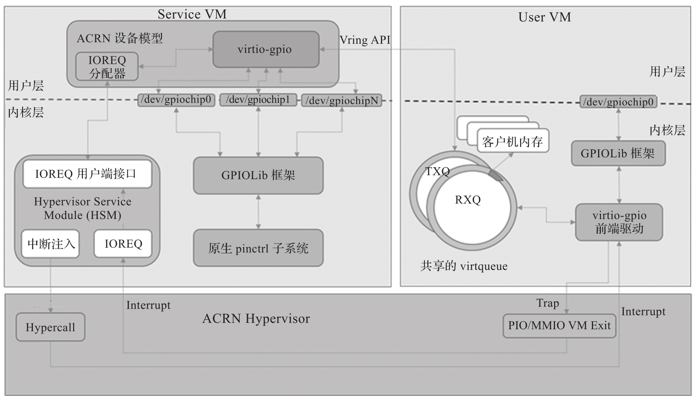
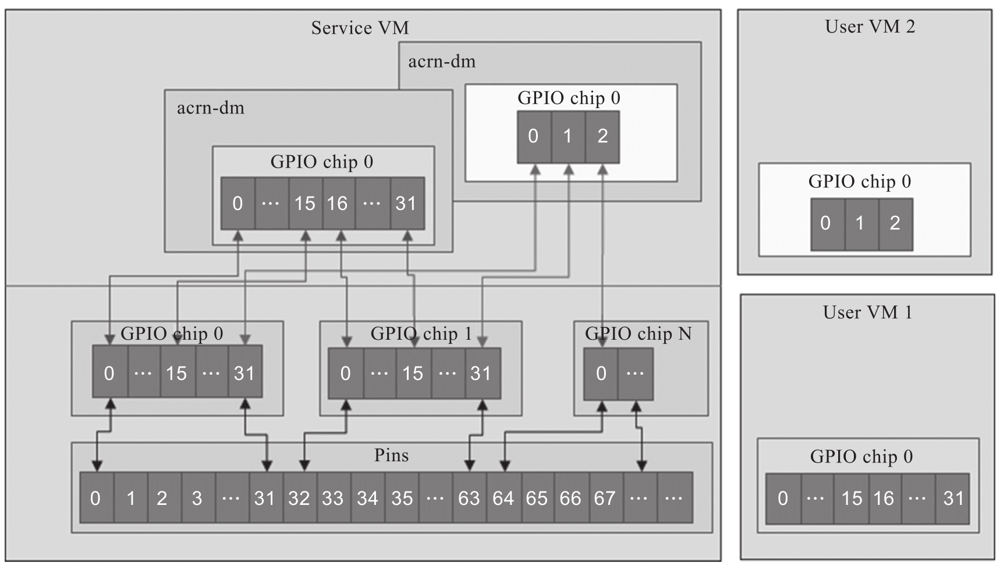

virtio-gpio 提供了一个虚拟 GPIO 控制器, 它将本地 GPIO 的一部分映射到客户机虚拟机, 客户机虚拟机可以通过它执行 GPIO 操作, 包括设置 / 获取值, 设置 / 获取方向和配置. GPIO 作为中断, 通常用于唤醒事件, virtio-gpio 支持电平和边沿中断触发模式.

ACRN virtio-gpio 模拟原理如图所示.

virtio-gpio 在 ACRN 设备模型中被实现为 virtio 旧式设备, 并已作为 User VM 的 PCI virtio 设备注册. 前端 Linux virtio-gpio 不需要进行任何更改, 使用 CONFIG_VIRTIO_GPIO=y 构建内核即可.

在前端驱动和后端驱动之间有三个虚拟队列, 一个用于 gpio 操作, 一个用于中断请求, 一个用于中断事件通知.

当探测到 virtio-gpio 前端驱动程序时, 它将注册一个 gpiochip 和 irqchip,gpio 的基地址和数目由后端程序生成. 每个 gpiochip 或 irqchip 操作 (例如 gpiochip 的 get_direction 或 irqchip 的 irq_set_type) 都会在其自身的虚拟队列上触发 virtqueue_kick. 如果某些 gpio 已被设置为中断模式, 则中断事件将在 IRQ virtqueue 回调中处理.

主机与客户机之间的 GPIO 引脚映射如图 5-27 所示.

* 每个 User VM 仅具有一个 GPIO 芯片实例, 其 GPIO 数量由 acrn-dm 命令行指定, 并且 GPIO 基数始终从 0 开始.

* 每个 GPIO 引脚都是互斥的, 这意味着各个 User VM 无法映射相同的主机 GPIO 引脚.

* 每个 User VM 的 GPIO 引脚的最大数量为 64.

virtio-gpio 相关源码: https://github.com/projectacrn/acrn-hypervisor/blob/v3.0/devicemodel/hw/pci/virtio/virtio_gpio.c
