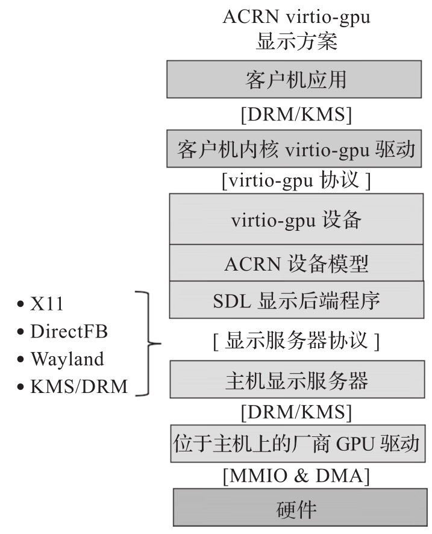

ACRN v3.0 支持 virtio-gpu 显示虚拟化, ACRN virtio-gpu 原理如图所示.

virtio-gpu 是一个基于 virtio 的图形适配器, 支持 2D 模式. 它可以将 User VM 的帧缓冲区传输到 Service VM 的缓冲区, 用于显示. 可与 Intel GPU VF(SRIOV) 协同工作并为图形功能提供加速. 利用 virtio-gpu, User VM 可以受益于 Intel GPU 硬件来加速媒体编码, 3D 渲染和计算.

ACRN 虚拟监视器是一个 Service VM 的图形界面窗口, 它可以显示 User VM 利用 virtio-gpu 存储在 Service VM 缓存区的图形. virtio-gpu 通过 SDL(OpenGL ES 2.0 后端) 与 Service VM(HOST) 上的显示服务连接, 为 User VM 提供了一种通用的显示解决方案. 当 ACRN virtio-gpu 后端启动时, 它会首先尝试与 Service VM 的图形子系统连接, 然后在 Service VM 上以图形窗口的形式显示 User VM 的图形界面.

许多操作系统利用 VGA 来显示系统安装界面, 安全模式, 以及系统蓝屏. 此外, 像 Windows 这样的系统默认不带 virtio-gpu 前端驱动. 为了解决这些显示需求, ACRN 的 virtio-gpu 后端方案支持传统 VGA 模式. 为了兼容 VGA 与现代型 virtio-gpu 设备, ACRN virtio-gpu 设备的 PCI bar 空间定义如下.

* BAR0:VGA 帧内存缓冲区, 大小为 16 MB.

* BAR2:MMIO 空间.

* `[0x0000～0x03ff]` 延伸显示能力识别数据.

* `[0x0400～0x041f]` VGA 端口寄存器.

* `[0x0500～0x0516]` Bochs 显示接口寄存器.

* `[0x1000～0x17ff]` virtio 通用配置寄存器.

* `[0x1800～0x1fff]` virtio 中断状态寄存器.

* `[0x2000～0x2fff]` virtio 设备配置寄存器.

* `[0x3000～0x3fff]` virtio 通知寄存器.

* BAR4:MSI/MSI-X 信息.

* BAR5:virtio 端口 I/O.

virtio-gpu 相关源码:

* https://github.com/projectacrn/acrn-hypervisor/blob/v3.0/devicemodel/hw/pci/virtio/virtio_gpu.c,

* https://github.com/projectacrn/acrn-hypervisor/blob/v3.0/devicemodel/hw/vdisplay_sdl.c,

* https://github.com/projectacrn/acrn-hypervisor/blob/v3.0/devicemodel/hw/vga.c,

* https://github.com/projectacrn/acrn-hypervisor/blob/v3.0/devicemodel/hw/gc.c

