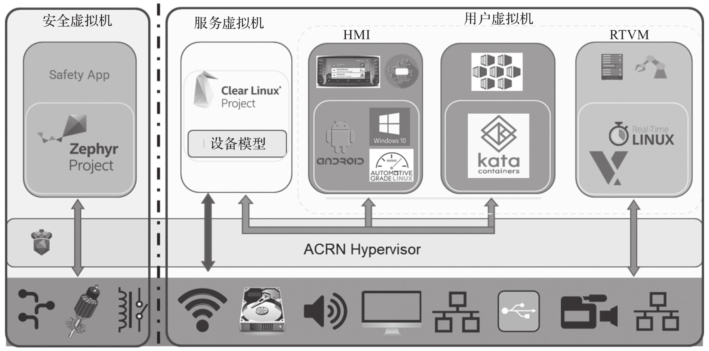
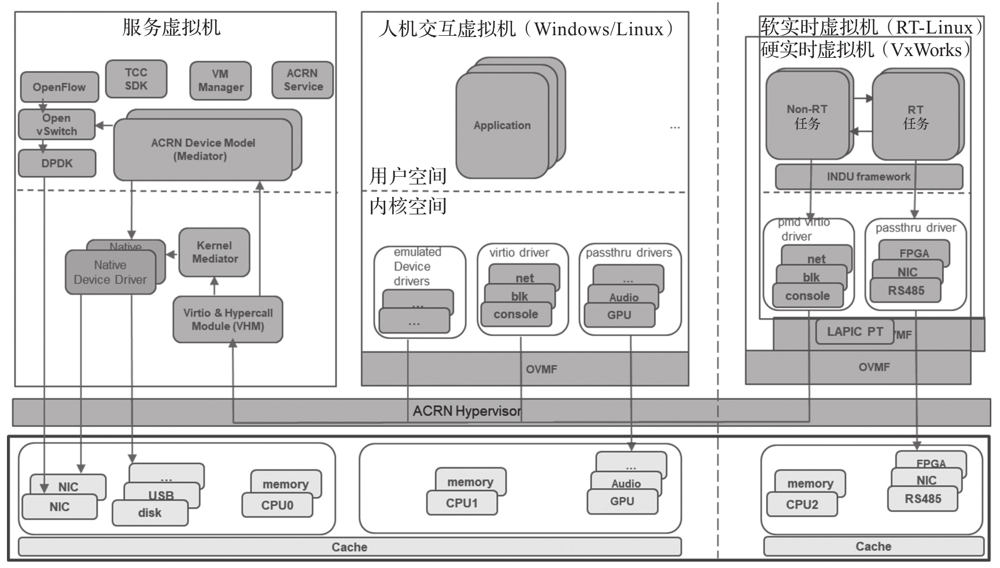

如前所述, 嵌入式虚拟化技术主要用于满足负载整合的需求, 其中一个重要的应用场景就是工业控制领域, 需要在一个物理硬件平台同时支持至少一个实时操作系统 (RTOS) 和一个人机交互界面 (Human Machine Interface,HMI) 操作系统.

在这里, 如果一个 VM 里运行的是一个实时操作系统, 我们还可以称它为实时虚拟机(Real-Time VM, RTVM). 一个典型的 HMI+RTVM 场景如图所示.

其中人机交互界面多为 Windows 系统, RTVM 运行的实时操作系统可以是 Xenomai, PREEMPT_RT Linux, Zephyr 等开源 RTOS 或者其他商用的实时任务操作系统.

实时场景的 ACRN 架构如图所示. 为支持实时性, 该架构做了特殊设计, 例如: RTVM 会需要独占一些硬件资源, 如多个 CPU 核中的一个或两个核, 需要实时操作的一些控制设备, 实时传输数据的网卡等. 这部分独占设备需要直通给 RTVM 进行操作. 如果 RTVM 需要使用共享的物理设备, 则推荐使用 virtio 轮询模式来实现.

通常情况下推荐 RTVM 独占 CPU 的两个核, 其关联的中断控制系统 (x86 系统下为 APIC) 直通给 RTVM, 避免中断陷入 Hypervisor 里面等待处理. 直通的外设经过 ACRN 配置后可以直接由 RTVM 进行操作, 设备的中断也会直接通知到 RTVM 所属的 CPU 核上. 这些对实时性支持的实现会在后面逐一讲述.

对于人机交互系统, 其资源可以根据系统需求进行配置, 通常并无实时性的需求, 但部分场景可能有一定的实时性需求, 如视频采集 + 视觉分析, 然后把处理结果通知 RTVM 来处理. 这样的需求通常需要平衡硬件资源在两个 VM 之间的分配, 同时提供低延时的虚拟机间通信机制.

下面从实时性的分类, 实时性的优化准则和具体实现来进行说明.