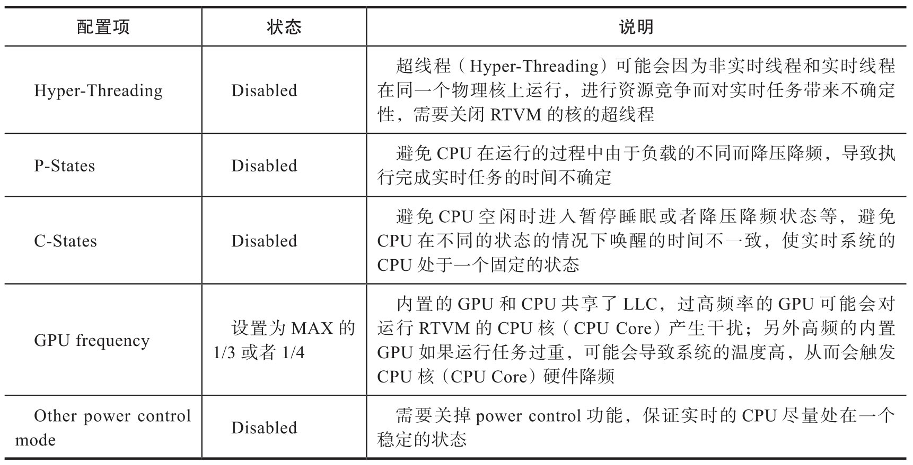
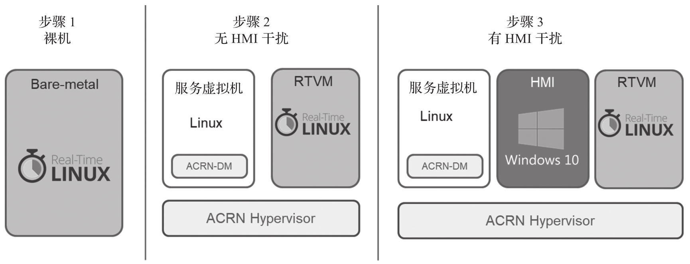

实时性要求的目标随着应用场景的不同而有所不同. 在工业领域, 有的应用场景可能要求在 50μs 内执行完一个动作, 有的应用场景可能要求在 1ms 内执行完一个动作. 另外, 对 HMI 系统的需求也可能有所不同, 有的应用场景只需要 HMI 做基本的配置管理, 查看负载状态等简单的工作, 有的应用场景对 HMI 要求可能会高一些, 需要完成视频图像采集处理, 视觉分析之类负载较重的工作, 这对实时性也有一定的影响.

实时性还必须具备确定性. 实时任务在运行过程中虽然会由于系统资源竞争, 软硬件各种状态变化等带来一些不确定性, 但是实时任务仍必须在给定的时间内完成. 最基本的做法是把任务优先级调高, 确保可以优先获得系统资源并保证任务被优先执行. 所以实时性优化准则之一是尽可能地排除不确定性并追求确定性.

嵌入式系统的实时性优化是一个系统工程. 从硬件到软件, 从 OS 层到应用层, 具体的场景还会涉及某个硬件设备配置等. 对于嵌入式虚拟化技术的实时性的优化, 本章主要关注以下两点.

* 硬件平台的相关配置和优化. x86 平台主要通过 BIOS 的配置实现.

* Hypervisor 虚拟化的实现, 配置和优化.

其中硬件平台的配置优化是比较通用的, 无论是否运行在虚拟化环境下, 都会涉及实时性的支持和优化, 这里将对一些重点配置项加以说明. 另外, 实时虚拟机内运行的 RTOS 及相关实时任务的实现和优化在后续章节中详述.

下面以 x86 的 BIOS 的配置为例介绍对系统实时性产生较大影响的配置项, 如表 7-2 所示.

除以上配置项之外, 还有一些与 ACPI 和总线相关设置需要配置, 这里不再一一说明. 由于 x86 系统相对复杂, 相关的配置原则上要尽量使系统处于一个稳定的状态, 排除掉由于软硬件运行时状态的变化对实时性带来的影响.

在嵌入式虚拟化实时系统里面, 优化的步骤也很重要. 这里以 ACRN 虚拟机为例介绍嵌入式虚拟化系统的实时性能优化步骤, 如图 7-3 所示.

首先建议先在物理机裸机环境下搭建 RTOS, 配置优化实时性能, 运行实时任务或者基准测试工具, 使其达到实时要求. 如果在裸机环境下不能满足实时要求, 则在虚拟化环境下肯定也无法满足实时要求. 虚拟化的实时性能通常只能接近裸机环境下的实时性, 不会超越.

在第一步满足实时要求后, 第二步搭建虚拟化环境. 首先在没有 HMI 虚拟机干扰的情况下配置调试 RT V M 的实时性, 使其达到实时要求. 第三步增加系统干扰, 先增加一个 HMI 系统. 在 HMI 处于无负载空闲的情况下, 调试 RTVM 的实时性, 如满足, 再增加 HMI 内部的负载, 比如在 HMI 内部运行真正的业务负载, 进而调试 RTVM 在此状态下的实时性能. 如果在虚拟化环境下, 实时性有较大的差距, 除了通常的排查调试用辅助调试工具来抓取数据进行分析外, 也可以在裸机上模拟干扰, 进行对照排查问题.

嵌入式虚拟化环境下的实时调优策略总体的原则是 "先易后难, 简单到复杂, 逐步调试, 排查问题"​, 通过减少干扰变量, 降低调优复杂度.