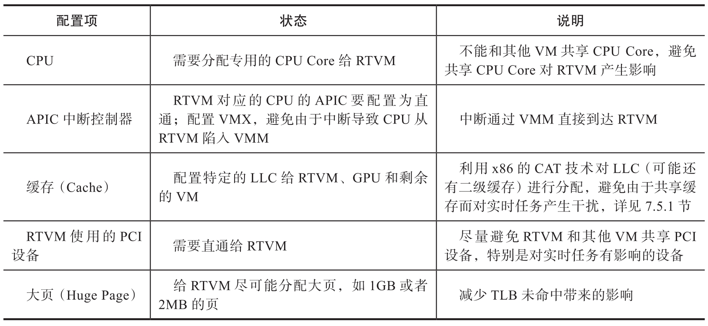
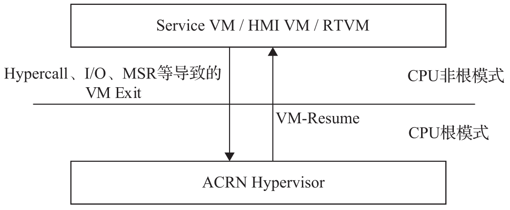

嵌入式虚拟化系统在实时系统和硬件之间增加了一层 VMM(即 Hypervisor)​, 因此除硬件相关的配置之外, VMM 层的实现或者配置对于实时系统的影响也比较大. 下面结合 ACRN 在 x86 平台的实现来说明一些基本的 VMM 相关实时性能支持和配置优化项, 如表 7-3 所示.

以上是一些通用的 VMM 实时性能优化的配置项. 下面详细说明为何以上优化项会对实时性有较大的影响.

# ACRN VM-Exit-less

什么是 VM Exit? 这里以 x86 平台为例来说明. 在支持 CPU 硬件虚拟化的 Intel x86 平台上, CPU 有两种模式, 正常模式为根模式(Root Mode), 有对 CPU 资源的全部控制权, 用来运行 Hypervisor; 另一种模式为非根模式(Non-Root Mode), 是一种受限模式, 通常用来运行 VM. 两种模式可以互相切换, 从 Root Mode 到 Non-Root Mode, 通常需要执行特定的指令(VMLAUNCH/VMRESUME); 从 Non-Root Mode 切换到 Root Mode 有多种情况, 可以调用 VMCALL, 或者由于外部中断调用了特权 / 特定指令, 如 CPUID,HALT 等, 或者由于访问了特定的敏感资源, 如 Port IO/MMIO, 特定的一些 MSR 等.

CPU 从 Non-Root Mode 到 Root Mode(CPU 从 VM 陷入 Hypervisor)的事件统称为 VM-Exit, 即从 VM Exit(陷入)到 Hypervisor. 如果发生了 VM Exit, 一个显而易见的影响是 CPU 需要执行 Hypervisor 的代码, 对相应的事件进行处理, 从而带来额外的时延. 另外, Hypervisor 里面可能有一些共享资源带来的互斥问题等, 各种原因导致的每个 VM Exit 的处理时间可能不固定, 给实时性带来了很大的不确定性. 正是由于这些原因, 虚拟化系统实时性优化需要关注 VM Exit. 下图是 CPU 在两个模式之间切换造成的 VM Exit 的示意图.

解释了 VM Exit 后, 那么什么是 VM-Exit-less? 避免 VM Exit 的产生就是 VM-Exit-less. 虚拟化系统里面, 完全避免 VM Exit 比较困难, 也没有必要.

> 这是 ACRN 项目里 "创造" 出来的一个术语, 意思是非常少的 VM Exit.

以 ACRN 为例, 为了减少虚拟机对于 RTVM 里运行的实时任务带来的影响, 应该尽可能减少 VM Exit, 即尽可能避免 CPU 从 RTVM 陷入 ACRN Hypervisor 里面, 这是优化的原则之一. 要使 RTVM 尽量达到 VM-Exit-less, 或者至少在运行实时任务时达到这一点.

前面提到的 CPU 的分区 (partition), 中断控制器(APIC) 的直通即可避免很大一部分的 VM Exit. 但由于虚拟化的特殊性, 单靠 ACRN Hypervisor 是无法完全避免 VM Exit 的, 需要从上层 RTVM 来配合支持 VM-Exit-less.

举例来说, 对于 RTVM 而言, 至少在执行实时任务的过程中, 尽量避免对 CPU 核进行一些特殊 MSR(如 MTTR/PAT)的访问, 避免一些特殊指令的执行(如 CPUID)​, 避免访问模拟的 I/O 设备. 这些都会导致 CPU 从 RTVM 陷入 ACRN Hypervisor 里面. 这些寄存器或者 I/O 资源, 在虚拟化环境下由于设备模拟或者系统安全原因, 不能直通给 RTVM, 因此需要 RTVM 本身的配合, 才能避免实时任务运行过程中产生 VM Exit.

综上所述, 嵌入式虚拟化环境下的实时优化会尽量从 Hypervisor 层来避免 VM Exit 的产生, 但需要 RTVM 的配合支持, 才能达到实时任务运行中的 VM-Exit-less.

