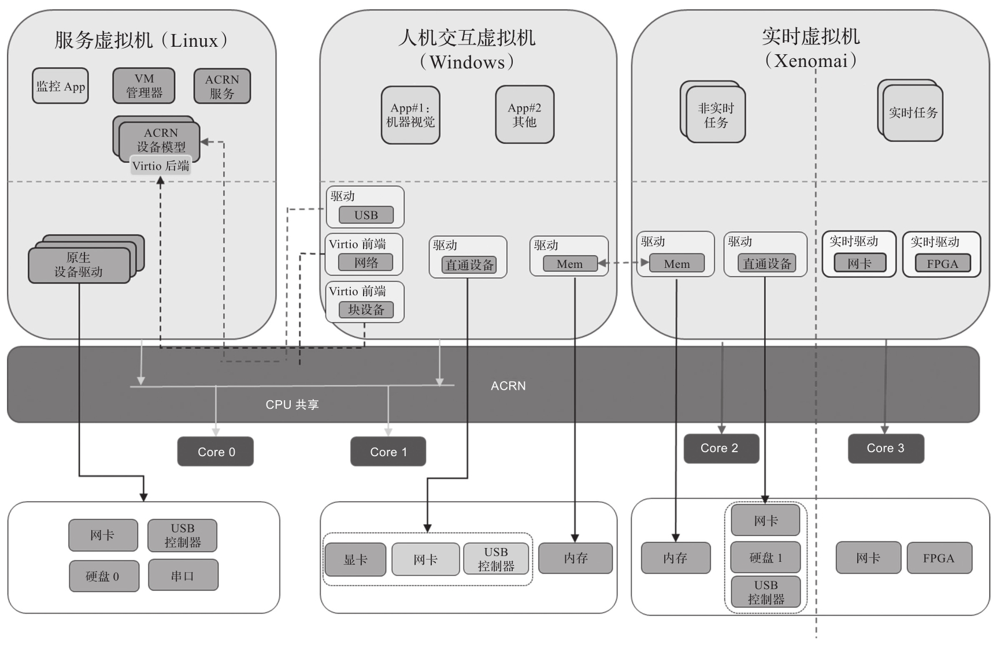

嵌入式虚拟化为了支持实时性, 避免由于共享资源导致非实时系统对实时系统带来干扰, CPU 资源通常会作为分区处理: 即分配固定的 CPU 核给 RTVM. 如果 RTVM 系统本身比较复杂, 如 Preempt-Linux 或 Xenomai, 还需要一个专门的核来处理实时任务, 从而避免处理非实时任务对实时任务的干扰, 如图所示.

ACRN 支持对 CPU 核资源的共享或者分区配置. 上图所示 ACRN 的实例中, 服务虚拟机和 HMI 共享 Core0 和 Core1 两个核, RTVM(Xenomai) 独自占用了另外两个核 (Core2 和 Core3)​, 其中一个用作实时核负责处理实时任务, 另一个用作非实时核负责处理非实时事务.

原则上, 在嵌入式虚拟化环境下和裸机环境下实时任务对 CPU 的需求基本一致: 运行在其他非实时 CPU 核上的任务尽量避免对实时 CPU 核的干扰, 从而保证实时 CPU 核的实时性.
