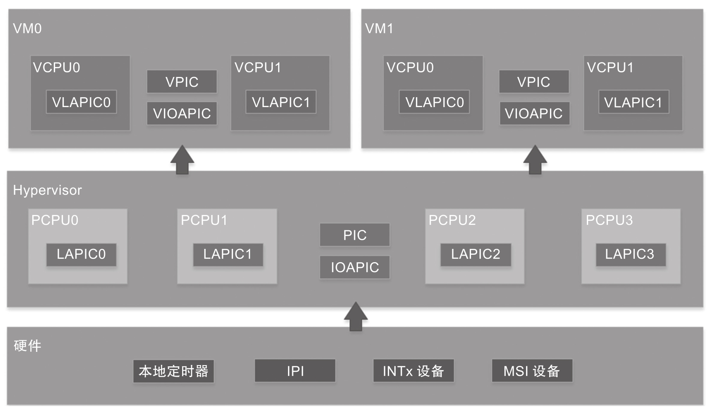
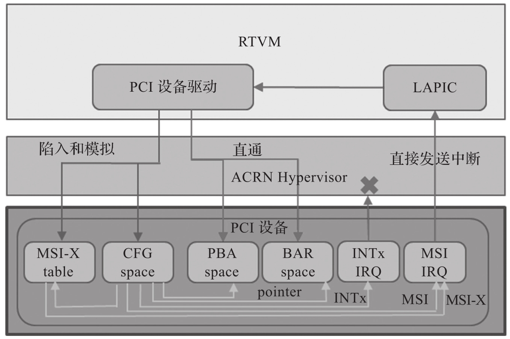

在虚拟化环境下, VMM(即 Hypervisor)通常需要实现对中断虚拟化的支持. Hypervisor 需要接管物理设备或者虚拟设备产生的中断, 然后决定分发给哪一个 VM, 具体的实现可以参考前面的章节. 在虚拟化环境下, 中断产生后的处理流程比较复杂, 如图所示.

Hypervisor 在处理中断的过程中, 不同的 VM 之间, 不同 CPU 之间可能会产生干扰. 如果嵌入式虚拟化系统要支持实时性, 就需要尽量避免这种干扰. 其中一种比较直接的中断处理设计思路就是使能中断直通, RTVM 所属的中断信号可以直通给对应的 VCPU 核, 不要在 Hypervisor 里面做中断的中转处理. 这样 RTVM 系统所属的设备产生中断或者系统内部产生的中断都会由中断控制器直接传送给对应的 VCPU 核, 并不会产生 VM Exit, 因而不需要陷入 VMM 里面进行处理, 避免了在 VMM 中处理中断时对其他 CPU 核的干扰, 同时也缩短了中断处理的路径, 基本上能做到和非虚拟化环境下的中断处理保持一致.

支持中断控制器直通需要对 RT V M 所使用的外设有一定的限制. 首先尽量不要使用共享的设备, 即便使用也最好采用轮询模式, 避免使用中断模式. 对于 RT V M 使用的物理设备, 需要在 VMM 里面对其中断向量进行配置做重映射 (interrupt remap). 如果外设支持的是 IOAPIC 的中断, 则需要配置 IOAPIC 的中断映射表到对应的 RTVM 的 APIC 上; 如果外设支持的是 MSI(MSIX) 中断, 则需要配置设备的 MSI 映射表到对应的 RTVM 的 APIC 上. 如果有设备包含 IOMMU 部分, 则中断映射的配置可能还需要经过 IOMMU 里面的中断映射表. 对于这部分内容, 请参考 IOMMU 的相关的资料, 这里不做赘述.

目前的外设大部分是 PCI/PCIe 相关的设备, 基本都支持 MSI/MSIX 的中断模式, 在 ACRN Hypervisor 里对直通的 PCI 设备做了 MSI 中断的重映射, 目前不支持 INTx 的重映射.

图 7-7 是 RTVM 所支持的 PCI 设备, 其 MSI 或 MSI-X 中断直接在配置空间里做好映射, 设备产生中断时, 直接回写到对应的中断控制器地址空间, 触发 RTVM 的中断处理.

综上所述, 中断优化的目标是在嵌入式虚拟化环境下, RTVM 中各个物理设备的中断处理流程和在非虚拟化环境下的处理流程保持一致, 避免 VMM 的参与, 从而减少对其实时性的影响.
