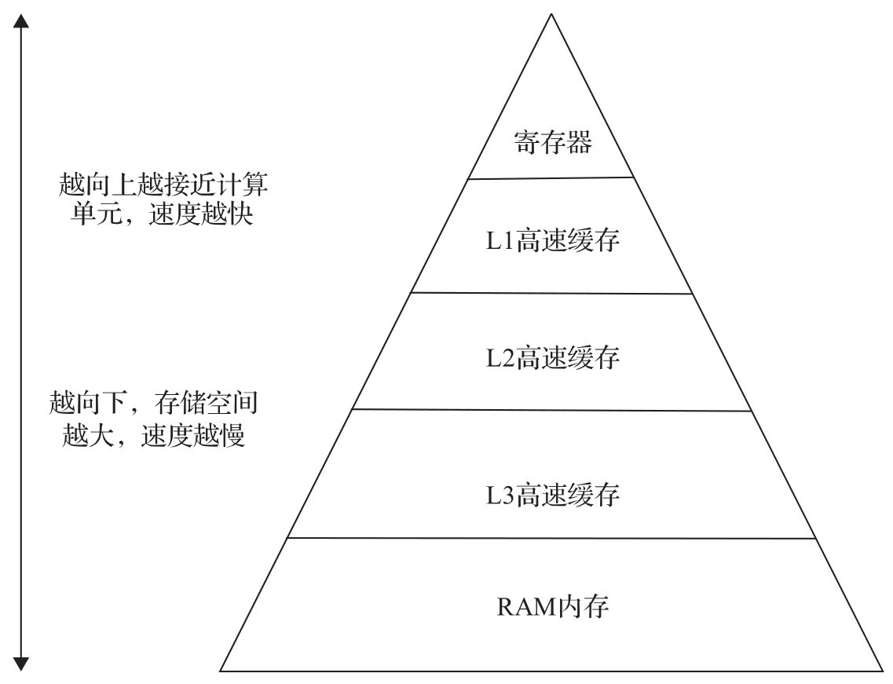

现代计算机架构的内存及存储系统越来越细化, 越来越复杂, 但基本规律一直没有改变: 越靠近 CPU 计算单元的存储部分, 读写速度越快, 但存储容量越小; 越远离 CPU 计算单元的存储部分, 读写速度会越慢, 但存储容量越大. 现代 CPU 的基本存储架构如图 7-8 所示.

其中高速缓存 (cache) 是现代 CPU 存储系统中重要的组成部分, 对系统性能有关键的影响. 高速缓存也是高性能计算研究的热点领域. 在嵌入式虚拟化系统上, 各个 VM 共享系统总线和物理内存, RTVM 的实时任务在运行的过程中访问内存的时候, 如果高速缓存都不能命中, 它会通过系统总线来访问总线上的物理内存, 这时不同的 VM 之间可能会由于总线竞争而导致 RT V M 的实时任务有较长的内存访问延时, 会对实时任务带来较大的不确定性. 当然, 如果实时任务的相关外设也较频繁地访问物理内存, 同样会带来 I/O 的延时, 从而影响实时性.

在支持实时性的嵌入式虚拟化系统中, 内存部分的优化目前主要集中在高速缓存部分. 基本思路是保证实时任务在运行的过程中, 内存访问尽可能在高速缓存里完成, 尽量避免高速缓存的不命中, 从而保证实时性.

下面结合 x86 平台下高速缓存优化技术和 ACRN 的实现来说明如何进行内存优化.
