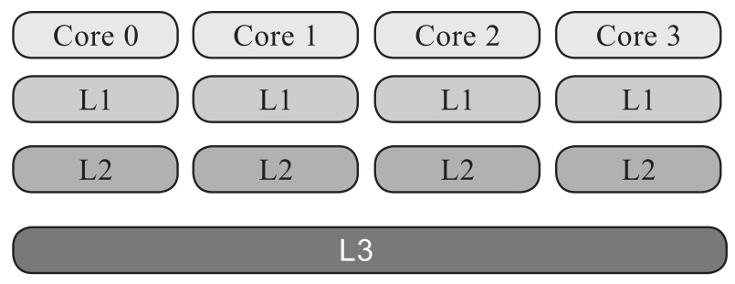
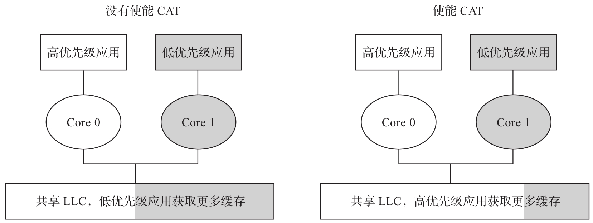
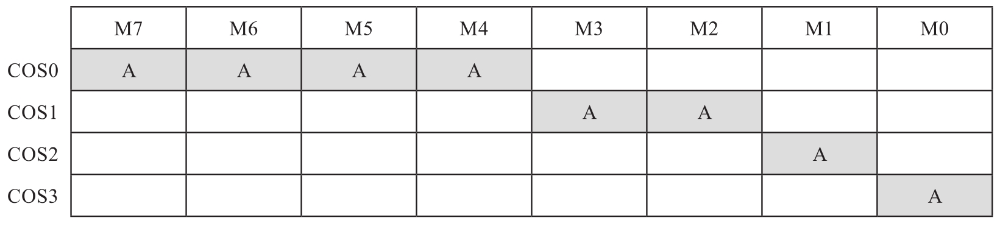
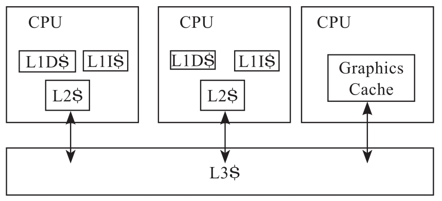
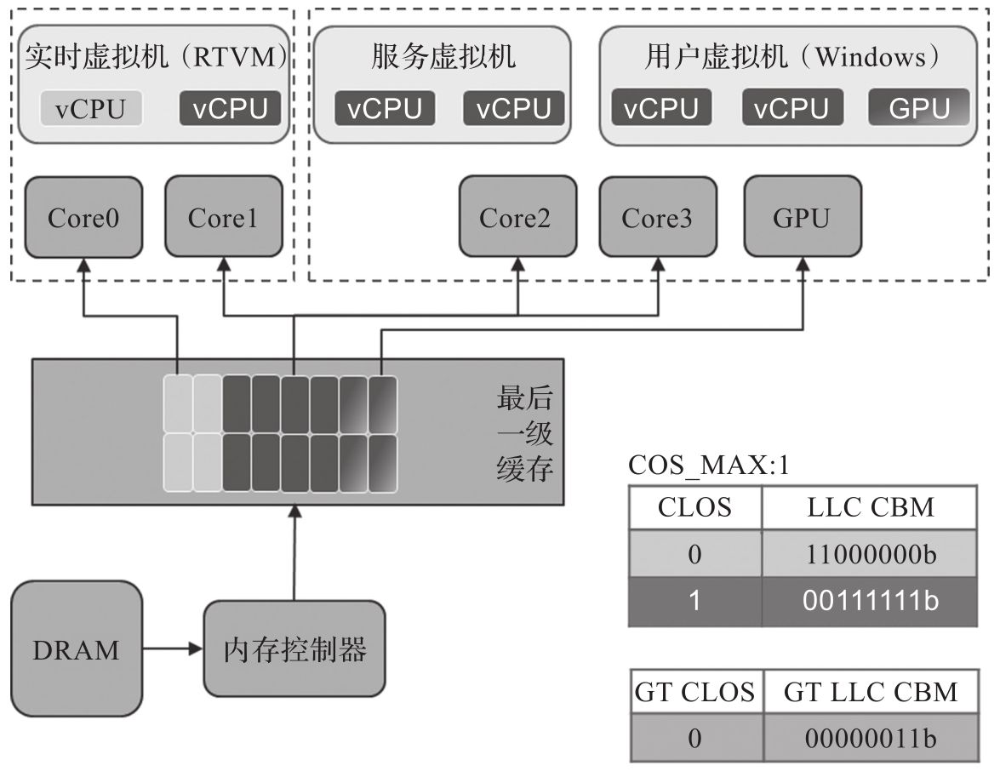
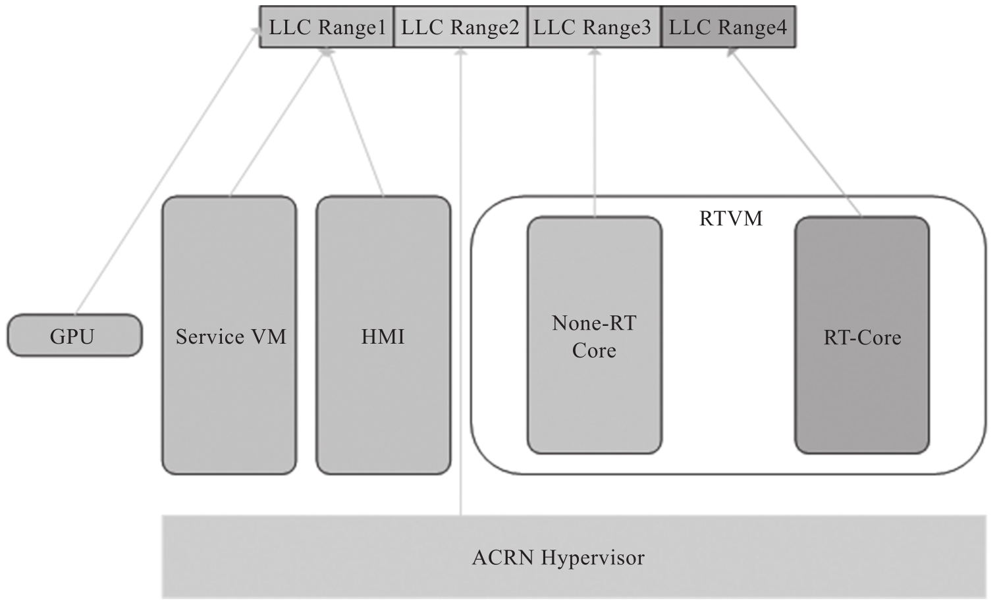

首先介绍 x86 上的缓存分配技术 (Cache Allocation Technology,CAT), 其本身是用来配置分配共享缓存资源的一种技术. 在虚拟化环境下, CAT 是可以用来指定某个 VM 或者 VMM 使用某一固定数量的缓存的技术. 在 x86 上通过设定 VM 或者 VMM 的各个 CPU 的 CAT 相关的 MSR 来实现. 不同的 CPU 型号可能支持 CAT 的级别不一, 可能会支持 L2 和 L3.L2 是各个 CPU 核私有的 cache,L3 是各个 CPU 核之间共享的 cache, 因此这里以 L3 为例来说明.

从图 7-9 可以看出, L3 的高速缓存是各个 CPU 核共享的, 并且其容量相对较大, 可以作为资源分配给不同的 CPU 核. 英特尔的 x86 部分芯片就支持这种功能. 下面结合一个例子进一步说明 CAT 的配置和应用.

参考 x86 的软件开发文档的 L3 cache 使用 CAT 的例子, 如图 7-10 所示.

如果没有使能 CAT, 由于每个 CPU 核公平地抢占共享的高速缓存, 那么在 Core 1 上运行的一个低优先级的应用可能会占用较多的最后一级缓存 (Last Level Cache,LLC)(这里 LLC 等同于 L3 缓存)​, 而优先级较高的运行在 Core 0 上的应用可能只能使用较少的 LLC. 如果使能了 CAT 配置, 则可以给 Core 0 上的高优先级应用分配较多的 LLC, 而给 Core 1 上的低优先级应用分配较少的 LLC. 这样在运行的过程中互不占用, 保证了高优先级的应用能够一直使用较多的 LLC, 从而保证它的性能和运行时延.

CAT 是如何实现的呢? 受篇幅所限, 这里仅介绍其基本原理, 更多细节可以参考英特尔 64 位与 IA-32 架构开发人员手册中的 CAT 相关章节.

cache 基本结构可以分为多路 (way), 如 8way 或者 16way. 例如, 某型号 CPU 的 LLC 的大小为 4MB, 共 8way, 则每一个 way 对应的 cache 大小为 0.5MB 即 512KB. 英特尔的 CAT 以 way 为单位进行分配.

在 x86 平台, 有一组 MSR 名为 COS(Class of Service, 也称为 CLOS)​, 可以设置其对应的 mask 值为 CBM(Cache Bit Mask), 如图 7-11 所示.

COS0～COS3 对应 4 个 MSR,COS0 的值为 0xF0, 如果总的 LLC 为 4MB, 则 COS0 对应 LLC 的高 4way, 大小为 2MB;COS1 对应 0x0C, 大小为 1MB;COS2 为 0x02,COS3 为 0x01, 均对应 0.5MB 大小的 LLC. 这 4 个 MSR 是全域的, 即一个 SMP 的 CPU 的各个核共用这 4 个寄存器.

在 x86 上另有一个 MSR, 名称为 IA32_PQR_ASSOC(每个 CPU 核都有一个)​, 可以配置当前 CPU 核使用哪一个 COS 对应的 LLC mask; 如果选择了 COS0, 则此 CPU 核可以填充的 LLC 为高 4way, 共有 2MB 的 LLC 供其使用.

对运行在嵌入式虚拟机上的 RTVM,CAT 是一项重要的优化技术. 对运行实时任务的 CPU 核, 需要使用单独的 LLC way, 不能和其他 CPU 核共享, 从而避免 LLC 的资源竞争, 造成较多的 cache 不命中, 导致较长的延时. 从简化配置的角度看, 其他 CPU 核可以共享剩余的 LLC.

另外, 在某些 x86 平台上, 由于有内置 GPU, 该 GPU 也将和 CPU 共享 LLC, 因此如果使用了 GPU, 还需要配置 GPU 对应的 LLC, 如图 7-12 所示.

因此也需要对 GPU 配置 CAT, 通常可能会用对应的 GT CLOS MSR(不同的平台配置方法可能有差异, 具体需要查询资料或者咨询厂商)​.

ACRN 上 CAT 的一个通用配置示例如图 7-13 所示. 因为 RTVM 的 Core 3 运行实时任务, 需单独分配 LLC, 剩余部分和其他 CPU 核共享. 另外, GPU 和其他 CPU 共享低 2way 的 LLC.

如果有复杂的场景, 如 RTVM 的 Core2 和 Core3 之间有较多的交互, 可能需要重新配置, 可以基于 VM 和 Core 进行配置, 如图 7-14 所示.

综上所述, CAT 的配置比较灵活, 可以根据实际需要进行调试配置. 在 ACRN 项目上, 目前推荐通用的配置 (如图 7-13 所示)​, 经测试, 对 RTVM 的实时性优化有不错的效果.

除上面涉及 CPU/GPU 的 CAT 配置之外, 这里也提一下 I/O 相关的 CAT 配置. Intel 的一些平台支持 DDIO(Data Direct I/O) 技术, 设备可以直接从 cache 里读写数据, 从而提高 I/O 的效率. 这些平台可能也支持设备 I/O 的 CAT 配置, 这部分 cache 可以专门用于设备的收据收发, 从而提高读写效率, 改善实时性.

CAT 可以应用在物理机上, 也可以用在虚拟化环境里. 在嵌入式虚拟化中使用 CAT, 可以很好地支持 RT V M 的实时性.
