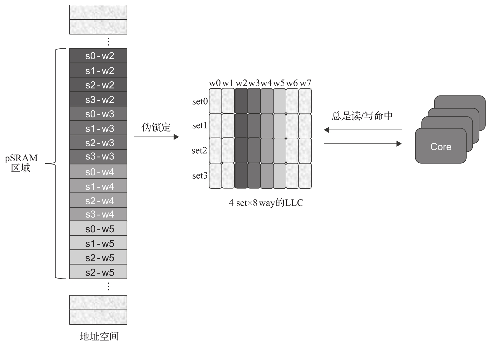

高速缓存可以通过 CAT 来做比较粗粒度的配置, 还有一种细粒度地使用高速缓存的方式, 这种方式通常被称为软件 SRAM 或者写为 SSRAM, 也可以被称为 PSRAM(Pseudo-SRAM). 它也是内存优化的一种方案, 下面进行详细介绍.

软件 SRAM 是一种把高速缓存映射到内存地址空间用作普通内存的方式. Intel 支持 CAT 的 CPU 通常能够支持这种功能. 它的基本思路就是把共享的 L3(或 L2)cache 的一部分映射到内存空间并锁定这部分 cache, 可以将特定的实时任务或者数据加载到这段内存空间运行, 从而改进性能, 并保证实时性. 图 7-15 为软件 SRAM 的示意图.

软件 SRAM 的实现思路是把一部分 LLC 映射到内存地址空间. 软件 SRAM 建立时 CPU 会访问这段地址空间, 以使这段内存加载到缓存里, 同时这部分 LLC 通过 CAT 避免被占用, 从而加载到该区域的数据或指令不会产生访存不命中的情况, 以提高程序执行的确定性.

如果软件 SRAM 只从 OS 层和应用层来支持, 需要避免这段软件 SRAM 被刷出去, 要做到这一点是比较困难的. 因此, 在基于 x86 的 ACRN 平台上, 软件 SRAM 实现了从底层到应用层的支持, 从 BIOS 到 VMM 层 (ACRN), 到 OS 层 (kernel 模块)​, 再到提供应用层相关的库文件和 API 接口函数, 在 7.8.5 节会有进一步的说明.

综上所述, 在虚拟化环境下, 英特尔对软件 SRAM 的内存优化技术提供了很好的技术支持, 给 RT V M 的实时优化提供了另一个技术选择.
