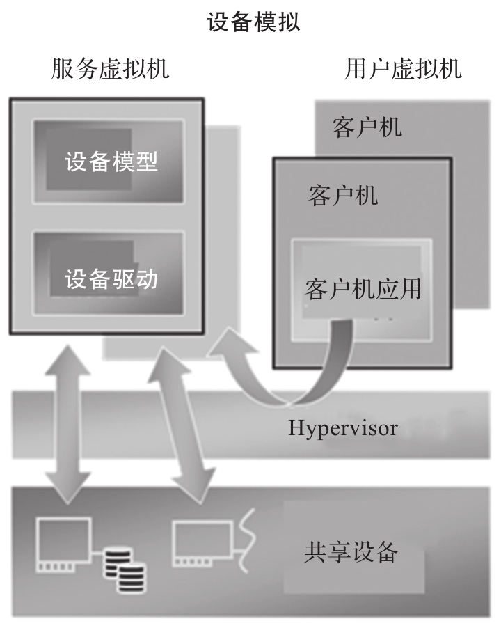

I/O 设备的虚拟化是 VMM 系统中的一项主要功能, 这里主要讨论 I/O 设备虚拟化对实时性的影响.

常见的设备虚拟化路径比较长, 如图所示.

由图可以看到, 对于共享设备而言, 通常虚拟化的设备操作路径会从用户虚拟机到 Hypervisor, 再到服务虚拟机, 最后到物理设备. 这种虚拟化除路径比较长之外, 由于部分操作是在 Hypervisor 和服务虚拟机里进行的, 因此难免会被其中相关的非实时任务影响, 带来了很大的不确定性.

因此这种较长路径的 I/O 设备虚拟化对于嵌入式的实时场景不太适用, 它会带来较长的延时和不确定性. RT V M 中的实时任务要求实时操作相关 I/O 设备, 因此最好的设备模型是直通所属的物理设备. 对于非实时的事务可以用轮询模式操作模拟的设备, 如串口等. 但要保证这部分事务不能影响实时任务, 因此如果 RTVM 有两个 CPU Core, 则其中非实时的 Core 可以用来操作虚拟的 I/O 设备, 避免 I/O 虚拟化对实时任务的影响.

综上所述, 在嵌入式虚拟化场景下, 如果对实时性有较高的要求, 则实时的 CPU 核最好只操作直通的物理设备, 不要处理虚拟的 I/O 设备. 下面结合 ACRN 逐一讨论相关设备在虚拟化场景下的处理方法.
