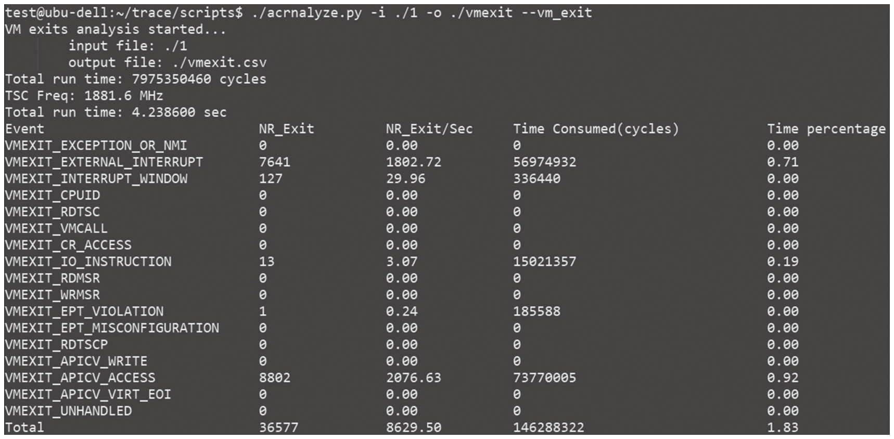
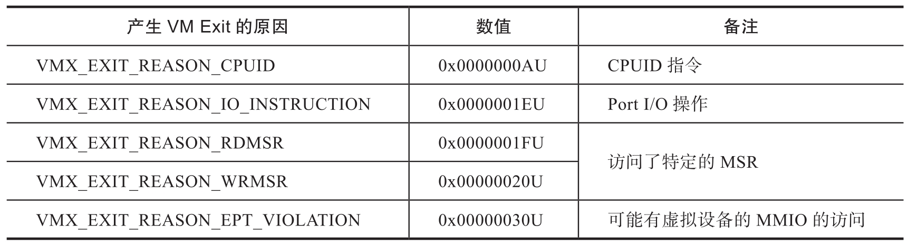

ACRN 提供了工具 ACRNTrace 以抓取每个 CPU 上产生的 VM Exit 的数据. 该工具的参数配置和使用方法参考 ACRNTrace 的相关文档, 这里不再赘述. 当 RTVM 里开始运行实时任务或者基准测试工具时, 在 ACRN 里运行该跟踪工具来抓取数据, 测试完成后, 再用相关的脚本分析 VM Exit 的数据. ACRNTrace 工具抓取的数据如图 7-18 所示.

> ACRNTrace 工具: https://projectacrn.github.io/latest/misc/debug_tools/acrn_trace/README.html

这些数据包含 VM Exit 的原因, 个数, 总的时间等. 举个例子, 如果 RTVM 运行的 CPU 核或者设备有外部中断产生, 但是中断控制器没有被配置成直通模式, ACRN 这时候就会从 RTVM 的 CPU 核上抓取到很多中断数据, 这些被 ACRN 截获的中断需要 VMM 来处理, 并会带来额外的开销, RTVM 的实时性能就会受到显著影响. 解决方法是检查 ACRN-DM 的启动脚本, 查看中断控制器是否配置正确.

在实时性细颗粒度调优阶段, RTVM 里的实时 CPU 核产生 VM Exit 的原因如表 7-4 所示.

如果 RTVM 中的实时 CPU 核上有 VM Exit 产生, 可以对跟踪数据做进一步的分析, 找到 VM Exit 产生的那条记录, 再根据提示信息来协助分析, 比如访问 MSR, 跟踪数据里会打印具体的 MSR 值.
