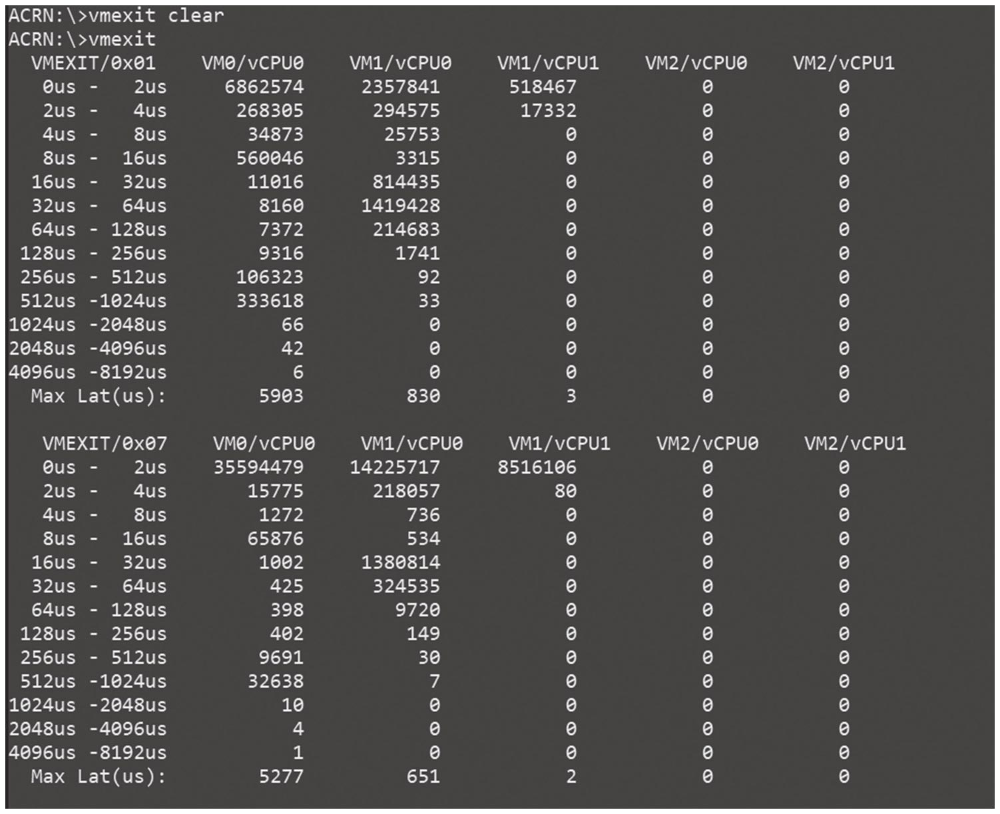

ACRN 控制台也提供了一条专门的命令用来抓取 VM Exit 的信息, vmexit 命令使用起来比较简单. 在实时任务或者基准测试运行之前先运行 vmexit clear, 测试结束后再输入 vmexit 查看 VM Exit 的数据即可. 该命令及其输出如图所示.

该命令可以显示 VM 中的 CPU 核上产生的 VM Exit 信息, 包含每一种 VM Exit 的序号 (具体对应的含义可以在代码或者开发文档里中查询)​,ACRN 处理这个 VM Exit 的时间 (落在不同的区间里)​, 以及 VM Exit 的数量和最长的处理时间. 为保证 RTVM 里达到最佳实时性能, RTVM 的 CPU 核应该基本不会产生 VM Exit, 如果产生, 则需要具体分析原因, 并尽量避免这种情况的发生.

