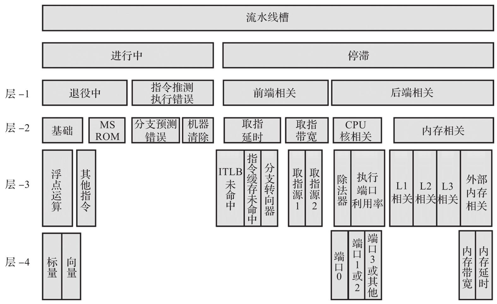

除了对 VM Exit 的分析之外, 也可以利用 CPU 里的性能测试单元 (Performance Monitor Unit,PMU) 采样来做详细的分析. 它可以对 CPU 的计算单元的微架构进行更加精细的数据分析. 利用 PMU 采样, 可以分析计算单元中的流水线, 指令预取, 分支预测, TLB 命中及 L1/L2/L3 高速缓存的访问等相关数据. 基本思路是从上到下进行采样和分析, 先整体后局部地找出性能瓶颈的根本原因. 借助于英特尔的 VTune 和 Perf 工具可以很方便地使用此方法. CPU 的计算单元微架构如图 7-20 所示. 具体优化分析思路可以参考英特尔 64 位与 IA-32 架构优化参考手册.

可以将 PMU 采样的功能嵌入具体的实时基准测试工具或者实时任务中, 在测试过程中进行采样, 如有异常可以分析相关数据, 找到原因. 下面以 Cyclictest 为例加以说明.
