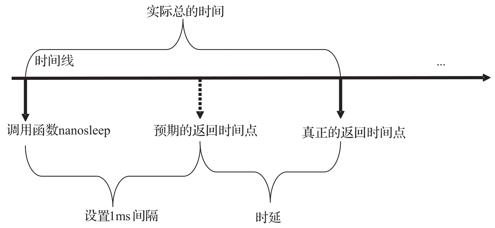
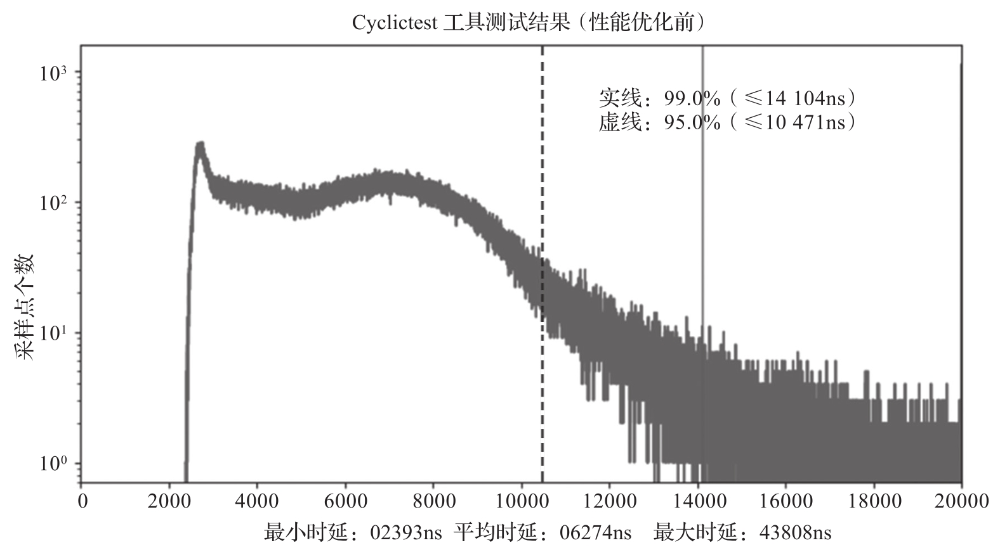
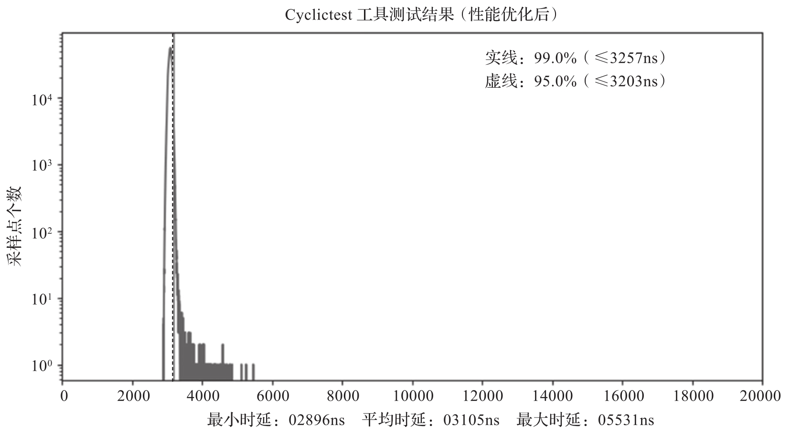

RTOS 上有各种实时性能基准测试工具, 例如, PREEMPT_RT Linux 上的 Cyclictest,Xenomai 上的 Latency 都是重要的实时基准测试工具. 这里以 Cyclictest 为例介绍如何利用基准测试对 RT V M 进行性能调优.

> Cyclictest 工具: https://man.archlinux.org/man/cyclictest.8
>
> Latency 工具: https://www.xenomai.org/documentation/xenomai-3/html/man1/latency/index.html

Cyclictest 是可以运行在 PREEMPT_RT Linux 上的一个标准基准测试工具, 用来测试系统的时间中断到调度响应的时间. 如图 7-21 所示, 每次测试设固定时间 (如 1ms) 的系统睡眠, 实际返回的时间和预期应该返回的时间差就是它采集的时延, 可以用来测定系统的实时响应调度能力, 最大时延越小越好. 根据不同的客户场景需求, 最大时延可能要求在 10μs 或者 20μs 以内, 不同的硬件平台以及具体的应用场景可能有不同的要求.

Cyclictest 的时延的计算方式:

图 7-22 和图 7-23 是用 Cyclictest 工具采集的时延数据, 分别是没有进行性能优化的时延数据和进行性能优化后的时延数据. 以图 7-22 为例, 横坐标是时间, 单位为纳秒 (ns), 纵坐标是具有相同时延数值的采样点个数. 其中实线表示的是采样个数的分界线, 其左边为小于某一时间(此处为 14104ns) 的个数占 99.0%, 右边为大于 99.0% 的个数. 虚线的分界线表示的是其左边小于某一时间 (此处为 10471ns) 的点的个数占 95.0%, 其右边是大于 95.0% 的个数.

ACRN 没有使能 CAT 优化, Cyclictest 2h 采样:

ACRN 使能 CAT 优化, Cyclictest 2h 采样:

该测试环境里同时运行了两个虚拟机, 一个是基于 PREEMPT_RT Linux 的 RTVM, 其中运行 Cyclictest 工具; 另一个运行 Windows 的人机交互虚拟机. 从图 7-22 中可以看到非常多的很大的时延数据, 说明产生异常的情况比较多. 从图 7-23 中可以看到, 在 ACRN 使能 CAT 优化技术后, RTVM 系统中的数据没有出现较大的时延和异常数据, 说明实时性能很好.

另外还可以在测试的过程中对测试进行细粒度的 PMU 采样, 例如采集 L2/L3 的缓存未命中次数, 以及导致 CPU 停顿的数据(CPU 停顿是指其内部某一执行单元缺少资源, 而导致流水线无法执行的间隙)​, 这样对于异常点, 可以进行详细的分析, 用来确定异常产生的原因.

当然, 也可以在基准测试的过程中在非实时的核上进行系统采样, 如中断数据, 系统温度等用来分析异常干扰等.

总而言之, 这些辅助工具采样的方法可以很好地帮助我们分析一些异常数据. 但比较有挑战性的是需要对测试工具进行改造. Intel 在实时性调优方面也做了很多工作, 提供了很好的支持, 下面进行简要介绍.