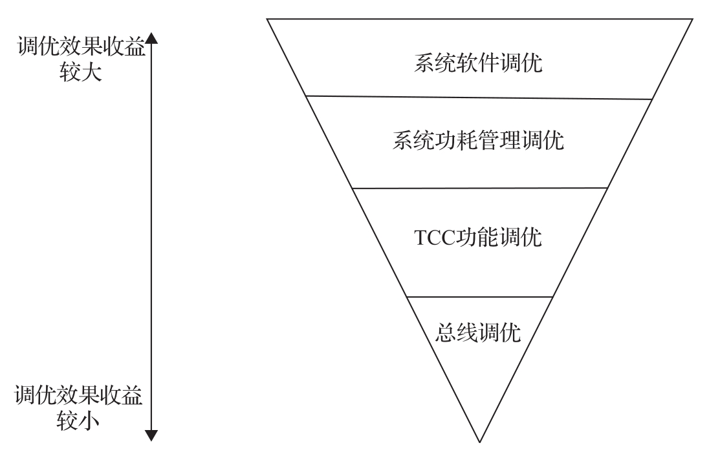
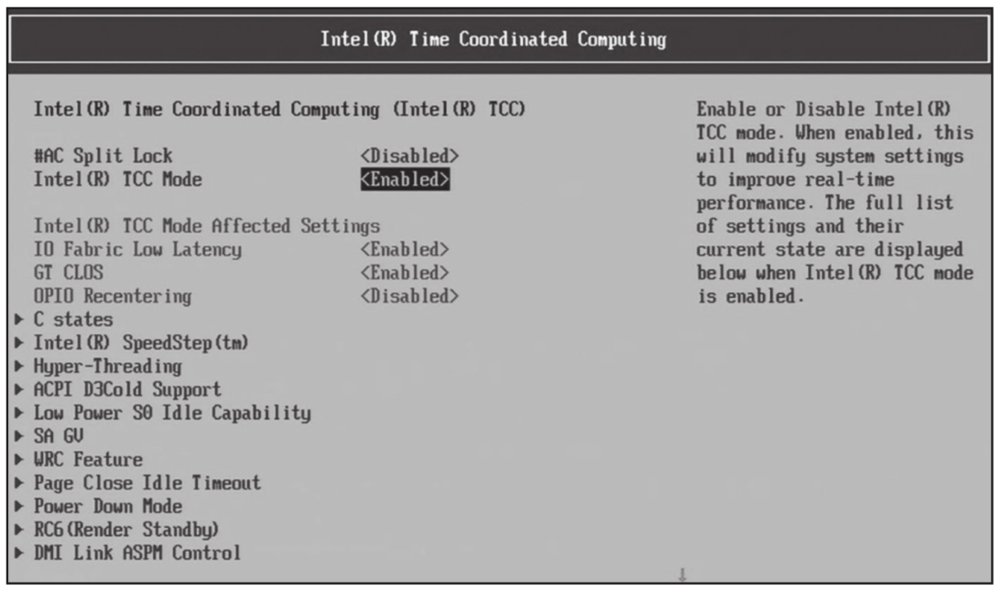
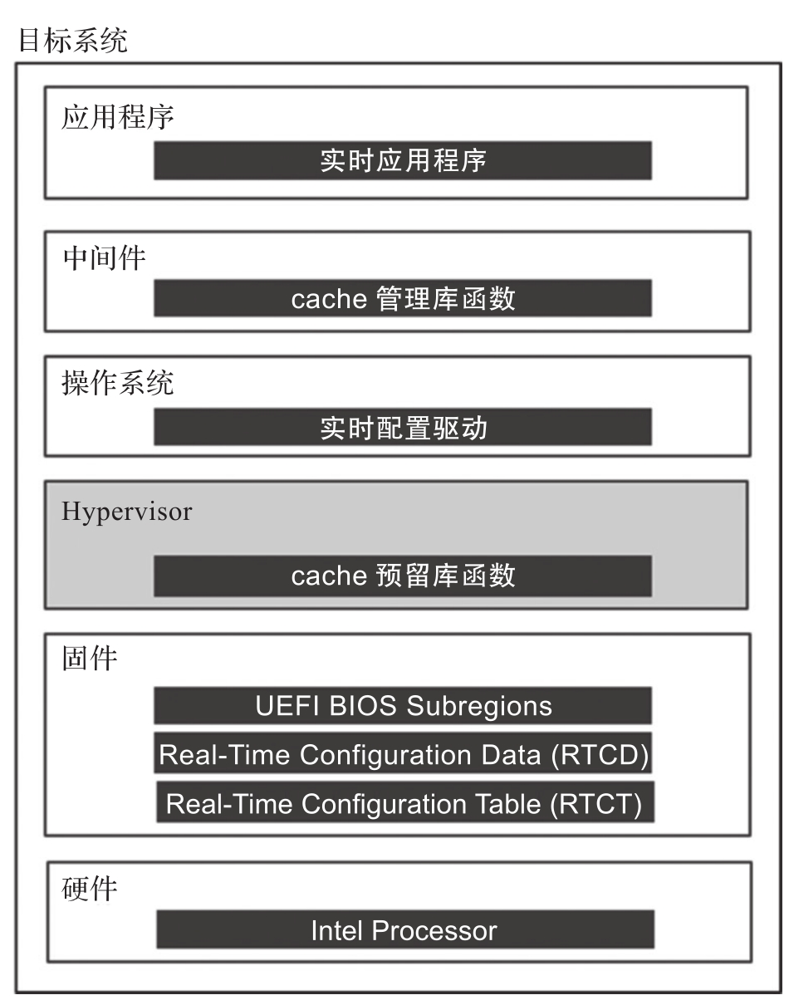
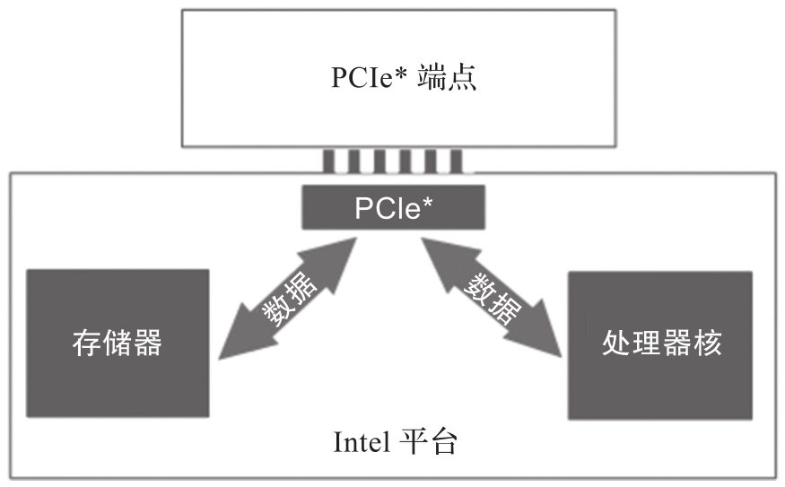

嵌入式系统的实时性能优化会涉及很多方面, 从硬件到固件, 从操作系统到应用程序, 都会直接影响嵌入式系统的整体实时性能. 对嵌入式系统进行实时性能调优, 可以遵循从外向内, 从宏观到微观的思路, 先从对性能瓶颈影响最大的系统软件开始, 再深入到微观的硬件总线设计. 不同层级的调优工作带来的收益效果也不一样. 系统软件的调优对实时性的支持和优化带来的效果最大, 比如采用实时操作系统把 CPU 核分为实时核和非实时核分别运行不同优先级的任务, 这些工作都可以带来实时性能的显著提升; 其次是功耗管理的调优, 如 CPU 的主频管理; 然后用 Intel TCC(Time Coordinated Computing, 时序协调运算)工具进行调优; 再进一步微调就是硬件总线级别的调优. 按照这样的工作顺序进行调优工作, 可以事半功倍, 获得收益的最大化, 如图 7-24 所示.

> Intel TCC 工具: https://www.intel.com/content/www/us/en/developer/tools/time-coordinated-computing-tools/overview.html

Intel TCC 对应的调优层次:

Intel TCC 是 Intel 开发的用来支持优化实时计算性能的软硬件技术. 它包含硬件的支持, BIOS 设置, 操作系统内核驱动层和库函数的支持, 另外提供了一套工具用于采样和调优, 及实例代码供开发人员参考.

TCC 工具可以根据需要的时延来进行性能优化, 可以综合利用硬件和软件的能力来减少实时任务的最大时延或者最差执行时间.

从硬件角度看, 支持 TCC 的 Intel 平台 BIOS 层会有 TCC 的相关配置. 如图 7-25 所示, TCC 相关配置里面包含了很多与实时相关的配置项, 例如 IO,CLOS 等.

除 BIOS 配置之外, Intel TCC 还包含两个主要功能: 其一是软件 SRAM(即 SSRAM)​, 如前文所述, 它是把部分高速缓存映射到内存地址空间, 用作系统 RAM 的一种机制; 另一个是 DSO(Data Stream Optimizer, 数据流优化器)​, 用来优化数据流的功能. 下面分别进行简单的介绍.

软件 SRAM 是 TCC 上支持的一个重要功能. 它把部分高速缓存映射到内存地址空间, 应用层的实时任务程序可以把其运行需要的关键数据放到软件 SRAM 里, 这样可以有效避免实时任务程序访问这部分数据的缓存未命中情况, 从而提供可预测的较短的访问时间.

为了实现软件 SRAM 功能, TCC 需要对全栈进行优化支持, 如图 7-26 所示.

* 从 BIOS 预留配置的高速缓存信息映射的物理地址空间信息都会保留在 ACPI 表, 即实时配置表 (Real-Time Configuration Table,RTCT) 中, 供上层 RTVM 配置使用.

* 操作系统层实现了支持软件 SRAM 功能的驱动模块.

* 在中间件层, TCC 提供了一套 API 函数接口供上层应用程序操作软件 SRAM. 它是类似于 C 语言的库函数, 例如以分配函数 (malloc) 和释放函数 (free) 方式来使用.

TCC 的另一个重要功能是用来优化数据流, 图 7-27 所示是把 PCI 设备的数据写入内存, 或者 CPU 访问 PCI 设备的数据.

在实时环境下, 需要尽量避免总线上的竞争, 从而获得时间的确定性. 这部分和 ACRN 虚拟化没有直接关系, 因此这里不再单独介绍.

Intel TCC 是一套完整的用于实时性优化的工具, ACRN 已经提供了很好的支持.
