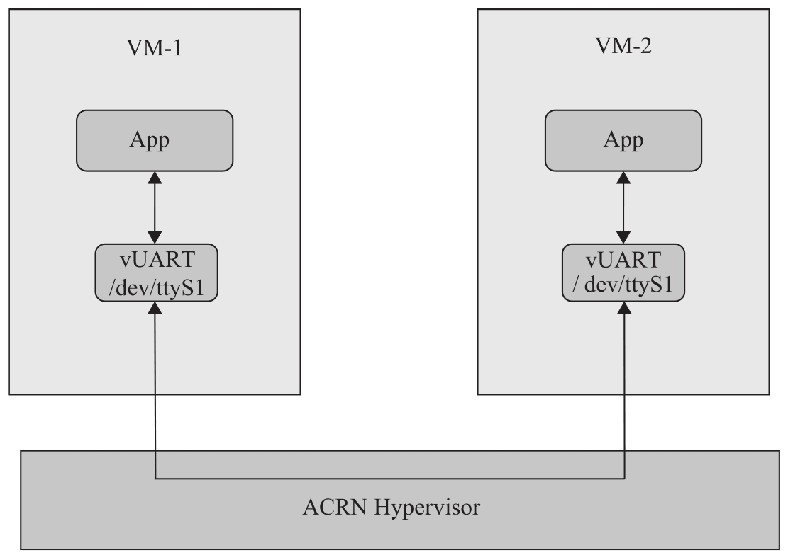

虚拟机间的通信可以有多种方式. 这里以 ACRN 为例进行介绍, ACRN 支持的通信方式通常有三种: 网络套接字, 虚拟串口和共享内存通信.

* 网络套接字的方式基于以太网接口的实现. 每个 VM 都可以配置独立的虚拟网卡和 IP 地址. VM 之间的通信基于 TCP/IP, 用 UDP 或者 TCP 的方式来通信即可.

* 基于虚拟串口的通信. ACRN 在自己的 Hypervisor 层实现了对虚拟串口的支持, 通过配置工具可以对 VM 进行虚拟串口之间的点对点通信. 不过通过串口的通信方式只适用于对带宽要求不高的场景, 如图 7-28 所示.

* 基于共享内存的通信则支持 VM 之间大数据的高速通信. Ivshmem 是 ACRN 采用的共享内存通信, 它的具体实现可以参考前面章节的介绍.

ACRN 虚拟机基于虚拟串口的通信:

对于 RTVM 中运行实时任务的 CPU 核, 不建议用它运行通信程序和其他 VM 进行通信, 可以由非实时的 CPU 核来负责进行 VM 间通信.

虚拟机之间的通信如果对实时性有要求, 则还需要对整个路径进行调优. 虚拟机之间的通信时延要求需要根据用户场景来具体确定, 比如, 即时通信需要两个 VM 的操作系统都是实时操作系统.