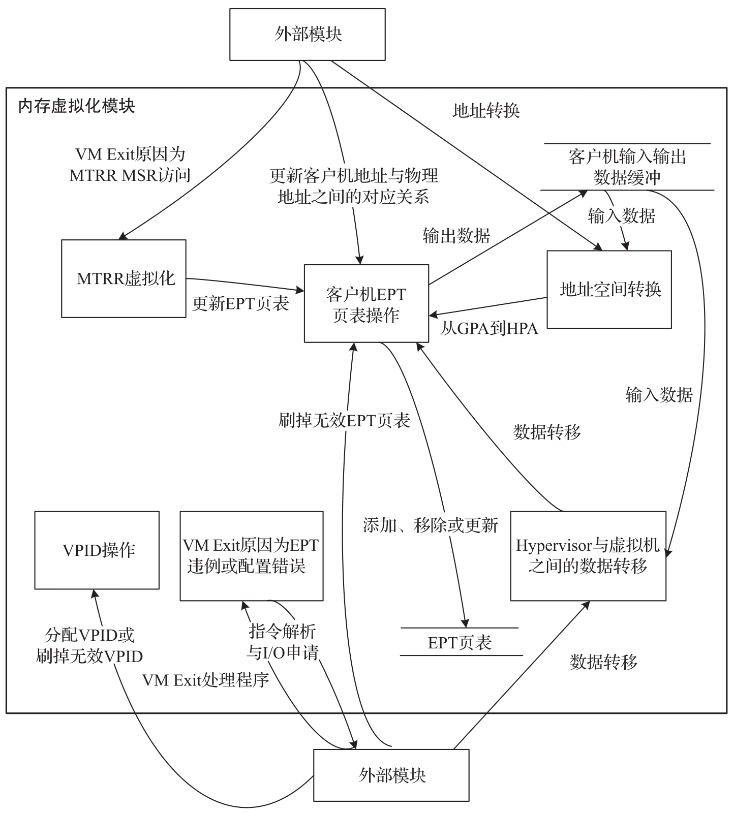

ACRN Hypervisor 为服务虚拟机和每个用户虚拟机提供一个连续的物理内存区域. ACRN Hypervisor 也保证了服务虚拟机和用户虚拟机不能访问 Hypervisor 的代码和内部数据. 同时, 每个用户虚拟机都不能访问服务虚拟机和其他用户虚拟机的代码和内部数据.

ACRN Hypervisor 会:

* 启用 EPT 和 VPID 硬件虚拟化功能.

* 为服务虚拟机和用户虚拟机建立 EPT 页表.

* 提供 EPT 页表操作服务.

* 为服务虚拟机和用户虚拟机虚拟化 MTRR.

* 提供 VPID 操作服务.

* 为 GPA 和 HPA 之间的地址空间转换提供服务.

* 为 Hypervisor 和虚拟机之间的数据传输提供服务.

# 内存虚拟化功能检查

在 ACRN Hypervisor 中, 内存虚拟化提供 EPT/VPID 的支持检查和 EPT 大页的支持检查. 在 ACRN Hypervisor 使能内存虚拟化和使用 EPT 大页之前, 需要首先检测是否支持这些功能.

# 不同地址空间之间的数据传输

在 ACRN Hypervisor 中, 为了实现空间隔离, Hypervisor, 服务虚拟机和用户虚拟机使用不同的内存空间管理. 在内存空间之间存在不同类型的数据传输, 例如, 服务虚拟机可以通过 Hypercall 请求 Hypervisor 来提供数据传输服务, 或者, 当 Hypervisor 进行指令模拟时, Hypervisor 需要访问 Guest 的 RIP 来获取 Guest 指令数据.

* 从 Hypervisor 访问 GPA(copy_from_gpa). 当 Hypervisor 需要访问 GPA 进行数据传输时, 来自 Guest 的调用者必须确保此内存范围的 GPA 是连续的. 但是对于 Hypervisor 中的 HPA, 它可能是不连续的(尤其是对于 Hugetlb 分配机制下的用户虚拟机)​. 例如, 4MB GPA 范围可能映射到两个不同的 Host 物理页面. ACRN Hypervisor 必须基于其 HPA 进行 EPT 页表遍历来处理这种数据传输.

* 从 Hypervisor 访问 GVA(copy_gva). 当 Hypervisor 需要访问 GVA 进行数据传输时, GPA 和 HPA 可能都是地址不连续的. ACRN Hypervisor 必须特别注意这种类型的数据传输, 并基于其 GPA 和 HPA 进行页表遍历来进行处理.

# EPT 页表操作

ACRN Hypervisor 使用最少的内存页从客户机物理地址 (GPA) 空间映射到宿主机物理地址 (HPA) 空间.

* 如果 1GB 的大页可以用于 GPA 空间映射, 则需要为这个 1GB 的大页设置对应的 EPT PDPT 表项.

* 如果 1GB 的大页不能用于 GPA 空间映射, 但是 2MB 的大页可以被使用, 则需要为这个 2MB 的大页设置对应的 EPT PDT 表项.

* 如果 1GB 的大页和 2MB 的大页都不能用于 GPA 空间映射, 则需要设置相应的 EPT PT 表项.

ACRN Hypervisor 为 Guest 提供地址映射添加 (ept_add_mr), 修改(ept_modify_mr), 删除(ept_del_mr) 服务.

# 虚拟 MTRR

ACRN Hypervisor 只虚拟化固定范围 (0～1MB) 的 MTRR.

* 对于用户虚拟机来说, Hypervisor 将固定范围的 MTRR 设置为 Write-Back 类型.

* 对于服务虚拟机来说, 它将直接读取由 BIOS 设置的物理的 MTRR(固定范围)​.

如果客户机物理地址在固定范围 (0～1MB) 内, ACRN Hypervisor 根据上述固定的虚拟 MTRR 设置内存类型.

如果客户机物理地址不在固定范围 (0～1MB) 内, ACRN Hypervisor 将 MTRR 设置为默认类型(Write-Back).

当 Guest 禁用 MTRR 时, ACRN Hypervisor 将 Guest 地址内存类型设置为 UC.

当 Guest 启用 MTRR 时, ACRN Hypervisor 首先通过 VM Exit 截获 Guest 对于 MTRR MSR 的访问, 并根据 MTRR 选择的内存类型更新 EPT 中的内存类型字段. 然后与 PAT MSR 相结合, 以确定最终有效的内存类型.

# VPID 操作

虚拟处理器标识符 (VPID) 是一种用于优化 TLB 管理的硬件功能. 通过在硬件上为每个 TLB 项增加一个标志, 来标识不同的虚拟处理器地址空间, 从而区分 Hypervisor 以及不同虚拟机的不同虚拟处理器的 TLB. 换而言之, 硬件具备区分不同的 TLB 项属于不同的虚拟处理器地址空间 (对应于不同的虚拟处理器) 的能力. 这样, 硬件可以避免在每次 VM Entry 和 VM Exit 时, 使全部 TLB 失效, 提高了 VM 切换的效率. 由于这些继续存在的 TLB 项, 硬件也避免了 VM 切换之后的一些不必要的页表遍历, 减少了内存访问, 提高了 Hypervisor 以及虚拟机的运行速度.

在 ACRN Hypervisor 中, 创建 vCPU 时为每个 vCPU 分配唯一的 VPID. 当逻辑处理器启动 vCPU 时, 逻辑处理器会刷掉与所有 VPID(除 VPID 0000H 外)及 PCID 相关联的线性映射和组合映射. 当中断挂起请求的处理需要刷掉指定 VPID 的缓存映射时, 逻辑处理器会刷掉与其相关联的线性映射和组合映射.

# 数据流设计

ACRN Hypervisor 内存虚拟化单元支持地址空间转换功能, 数据传输功能, VM EPT 操作功能, VPID 操作功能, 由 EPT 违例和 EPT 错误配置引起的 VM Exit 处理以及 MTRR 虚拟化功能. 该单元通过创建或更新相关的 EPT 页表来处理地址映射, 通过更新相关的 EPT 页表来虚拟化 Guest VM 的 MTRR, 通过遍历 EPT 页表来处理从 GPA 到 HPA 的地址转换, 通过遍历访客 MMU 页表和 EPT 页表将数据从 VM 复制到 HV 或从 HV 复制到 VM. 它为每个 vCPU 分配 VPID. 图 4-18 描述了 ACRN Hypervisor 内存虚拟化单元的数据流图.

