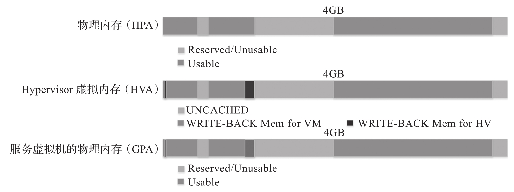

ACRN Hypervisor 启动后, 它会创建服务虚拟机作为其第一个 VM. 服务虚拟机运行自身的设备驱动程序, 管理硬件设备, 并为用户虚拟机提供 I/O 服务. 服务虚拟机也负责为用户虚拟机分配内存, 它可以访问除 Hypervisor 部分之外的所有系统内存.

# Guest 内存布局 (E820 表)

ACRN Hypervisor 过滤掉自己的部分后, 将原始的 E820 表传递给服务虚拟机. 因此, 从服务虚拟机的角度几乎可以看到所有系统内存, 如图 4-19 所示.

服务虚拟机物理内存布局:

# Host 到 Guest 映射

ACRN Hypervisor 在创建服务虚拟机时通过函数 prepare_sos_vm_memmap 创建服务虚拟机的 GPA 到 HPA 的映射, 并遵循以下规则.

* 一对一的映射 (HPA 与 GPA 相同)​.

* 开始使用 UNCACHED 类型映射所有内存范围.

* 之后使用 WRITE-BACK 类型重新映射修改过的 E820 表中的 RAM 类别, 取消映射 ACRN Hypervisor 内存范围, 取消映射所有平台 EPC 资源, 取消映射 ACRN Hypervisor 模拟的 vLAPIC/vIOAPIC MMIO 范围.

对于服务虚拟机, GPA 到 HPA 的映射是静态的; 服务虚拟机可以更改 PCI 设备 BAR 的地址映射, 除此之外的映射在服务虚拟机开始运行后都不会改变. EPT 违例用于 vLAPIC/vIOAPIC 模拟或者 PCI MSI-X table BAR 的模拟.

