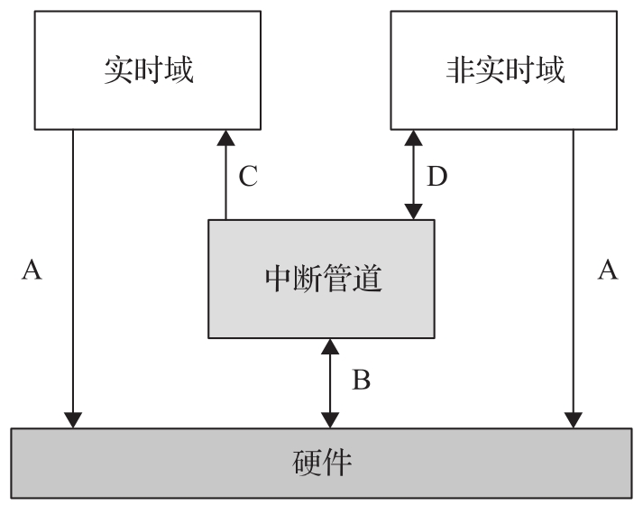
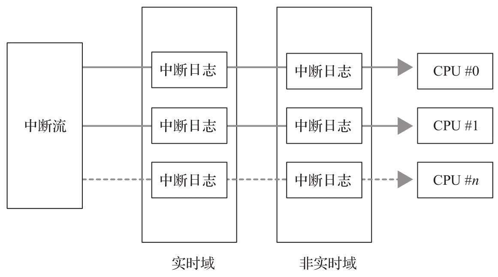

Xenomai 的核心思想是为操作系统提供一个灵活的, 可扩展的自适应环境. 在这个环境下, 实时操作系统和非实时操作系统可以共存, 共享硬件资源. Xenomai 是在已有的 Linux 操作系统底层插入一个软件层, 通过该软件层向上层的实时内核和非实时内核提供某些原语和机制而实现硬件共享.

Xenomai 实现的功能主要包括中断管道 (Interrupt Pipeline) 机制, 域管理模块, Cobalt 等. 其中 Cobalt 又可以分成内核态部分和用户态部分. Xenomai 正是通过这些功能实现硬实时特性的.

# 实时域和非实时域的管理

Xenomai 允许实时域和非实时域同时存在于同一台机器上. 这两个域分别对应 Xenomai 域和 Linux 域, 它们都是完整的操作系统. 但是, 根据系统范围内的优先级, 这两个域都对处理外部事件 (例如中断) 或内部事件 (例如陷阱, 异常) 进行竞争, 并且实时域的优先级始终高于非实时域.

在基于 Xenomai 的系统中, 两个操作系统都在独立的域内运行, 每个域可以有独立的地址空间和类似于进程, 虚拟内存等的软件抽象层, 而且这些资源也可以由不同的域共享. 在基于 Xenomai 的系统中存在四种类型的交互, 如图 8-1 所示

参考 Adeos 架构: https://www.opersys.com/ftp/pub/Adeos/adeos.pdf

* A 类交互是各个域对硬件的直接操作. 在这种情况下, 对内存的访问和对硬件的设置就如 Xenomai 的中断管道不存在一样.

* B 类交互是双向的, 一方面 Xenomai 的中断管道接收硬件产生的中断和异常, 另一方面, Xenomai 的中断管道也直接控制硬件.

* C 类交互, 是指当 Xenomai 的中断管道接收到硬件中断后, 会执行相应域的中断服务程序.

* D 类交互, 是指当域内的操作系统知道有 Xenomai 存在的时候, 它可以主动通过中断管道向 Xenomai 请求某些服务, 例如, 请求共享其他域中的资源, 请求授权域优先级等. 通过 D 类交互, 可以实现各个域之间的通信.

# 中断管道

对于一个计算机系统来说, 系统对内部或外部事件的响应是由内部或外部的中断或异常所触发的. 例如, 系统时钟中断对操作系统来说是最重要的, 操作系统没有了系统时钟中断, 就好像人没有了心跳. 如果想要控制操作系统的运行, 最直接的方法就是接管操作系统的中断处理机制. Xenomai 的主要工作之一就是管理硬件的中断, 根据域的优先级依次执行相应域的中断服务程序, 从而驱动域内的系统运行; 同时, Xenomai 还提供域之间的通信机制, 实现域的调度等. 为了实现对中断的管理和域之间的优先级控制, Xenomai 使用了中断管道的概念, 如图 8-2 所示.

Xenomai 通过中断管道在不同的域之间传递中断, 而且提供了相应的机制以让域改变自己在中断管道中的优先级, 实时域的优先级始终大于非实时域的优先级.

通常, 操作系统对中断的处理方式有两种: 允许中断和禁止中断. 但在基于 Xenomai 的系统中, 由于存在中断管道, 域内的操作系统对中断的处理方式还有另外两种: 抛弃中断和终止中断.

* 如果某个域允许中断, 则中断产生后, Xenomai 会调用相应域的中断处理程序, 这与不存在 Xenomai 的情况是类似的, 只不过在这种情况下, 中断服务程序首先由中断管道负责调用.

* 如果某个域禁止中断(实际上并没有真正禁止硬件中断, 只是设置了一个软件标志)​, 则硬件中断沿着中断管道进一步向下传播.

* 如果某个域抛弃某个硬件中断, 则当中断传播到这个域的时候, 中断管道不做任何的处理, 直接将这个中断沿着中断管道向后面的低优先级的域传播.

* 如果某个域终止某个中断, 则当中断传播到这个域的时候, 中断管道根据这个域的设置处理完这个中断之后, 不再将这个中断沿着中断管道向后传播, 也就是说, 后面低优先级的域将不知道有这个硬件中断的产生.

所以, Xenomai 通过控制系统的中断实现对各个域内操作系统的控制, 这是它实现硬实时功能中最重要的一环.

# Cobalt 实时内核和用户态 libcobalt

Cobalt 分为用户态和内核态两部分, 是 Xenomai 中除了中断管道外, 作为实时操作系统的最重要的两个部分. 内核态 Cobalt 就是我们通常所说的 Cobalt 内核. Xenomai 的 Cobalt 内核提供了一般实时操作系统内核该有的功能, 包含调度, 定时器, 同步, 线程, 锁等负责实时任务的执行.

* 通用的调度优先级机制: 保证 Xenomai 线程在所有现有的线程中按其优先级正确执行, 并提供一种方法让实时内核和 Linux 内核共享相同的优先级方案.

* 程序执行时间的可预测性: 当 Xenomai 线程在实时域上运行时, 无论是内核还是应用程序代码, 其时序都不应受非实时 Linux 中断活动的干扰.

* 优先倒置管理: Xenomai 实时内核和非实时 Linux 内核都应该处理高优先级线程不能运行的情况, 因为低优先级线程在可能无限制的时间内保存竞争资源, 这就需要优先级倒置管理.

* 实时驱动框架模型: 驱动方面, Xenomai 提供实时驱动框架模型(Real-Time Driver Model,RTDM), 专门用于 Cobalt 内核. 利用它, 可以基于 RTDM 进行实时设备驱动开发, 为实时应用提供实时驱动. RTDM 将驱动分为两类: 字符设备和协议设备.

* Xenomai 内存池管理: 无论是 Xenomai 还是 Linux, 在服务或管理应用程序过程中经常需要内存分配, 通常 Linux 内存的分配与释放都是时间不确定的, 例如, 缺页异常和页面换出会导致大且不可预测的延迟, 不适用于受严格时间限制的实时应用程序. Xenomai 作为硬实时内核, 不能使用 Linux 这样的内存分配释放接口, 为此 Xenomai 采取的措施是, 初始化从 Linux 分到一片内存后, 这片内存由 Xenomai 自己来管理.

* 事件管道: 系统中除了传入的外部中断, 自动生成的虚拟中断或 Linux 应用程序发出的每个系统调用之外, 还有内核代码触发的其他系统事件(例如 Linux 任务切换, 信号通知, Linux 任务退出等)​.Xenomai 还实现了这些系统事件的管道机制, 使这些事件能够及时和可预测地传递给实时内核.

另外, Xenomai 还提供针对实时应用优化的库 libcobalt, 这是 Cobalt 用户态部分. libcobalt 提供可移植操作系统接口 (Portable Operating System Interface,POSIX) 给应用空间的实时任务使用, 用户态的实时应用通过使用 libcobalt 使实时内核 Cobalt 为其提供各种服务.

