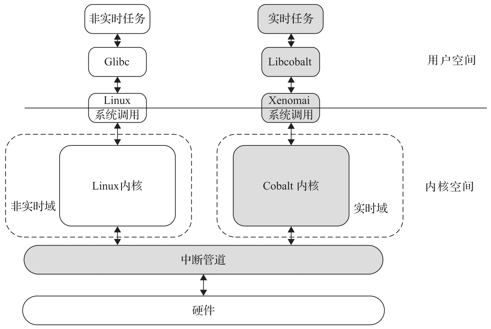

Xenomai 3.1 是目前维护的其中一个大版本, 这里着重介绍 Xenomai 3.1 的架构.

Xenomai 3 是支持实时框架的版本, 可以像 Xenomai 2 一样与普通 Linux 一起实现双内核架构, 和 Linux 内核并行运行, 也可以不需要 Cobalt 内核只在主线 Linux 内核上运行. 在后一种情况下, 可以通过 PREEMPT_RT 补丁集来提高主线内核的实时性, 以达到比标准内核更严格的响应时间要求. 下面主要介绍 Xenomai 双内核配置方式.

双内核方式是通过运行一个实时的 Cobalt 核且和 Linux 内核并行运行实现的. Cobalt 的实时扩展代码通过安装后就内植于 Linux 内核代码树中, 它会和 Linux 代码一起编译, 并生成统一的 Linux 镜像文件. 该镜像文件的烧录和运行等使用方法与普通 Linux 镜像文件没有什么区别. Cobalt 内核运行在实时域上, Cobalt 内核任务比非实时 Linux 内核任务具有更高的优先级. Xenomai 3 的系统结构如图 8-3 所示.

Xenomai 3 系统结构:

Xenomai 实现的可预测的中断延迟, 精确的中断控制 (每个域和每个中断处理程序注册, 每个域和每个 CPU 中断屏蔽)​, 根据域的优先级且双内核统一的事件传播方案, Cobalt 的实时调度和内存管理等设计, 使 Xenomai 可在最短的微秒延迟范围内提供真正的实时性能.
