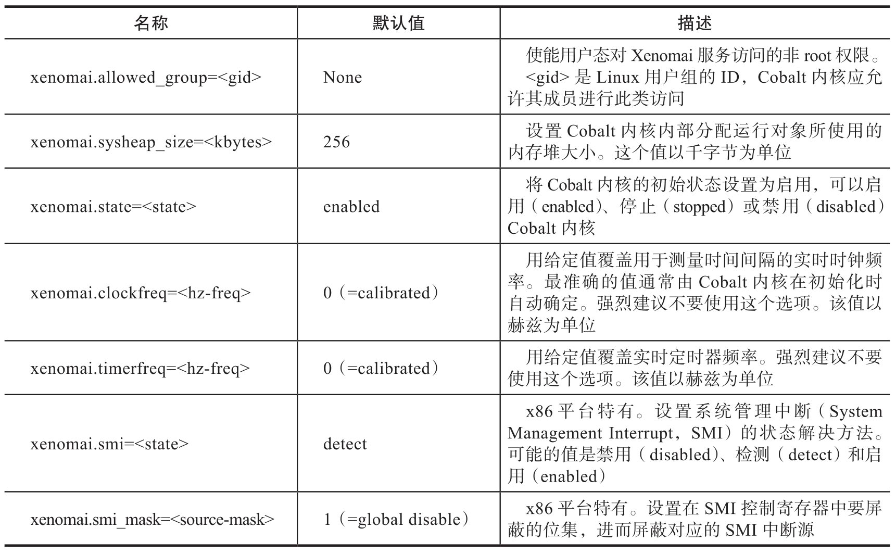
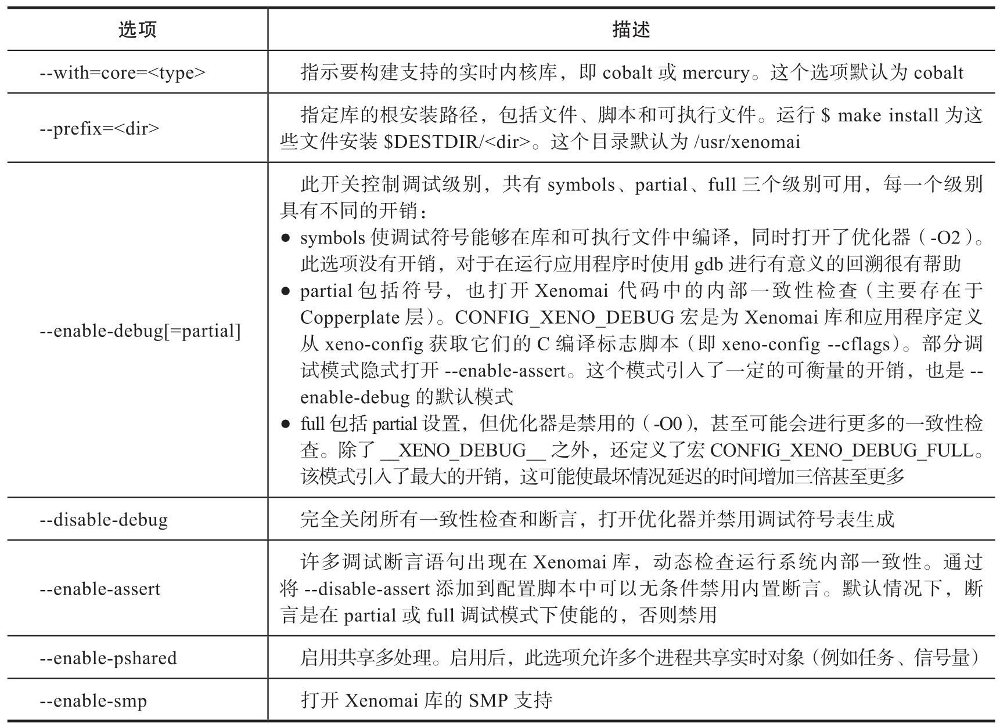
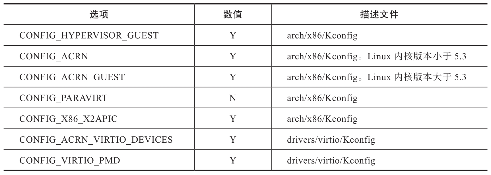
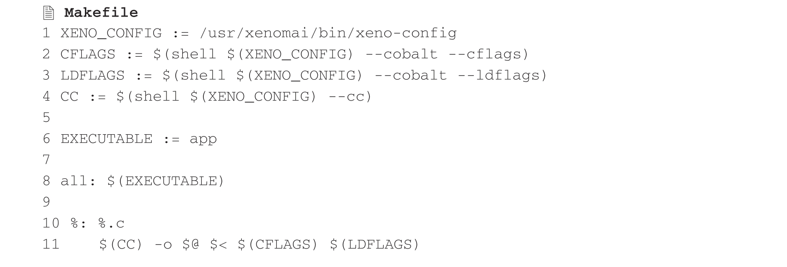

Xenomai 及其应用程序的编译和安装

# 1. Xenomai v3.1 编译和安装

本章主要介绍如何构建和安装 Xenomai 内核, 库和工具集.

Xenomai 解耦了内核空间和用户空间库. 内核空间和用户空间的 Xenomai 组件分别在源码的 kernel 和 lib 子目录下. 其他根目录, 例如 scripts,testsuite 和 utils, 提供了用于编译主机或者目标机上使用的其他脚本和程序.

实现核内支持代码的 kernel 子目录被视为 Linux 内核的内置扩展, 因此应该使用标准的 Linux 内核配置过程来定义 Xenomai 内核组件的各种设置. Xenomai 当前引入的内核代码实现了 Cobalt 内核 (即双内核配置)​.Mercury 内核 (即单内核配置) 在内核空间中不需要 Xenomai 特定的代码. Mercury 内核的内容不是本书的重点, 我们这里不做深入介绍.

lib 子目录包含各种用户空间库. 这些库是由 Xenomai 框架导出到应用程序的. 这个子目录的创建与内核是分开的. 它支持选定的内核配置: Cobalt 或 Mercury.

## 1.1. 安装 Cobalt 内核

### 1.1.1. 准备 Cobalt 内核

Xenomai/Cobalt 提供一个可以无缝集成到 Linux 的实时扩展内核, 因此第一步是将其构建为目标内核的一部分. scripts/prepare-kernel.sh 是一个正确设置目标内核的 shell 脚本, 语法如下:


* --linux: 指定目标内核源代码树的路径. 该路径默认为 $PWD.

* --ipipe: 指定要应用于内核树的中断管道 (I-pipe) 补丁的路径. 如果 I-pipe 已经被打上补丁, 这个参数可以省略, 或者脚本会建议一个合适的. 该脚本将检测 I-pipe 代码是否已经存在于内核树中, 如果存在则跳过此操作.

* --arch: 告诉脚本有关目标架构的信息. 如果未指定, 则将构建主机架构作为默认值.

注意: 该脚本将根据其在 Xenomai 源代码树中的位置推断 Xenomai 内核代码的位置. 例如, 如果～/xenomai-3/scripts/prepare-kernel.sh 正在执行, 那么～/xenomai-3/kernel/cobalt 中可用的 Xenomai 内核代码将被补丁到在目标 Linux 内核中.

### 1.1.2. 配置和编译 Cobalt 内核

准备好后可以照常配置目标内核. Xenomai 配置选项可从 Kconfig 顶级菜单 "Xenomai" 获得. 有几个重要的内核配置选项应该禁用:

* CONFIG_CPU_FREQ

* CONFIG_CPU_IDLE

* CONFIG_KGDB

* CONFIG_CONTEXT_TRACKING_FORCE

一旦配置好, 就可以像往常一样编译内核. 如果想要几个不同的配置 / 构建, 可以通过将 O=../build-<target > 添加到每个 make 来获得相同的源调用. 为了交叉编译 Linux 内核, 可以在 make 命令行上传递一个 ARCH 和 CROSS_COMPILE 变量.

Cobalt 内核接受参数集如下表所示, 由引导加载程序在内核启动命令行上进行传递.



### 1.1.3. 构建 Cobalt/x86 内核的例子

为 x86 构建 Xenomai/Cobalt 内核的过程对于 32 位平台和 64 位平台几乎完全一样. 但应该注意的是, 在为 x86_64 编译的内核上无法运行为 x86_32 编译的 Xenomai 库, 反之亦然. 假设要为 x86_64 系统 (x86_64 的 x86_32 交叉构建选项出现在括号之间) 构建, 首先配置内核通常运行:


其中示例使用以下约定:

* $linux_tree: 目标内核源的路径.

* $xenomai_root: 通往 Xenomai 源的路径.

在配置内核使能 Xenomai 选项后, 创建需要运行:

```
make [ARCH=i386] bzImage modules
```

(1) x86_32 系统

假设需要为某个项目构建基于奔腾的 x86 的 32 位平台的 Xenomai, 创建的典型配置内核步骤如下:


使能 Xenomai 选项后, 创建需要运行:

```
make bzImage modules
```

(2) x86_64 系统

同样, 要专门针对 x86 的 64 位平台, 使用:


配置内核, 使能 Xenomai 选项, 然后创建需要运行:

```
make bzImage modules
```

## 1.2. 安装 Xenomai 库和工具集

### 1.2.1. 前提条件

(1) 一般要求

GCC 必须支持传统的原子内置函数 (__sync 形式)​. 尽管 GCC 对使用 --disable-tls 构建并不是强制性的, 但是最好对 TLS 有健全和有效的支持.

如果打算启用用户空间注册表支持 (即 --enable-registry)​, 则运行实时应用程序的目标内核必须启用 CONFIG_FUSE_FS. 此外, FUSE 开发库必须在工具链中可用. 如果打算从 Xenomai GIT 树的可用资源进行构建, autoconf(≥2.62),automake 和 libtool 包必须可用. 如果是从发布的 tarball 解压然后再构建, 则这个步骤是不需要的.

(2) Cobalt 的特定要求

内核版本必须是 3.10 或更高. 中断管道 (I-pipe) 补丁必须可用于目标内核. 在 x86_32 上运行需要时间戳计数器 (TSC) 硬件. 使用 PIT 的 TSC 仿真寄存器是不可用的.

### 1.2.2. 配置

如果构建从 Xenomai GIT 树获得的源代码, 配置脚本和 Makefiles 必须在 Xenomai 源代码树中生成. 推荐的方法是运行自动重配脚本:

```cpp
./scripts/bootstrap
```

如果从发布的 tarball 构建, 不需要重新配置.

运行时, 生成的 configure 脚本用来准备构建库和程序. 表 A-2 列出的选项可以传递给这个脚本.



更多的可用选项可以通过 --help 查阅.

### 1.2.3. 交叉编译

为了交叉编译 Xenomai 库和程序, 需要将 --host 和 --build 选项传递给配置脚本.--host 选项允许选择构建库和程序的架构.--build 选项允许选择运行编译工具的架构, 即运行配置脚本的系统.

由于交叉编译需要特定的工具, 因此这些工具通常以主机架构名称为前缀; 例如, 一个 PowerPC 架构的编译器可以被命名为 powerpc-linux-gcc.

传递 --host=powerpc-linux 进行配置时, 会自动使用 powerpc-linux - 作为所有编译工具名称的前缀并由此推断主机架构名称字首. 如果 configure 无法从交叉编译工具前缀推断架构名称, 必须至少使用 CC 和 LD 去手动用配置命令行上的变量传递所有编译工具的名称.

构建 GNU 交叉编译器的最简单方法可能涉及使用 crosstool-ng.

如果想避免构建自己的交叉编译器, 可以使用更容易的嵌入式 Linux 开发工具套件 (Embedded Linux Development Kit). 它包括 GNU 交叉开发工具, 例如编译器, binutils,gdb 等, 以及一些目标所需的预构建目标工具和库系统. 也可以考虑使用其他一些预构建的工具链: Mentor Sourcery CodeBench 精简版, Linaro 工具链 (用于 Arm 架构) 等.

如下是构建 Xenomai x86(32/64 位) 库和工具的示例.

假设想使用 x86_64 交叉构建与 Cobalt 库相同的功能集, 用于在 x86_32 上运行:


其中示例使用以下约定:

* $xenomai_root: Xenomai 源的路径.

* $build_root: 构建目录的路径.

* $staging_dir: 暂时保存已安装文件的目录的路径.

安装后 (即使用 make install)​, 安装根目录应填充库, 程序和头文件, 该目录可用于构建基于 Xenomai 的实时应用程序. 此目录路径默认为 / usr/xenomai.

## 1.3. 安装测试

### 1.3.1. 启动 Cobalt 内核

为了测试 Xenomai Cobalt 内核安装, 应该首先尝试引导打过补丁的内核. 检查内核引导日志消息及输出结果如下所示.


### 1.3.2. 测试实时系统

首先, 运行延迟测试:

```
/usr/xenomai/bin/latency
```

latency 测试程序应该每秒显示一条消息, 包括最小, 最大和平均延迟值.

如果延迟测试成功, 应该尝试下一步运行 xeno-test 测试以评估系统最坏情况下的延迟:

```
xeno-test -help
```

### 1.3.3. 校准 Cobalt 核心计时器

Cobalt 计时服务的准确性取决于是否正确地校准其内核定时器. 合理的出厂默认校准值是为 Xenomai 支持的每个平台定义的, 但还是建议专门为目标机校准内核计时器系统. 可能使用 autotune 应用程序完成.

## 1.4. 运行 Xenomai 作为 ACRN 的客户虚拟机

要运行 Xenomai 作为 ACRN 客户虚拟机 (Real-Time VM), 需要针对性地配置 Xenomai 目标内核. 表 A-3 列出了 x86_64 架构 Linux 几个重要的内核配置选项.



其中 CONFIG_PARAVIRT 与 CONFIG_IPIPE 即中断管理通道代码冲突, 所以不能使能. 在 Linux 4 版本内核代码 arch/x86/acrn/Kconfig 中也要去掉 CONFIG_ACRN 对 CONFIG_PARAVIRT 的依赖关系.

此外由于设计上 ACRN Real-Time VM 没有 IOAPIC/PIC,SCI/GL 处理程序初始化失败, 进而禁用 ACPI, 最终导致 Real-Time VM 关机时故障. 所以修改 acpi_bus_init() 中的示例代码如下:

```cpp
// drivers/acpi/bus.c
#if defined(CONFIG_ACRN_GUEST) && \
    (defined(CONFIG_PREEMPT_RT) || defined(CONFIG_IPIPE))

    status = acpi_enable_subsystem(ACPI_NO_ACPI_ENABLE | \
            ACPI_NO_HARDWARE_INIT);
#else
    status = acpi_enable_subsystem(ACPI_NO_ACPI_ENABLE);
```

# 2. Xenomai 3.1 上的应用程序编译

为 Cobalt 内核构建应用程序时推荐使用 xeno-config 脚本来获取与 Xenomai 相关的正确编译参数和链接器标志 (linker flag). 可以在 Xenomai 3.1 官网 上找到 xeno-config 脚本的完整用法.

> Xenomai 3.1 官网: https://xenomai.org/documentation/xenomai-3/html/man1/xeno-config/index.html

一个简单的 Makefile 参考代码片段如下, 该片段通过 Cobalt API 检索了用于构建单文件应用程序 app.c 的编译参数和标志.



另外, 要编译基于 RTDM 的模块时, 构建常规内核模块 / 驱动程序的规则也适用于基于 RTDM 的驱动程序, 例如, 假设用于构建 some_driver.ko 的 Makefile 是基于 RTDM API 的, 该配置由两个文件 foo.c 和 bar.c 组成, 则参考代码如下:

```makefile
obj-y += some_driver.o
some_driver-y := foo.o bar.o
```

构建此模块应在包含模块源代码的目录下完成, 同时在为双内核配置构建驱动程序模块之前, 必须已准备并构建了目标内核, 如下所示:

```shell
make -C /path/to/kernel/tree M=$PWD modules
```

以上就是编译和构建 Xenomai 及其应用程序的主要内容.
