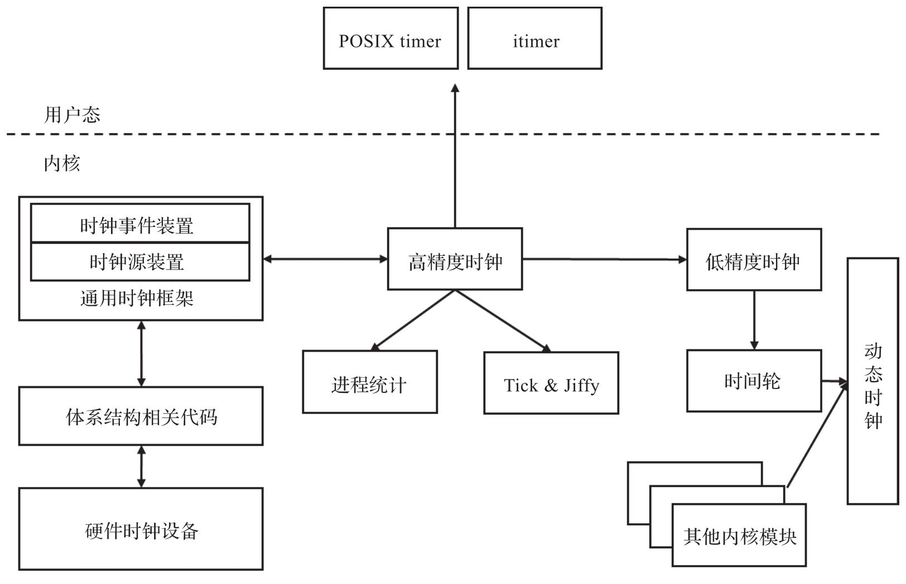
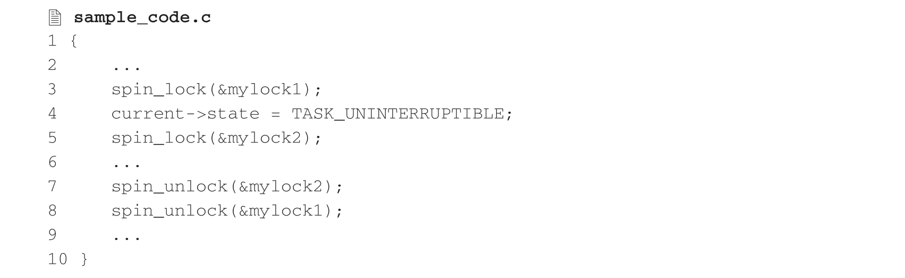
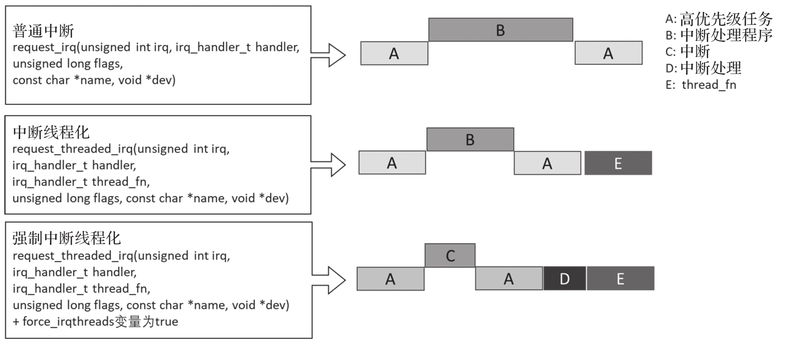
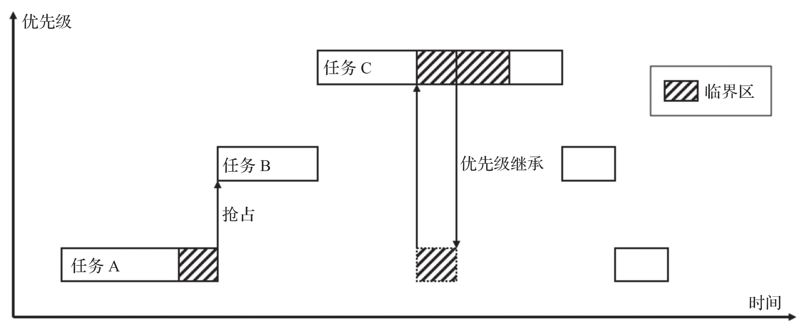

# 高精度时钟

时钟是操作系统基本事件的基准, 操作系统通过时钟来维护系统的时间更新和监控系统的运行. 内核中的大部分任务都是基于时间的, 其中有些是周期性的, 例如调度程序中的运行队列和屏幕刷新, 它们周期性地以固定频率发生. 有些是非周期性任务, 比如磁盘的 I/O 操作等. Linux 早期的系统时间中断频率在 2.4 内核版本中为 100Hz, 即每 10ms 产生一个中断, 在 2.6 内核中频率增加到每 1ms 产生一个中断. 这意味着早期的 Linux 系统提供的服务是毫秒级的, 这显然无法满足工业控制领域等高实时任务需求.

随着时钟源硬件设备精度的提高以及软件高精度计时的需求的增加, Linux 内核增加了对高精度时钟的支持, 实现了纳秒级的时钟精度, 进而为实时系统提供更细粒度的时间控制.

高分辨率计时器的使用没有特殊的要求. 在 Linux 内核中启用高分辨率计时器后, nanosleep,itimers 和 posix 计时器能提供高分辨率模式, 无须更改源代码. 对高分辨率计时器的动态优先级支持, 在实时抢占补丁中已经实现.

图 8-4 展示了 Linux 时钟系统的架构.

# 可抢占式临界区

在 PREEMPT_RT 中, 普通的自旋锁 (spinlock_t 和 rwlock_t)​,RCU 读取临界区(rcu_read_lock() 和 rcu_read_unlock())以及信号量临界区都是可抢占的, 此特性已经存在于可抢占和非抢占内核中. 这里的可抢占性意味着可以在获取自旋锁时被阻塞, 因为在 PREEMPT_RT 中, 自旋锁是可休眠的; 反过来也就意味着在禁用抢占或中断的情况下获取自旋锁是非法的 (这个原则的一个例外就是变体_trylock, 只要不是在密集循环中重复调用)​. 这也意味着当使用 spinlock_t 的时候 spin_lock_irqsave() 不会禁用硬件中断.

如果在禁用中断或抢占时需要获取锁, 则需要使用 raw_spinlock_t 而不是 spinlock_t. 用 raw_spinlock_t 调用 spin_lock().PREEMPT_RT 补丁包括一组宏, 这些宏使 spin_lock()像 C++ 重载函数一样. 当在 raw_spinlock_t 上调用时, 它的作用类似于传统的自旋锁; 但在 spinlock_t 上调用时, 它的临界区可以被抢占. 例如, 各种_irq 基元 (例如 spin_lock_irqsave()) 在应用于 raw_spinlock_t 时会禁用硬件中断, 但在应用于 spinlock_t 时则不会. 值得注意的是, 使用 raw_spinlock_t(及其对应的 rwlock_t,raw_rwlock_t)应该是例外, 而不是常规使用. 在一些低级区域 (例如调度程序, 特定于体系结构的代码和 RCU) 之外, 不应该需要这些原始锁.

由于临界区现在可以被抢占, 因此不能依赖给定的临界区在单个 CPU 上执行——它可能会由于被抢占而移动到不同的 CPU. 当在临界区使用 per-CPU 变量时, 必须单独处理抢占的可能性, 因为 spinlock_t 和 rwlock_t 不再完成这项工作. 处理方法包括:

* 通过使用 get_cpu_var(),preempt_disable()或禁用硬件中断, 显式禁用抢占.

* 使用 per-CPU lock 来保护 per-CPU 变量.

由于 spin_lock()现在可以休眠, 因此添加了额外的任务状态. 参考如下代码片段:

其中第二个 spin_lock()调用可以休眠, 它可以破坏 current->state 的值, 这对 blah()函数来说可能是一个相当大的意外. 在这种情况下, 新的 TASK_RUNNING_MUTEX 位用于允许调度程序保留 current->state 的先前值.

尽管以上特性生成的环境可能有点陌生, 但它允许以最少的代码更改抢占关键部分, 并允许相同的代码在 PREEMPT_RT,PREEMPT 和非 PREEMPT 配置中工作.

# 中断线程化

中断具有最高的优先级, 当有中断产生时, CPU 会暂停当前的执行流程, 转而去执行中断处理程序. 硬件中断处理过程中会关掉中断, 如果此时有其他中断产生, 那么这些中断将无法及时得到处理, 这也是导致内核延迟的一个重要原因. 另外, 中断优先级比进程高, 一旦有中断产生, 无论是普通进程还是实时进程都要给中断让路, 如果中断处理耗时过长, 则会严重影响系统的实时性. 因此内核设计的目标是将中断状态下需要执行的工作量尽量压缩到最低限度.

传统的中断处理流程由两部分处理逻辑协同完成, 上半部 (top half) 负责实际对硬件中断的响应处理, 下半部 (bottom half) 由上半部负责调度并执行额外的处理. 上半部在禁用中断的情况下执行, 因此必须尽可能地快, 从而不会给系统响应造成太大的延迟. 比如, 网卡驱动在上半部完成一些硬件设置或数据收发, 在下半部完成网络数据处理. 但是对于这种设计, 上半部的运行时长也是不确定的, 受各驱动实现的影响.

中断线程化后进一步压缩了上半部的工作量, 上半部的工作仅仅需要完成 "快速检查"​, 譬如确保中断的确来自期望的设备; 如果检查通过, 它将对硬件中断完成确认并通知内核唤醒中断处理线程以便完成中断处理的下半部.

图 8-5 展示了中断线程化对实时任务的影响.

# 可抢占式中断禁用代码序列

可抢占式中断禁用代码序列的概念在术语上似乎是矛盾的, 但重要的是要牢记 PREEMPT_RT 理念. 这种理念依赖于 Linux 内核的 SMP 功能来处理与中断处理程序的竞争. 大多数中断处理程序都在进程上下文中运行. 任何与中断处理程序交互的代码都必须准备好处理在其他 CPU 上同时运行的中断处理程序.

因此, spin_lock_irqsave()和相关原语不需要禁用抢占. 原因是, 即使中断处理程序在运行时抢占了拥有 spinlock_t 的代码, 但是在试图获取 spinlock_t 的时候也会立即阻塞, 临界区依旧会被保留.

local_irq_save()仍然禁用抢占, 因为没有相应的锁可以依赖. 可以看出使用锁而不是 local_irq_save()可以帮助减少调度延迟, 但是以这种方式替换锁会降低 SMP 性能, 所以要小心.

此外, 必须与 SA_NODELAY 中断交互的代码不能使用 local_irq_save(), 因为这不会禁用硬件中断, 应该使用 raw_local_irq_save(). 在与 SA_NODELAY 中断处理程序交互时, 需要使用原始自旋锁(raw_spinlock_t,raw_rwlock_t 和 raw_seqlock_t)​. 但是, 原始自旋锁和原始中断禁用不应该在一些低级区域之外使用, 例如调度程序, 体系结构相关的代码和 RCU.

# 内核自旋锁和信号量的优先级继承

实时程序员通常较关心优先级反转, 它可能发生在如下场景:

* 低优先级任务 A 获取资源, 例如锁.

* 中优先级任务 B 开始执行 CPU 密集型任务, 抢占低优先级任务 A.

* 高优先级任务 C 尝试获取低优先级任务 A 持有的锁, 但由于中优先级任务 B 抢占了低优先级任务 A 而阻塞.

这种优先级反转可以无限期地延迟高优先级任务. 解决这个问题主要有两种方法: 抑制抢占或者优先级继承. 在第一种情况下, 由于没有抢占, 任务 B 不能抢占任务 A, 从而防止发生优先级反转. 这种方法被 PREEMPT 内核用于自旋锁, 但不用于信号量. 抑制信号量的抢占是没有意义的, 因为在持有信号量的同时阻塞是合法的, 即使在没有抢占的情况下也可能导致优先级反转. 对于某些实时工作负载, 由于对调度延迟的影响, 即使对于自旋锁也无法抑制抢占.

在抑制抢占没有意义的情况下, 可以使用优先级继承. 这里的想法是高优先级任务暂时将其高优先级捐赠给持有关键锁的低优先级任务, 如图 8-6 所示.

这种优先级继承是传递性的: 在上面的例子中, 如果一个更高优先级的任务 D 试图获取高优先级任务 C 已经持有的第二个锁, 那么任务 C 和 A 都会被暂时提升到任务的优先级 D. 优先级提升的持续时间也受到严格限制: 一旦低优先级任务 A 释放锁, 它会立即失去其临时提升的优先级, 将锁交给任务 C(并被任务 C 抢占)​.

但是, 任务 C 可能需要一些时间才能运行, 并且另一个更高优先级的任务 E 在此期间很有可能会尝试获取锁. 如果发生这种情况, 任务 E 将 "窃取" 任务 C 的锁, 这是合法的, 因为任务 C 尚未运行, 因此实际上并未获得锁. 另一方面, 如果任务 C 在任务 E 尝试获取锁之前运行, 那么任务 E 将无法 "窃取" 锁, 而是必须等待任务 C 释放它, 这可能会提高任务 C 的优先级, 加快处理.

此外, 在某些情况下, 锁会被长时间持有. 这时可以添加 "抢占点"​, 以便在其他任务需要时, 锁持有者放弃锁. JBD 日志层包含几个这样的例子.

事实证明, 读写器优先级继承是一个难题, 因此 PREEMPT_RT 通过一次只允许一个任务读取持有读写锁或信号量来简化问题, 不过允许该任务递归地获取它. 这使得优先级继承变得可行, 尽管它会限制可伸缩性.

此外, 在某些情况下, 信号量不希望优先级继承, 例如, 当信号量被用作事件机制而不是锁时 (无法在事前知道谁将发布事件, 因此不知道要优先提升哪个任务)​. 在这种情况下可以使用 compat_semaphore 和 compat_rw_semaphore 变量. 在 compat_semaphore 和 semaphore 上使用各种信号量基元(up(),down() 和友元)​. 类似地, 可以在 compat_rw_semaphore 和 rw_semaphore 上使用读写器信号量基元 (up_read(),down_write() 和友元)​. 然而, 完成机制 (Completion Mechanism) 通常是完成这项工作的更好工具.

总而言之, 优先级继承防止了优先级反转, 允许高优先级任务及时获取锁和信号量, 即使锁和信号量被低优先级任务持有. PREEMPT_RT 的优先级继承提供传递性, 及时移除继承以及处理高优先级任务突然需要为低优先级任务指定锁的情况所需的灵活性. compat_semaphore 和 compat_rw_semaphore 声明可用于避免事件机制使用的信号量的优先级继承.

# 延期操作

由于 spin_lock()现在可以休眠, 因此在禁用抢占 (或中断) 时调用它不再合法. 在某些情况下, 通过将需要 spin_lock()的操作推迟到重新启用抢占可以解决:

* put_task_struct_delayed()将 put_task_struct()排队, 以便稍后在可以合法获取(例如)task_struct 中的 spinlock_t alloc_lock 时执行.

* mmdrop_delayed()将一个 mmdrop()排队等待稍后执行, 类似于上面的 put_task_struct_delayed().

TIF_NEED_RESCHED_DELAYED 会重新调度, 但会等到进程准备好返回用户空间, 或者直到下一个 preempt_check_resched_delayed(), 以先到者为准. 无论哪种方式, 关键是要避免不必要的抢占, 以防被唤醒的高优先级任务在当前任务失去锁之前被阻塞. 如果没有 TIF_NEED_RESCHED_DELAYED, 高优先级任务会立即抢占低优先级任务, 这只会造成快速阻塞, 等待低优先级任务持有的锁.

解决方案是将紧随 spin_unlock()之后的 wake_up()更改为 wake_up_process_sync(). 如果被唤醒的进程会抢占当前进程, 则唤醒会通过 TIF_NEED_RESCHED_DELAYED 标志延迟.

在以上所有这些情况下, 解决方案都是推迟一个动作, 直到该动作可以更安全或更方便地执行.

# 延迟减少措施

PREEMPT_RT 还有一些实现, 主要目的是减少调度或中断延迟.

以 x86 MMX/SSE 硬件为例, 该硬件在内核空间抢占关闭的情况下进行操作. 这意味着直到 MMX/SSE 指令运行完毕, 抢占才能开启. 一部分 MMX/SSE 指令对实时应用影响有限, 但有的 MMX/SSE 指令花费的时间过长, 因此 PREEMPT_RT 规避了对此类慢速指令的使用.

另一个例子是针对对称多处理系统中所有 CPU 对内存的平等访问这个特性. 共享数据需要互斥, 避免并发访问, 这意味着会产生锁定和相关的瓶颈. 即使没有锁的争用, 简单地在 CPU 之间移动缓存行也会破坏实时性能. 通过将 per-CPU 变量应用于 slab 分配器, slab 分配器维护每个 CPU 的空闲对象和 / 或页面列表, 可以实现在不锁定和排除其他 CPU 的情况下快速分配和释放资源从而减少延迟.

随着硬件性能的提高以及 PREEMPT_RT 的不断发展, PREEMPT_RT 的实时性能已经能满足越来越多的工业应用, 而其与通用 Linux 应用的高度兼容性是实现两化融合, 软件定义工业的未来的坚实助理. 充分理解 PREEMPT_RT 的实时特性, 并结合工业应用优化开发, 可以为工业软件带来长远的战略竞争优势.
