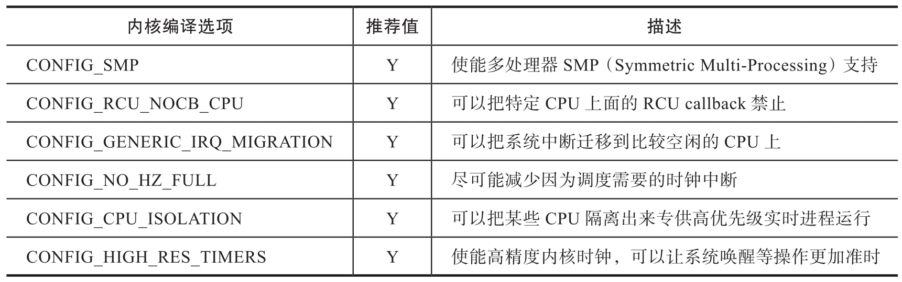
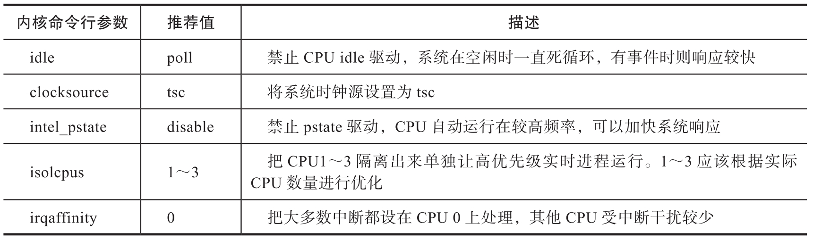

PREEMPT_RT Linux 的编译和安装

# PREEMPT_RT Linux 内核源代码

PREEMPT_RT Linux 内核与普通 Linux 内核类似, 都包含长期支持的稳定版本, 以及最新的开发版本. 比如长期稳定版本包括 v4.9-rt,v4.19-rt,v5.4-rt,v5.10-rt 等, 它们与开源社区长期支持版本 (LTS) 一一对应. 最新开发版本则随着 Linux 内核的升级而升级, 开发版本一般稍微滞后于最新 Linux 内核版本. 开发版本 PREEMPT_RT Linux 中内核在很多版本的 Linux 中都有, 比如 v4.8-rt, v4.18-rt, v5.19 rt, v6.0-rt 等.

稳定版本及开发版本的 PREEMPT_RT Linux 内核源码在不同的代码仓库中. 目前最新的稳定版本内核是 v5.15-rt, 最新的开发版本内核是 v6.1-rt. 英特尔公司也有对应增强版本的 PREEMPT_RT 稳定版本, 该增强版本包含了更好的英特尔硬件的支持, 比如 TSN 网卡以及其他英特尔最新硬件驱动等. 如果调试目标硬件是英特尔产品, 推荐使用英特尔的 PREEMPT_RT 发行版本.

用户可以根据自身需求克隆相应的 PREEMPT_RT Linux 内核代码.

# 配置 PREEMPT_RT Linux 内核

为了使 PREEMPT_RT Linux 内核发挥出最好的实时性能, 获得更短的响应时间, 用户需要根据硬件和需要支持的功能对 PREEMPT_RT Linux 内核进行配置. 内核配置包含编译安装内核前的内核选项配置, 以及内核启动时的命令行参数配置.

## 编译安装前的内核参数配置

在编译安装内核之前对 PREEMPT_RT Linux 内核进行配置, 内核选项配置与普通 Linux 内核一样, 都是对内核源代码根目录的 ".config" 文件进行配置(注意前面有个点 "."​)​. 用户可以先选择一个内核配置文件作为内核配置基础文件, 例如从 Ubuntu 的 / boot 目录下选择一个 config-<版本号>-generic.

运行 make menuconfig, 该命令会启动一个图形化内核配置选项工具. 首先在 General Setup 里找到 "Preempt Model" 选项, 勾选 Fully Preemptible Kernel(Real-Time), 也就是 CONFIG_PREEMPT_RT, 这是 PREEMPT_RT Linux 内核最重要的内核选项, 它可以大大提高内核的响应时间.

除了勾选 CONFIG_PREEMPT_RT 之外, 用户还可以根据实际应用环境使能或禁用某些内核选项, 如表 B-1 所示.



注意: 在 v4.18-rt 或更早的内核版本里, 没有 CONFIG_PREEMPT_RT, 对应的内核选项是 CONFIG_PREEMPT_RT_FULL, 菜单入口也有所不同: Processor type and features->Preemption Model.

## 内核启动命令行参数配置

除了内核编译选项之外, 一些内核命令行参数也可以提高系统实时响应性能. 与内核选项静态编译不同, 命令行参数是在内核启动时根据场景选择使能或禁止, 一般可以在 grub 菜单里修改. 表 B-2 列出了一些对实时性能有影响的内核启动参数.



# 编译和安装 PREEMPT_RT Linux 内核

配置完 PREEMPT_RT Linux 内核, 就可以编译了. 编译前要确保内核根目录有正确的内核配置文件. config. 根据目标系统不同, 编译命令有些差异.

如果目标系统是 Debian/Ubuntu, 则内核编译命令是:

```
make bindeb-pkg
```

编译完成后, deb 内核包在内核源代码上级目录中产生. 安装 deb 内核包的命令是:

```
dpkg -i <deb 包>
```

如果目标系统是 Redhat, 则内核编译命令是:

```
make binrpm-pkg
```

编译完成后, rpm 内核包默认在～/rpmbuild/RPMS/x86_64 / 目录中产生. 安装 rpm 内核包的命令是:

```
rpm -ivh <rpm 包>
```

至此, 就已经编译和安装好了带有 PREEMPT_RT 的实时内核 Linux.
