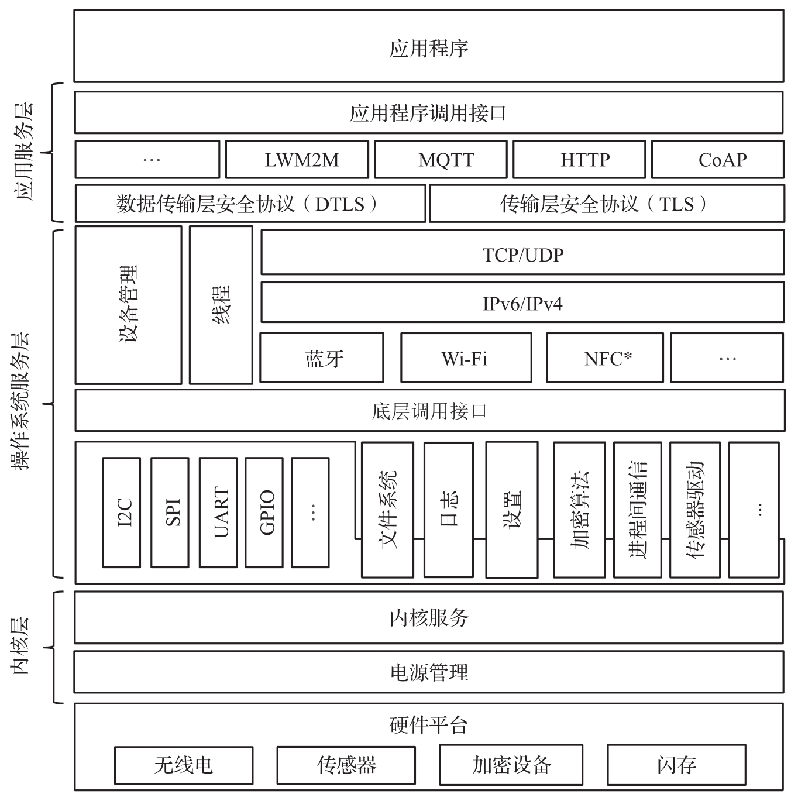
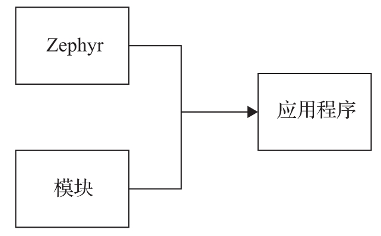

与大多数实时操作系统不同, Zephyr 不仅提供操作系统的内核, 同时也包含应用开发所需要的其他关键服务, 例如 TCP/IP 协议栈, MTQQ 协议栈, CAN 协议栈等. 同时, Zephyr 也是一个高度可定制化的系统, 所有的组件都可配置化, 应用开发者可以根据自己的需求选择组件, 避免包含不需要的组件, 从而充分优化系统资源, 节省硬件资源.

考虑到嵌入式设备以及 IoT 设备的硬件多样性, Zephyr 支持几乎所有主流 CPU 架构, 包含:

* ARC EM 和 HS.

* ARMv6-M,ARMv7-M 和 ARMv8-M(Cortex-M).

* ARMv7-A 和 ARMv8-A(Cortex-A,32 位和 64 位)​.

* ARMv7-R(Cortex-R).

* Intel x86(32 位和 64 位)​.

* NIOS II Gen 2.

* RISC-V(32 位和 64 位)​.

* SPARC V8.

* Tensilica Xtensa.

如图 8-7 所示, Zephyr 实时操作系统主要由三层组成: 内核 (kernel) 层, 操作系统服务 (OS Service) 层和应用服务 (Application Service) 层. 接下来的章节, 我们将基于 Zephyr 2.6 版本讨论每层的细节.

# 内核层

Zephyr 内核是整个系统的核心, 它构建了一个低内存占用, 高效和多线程的运行环境. Zephyr 系统其他部分, 例如驱动程序, 网络协议栈, 应用程序等, 全都依赖于内核提供的服务. 内核主要提供以下基础操作系统服务.

* 线程服务: 提供线程创建, 终止, 删除和调度接口. 在 Zephyr 里面, 每一个线程的所有信息被保存在一个内核对象中.

* 线程调度服务: 基于调度算法决定被运行的线程. 内核总是选择优先级最高的线程运行, 当多个线程的优先级相同时, 等待时间最长的线程将被运行. 但是, 中断服务程序总是能打断线程的运行, 除非中断被屏蔽.

* 系统线程: 内核启动过程中默认启动两个线程, 即内核主线程和空闲 (idle) 线程. 内核主线程负责内核的初始化以及调用应用程序的 main()函数. 空闲线程是一个必须被创建的线程, 否则将产生系统异常. 当系统没有其他的线程需要运行时, 空闲线程将被运行.

* 工作队列线程: 内核为工作队列创建一个专门的线程, 用于处理工作队列中的任务. 用户可以通过内核提供的工作队列机制, 方便地创建队列, 添加任务. 工作队列线程将依据先进先出的原则处理工作队列中的任务.

* 中断处理: 为用户提供响应硬件和软件中断的机制.

* 轮询等待服务: 提供使线程等待一个或者多个条件被满足的服务. 该服务作用于 Zephyr 的内核对象, 例如 FIFO 内核对象, 信号量内核对象, 信号对象等.

* 信号量(Semaphore): 提供内核信号量对象以便于多线程的同步. 同时, 提供相应的信号量的操作接口.

* 互斥(Mutex): 提供互斥内核对象以及相应的操作接口, 使多线程能安全地同时访问共享的硬件或者软件资源.

* 条件变量(Condition Variable): 提供一种同步机制, 通常用于控制共享资源的访问, 它允许一个线程等待其他线程创建共享资源需要的条件.

* 多处理器架构支持(SMP): 提供对多 CPU 架构的支持. 线程能运行在任意处理器上, 用户不需要对于某一处理器做特殊的处理.

线程之间的数据传送以及共享是操作系统必须提供的核心功能之一. Zephyr 内核提供了丰富的线程间传输共享方式, 能满足不同应用场景的需要. 应用程序开发者可以根据自己的需求选择合适的数据传输共享方式. 目前, Zephyr 主要支持以下几种数据传输方式.

* 队列(Queue): 一个队列在 Zephyr 中是一个内核对象, 内核提供操作该对象的相应接口. 队列可以用于线程之间或者线程与中断处理之间的数据传输和共享.

* 先入先出 (FIFO) 队列: 一种特殊形式的队列, 同时是一个内核对象. 它的实现基于普通队列, 最先被加入队列的元素将先被取出, 内核提供先入先出队列的操作方法. 它可以用于线程之间或者线程与中断处理之间的数据传输和共享.

* 后入先出 (LIFO) 队列: 一种特殊形式的队列, 同时是一个内核对象. 它的实现基于普通队列, 最后被加入队列的元素将先被取出, 内核提供后入先出队列的操作方法. 它可以用于线程之间或者线程与中断处理之间的数据传输和共享.

* 栈(Stack): 一种特殊形式的队列, 同时是一个内核对象. 它的实现基于普通队列, 最后被加入队列的元素将先被取出, 内核提供堆栈的操作方法. 它可以用于线程之间或者线程与中断处理之间的数据传输和共享.

* 消息队列(Message Queue): 一个内核对象. 内核提供消息队列的操作方法. 它可以用于线程之间或者线程与中断处理之间的数据传输和共享.

* 邮箱(Mailbox): 一个内核对象. 内核提供邮箱内核对象的操作方法. 它主要用于线程间的数据传输和共享, 适合于大数据的数据交换, 同时它支持同步和异步模式.

* 管道(Pipe): 一个内核对象. 内核提供管道对象的操作方法. 管道基于流数据的传输, 适应于大数据传输, 同时它支持同步和异步模式. 内存管理是操作系统的另一个核心功能. Zephyr 主要提供以下两种内存管理方式.

* 堆 (Heap) 内存管理: 内核提供丰富的接口对于堆内存进行管理. 堆内存通过两种方式定义: 静态定义和动态定义. 静态定义使堆的大小在编译时确定, 动态定义可以使堆的大小可以在应用程序运行时确定.

* slab 内存管理: 主要用于固定大小的内存进行分配和释放. 由于内存分配的大小是固定的, 内存操作的性能相较于堆内存管理更有优势, 同时能避免内存碎片的产生. 时间和定时器直接决定了操作系统的性能和实时性, 对于实时操作系统尤为重要.

* 时间: Zephyr 内核为用户提供健壮, 可扩展的时间框架. 基于此框架, 用户可以方便地从硬件时钟获得并计算时间.

* 定时器: 定时器在内核中由一个内核对象表示, 内核提供丰富的接口便于用户创建, 使用, 停止定时器.

# 操作系统服务层

操作系统服务层在内核层之上, 它为我们提供一些关键的, 应用程序开发过程中需要的服务组件. 对于应用程序的构建, 仅仅提供内核功能是不够的, 应用程序开发者还需要其他的关键服务组件, 便于快速开发他们的产品. 否则, 应用开发者不得不花费大量的时间, 精力去从头开发这些组件, 而不能将所有的精力放在他们的产品研发上. 例如, 当基于 Zephyr 研发物联网产品时, 通常我们需要 TCP/IP 协议栈, 因为需要将数据传到云端, 同时需要将数据或者策略从云端传到设备端. 在 Zephyr 中, TCP/IP 协议栈是操作系统服务层的一部分, 开发者只需要在开发过程中选择它, 立刻就可以使用一个功能完整, 稳定的 TCP/IP 协议栈去开发他们自己的应用.

Zephyr 主要用于资源受限的设备中, 通常在该类型的设备上, 只有非常小的内存和存储空间. 所以, 在 Zephyr 中, 所有操作系统服务层的组件都是可以配置的, 开发者只需要选择他们所需要的组件, 这样有助于减小系统所需要的存储和运行空间. 例如, 当我们开发蓝牙应用时, 如果不需要 TCP/IP 协议栈, 在这种情况下, 可以在 Zephyr 的配置文件中只选择蓝牙协议栈, 这样可以为我们节省大量的存储和运行空间.

在 Zephyr 中, 设备驱动也属于操作系统服务层, 它提供了一个强大的驱动开发框架, 以便于开发者为他们自己的硬件快速开发所需要设备驱动. 同时, Zephyr 项目中已经有了丰富的设备驱动程序, 在大多数情况下, 例如, 对于 GPIO,I2C,SPI 设备等, 开发者只需要选择他们所需要的驱动程序, 而不用自己开发. 另外, 在 Zephyr 中, 它基于设备树 (Device tree) 来描述硬件设备, 为设备驱动提供了一种灵活, 强大的获取硬件信息的方式, 同时设备驱动能更好地适应硬件的改变.

操作系统服务层提供很多应用程序开发所需要的组件, 如果想了解相关细节, 请参考 Zephyr 项目官方文档, 下面只列出一些重要的操作系统服务层组件.

* 设备驱动: 硬件设备驱动程序.

* CAN 协议栈.

* TCP/IP 协议栈.

* 蓝牙协议栈.

* Wi-Fi 支持.

* LoRA 支持.

* 文件系统支持.

* Logging/Tracing 支持.

* 传感器 (Sensor) 子系统.

# 应用服务层

在应用服务层, Zephyr 为应用程序开发者提供更高层次的组件, 方便应用程序的快速开发. 例如, 如果一个应用需要和亚马逊 AWS 的 IoT 服务通信, 因为 AWS 的 IoT 服务基于 MQTT 协议, 所以需要 MQTT 协议栈. 而 MTQQ 协议栈支持已经在 Zephyr 应用服务层中, 所以开发者不用再自己可发或者移植 MTQQ 协议栈到 Zephyr, 这将极大缩短应用开发时间. 有人会问为什么 MQTT 协议栈在应用服务层, 而且不是在操作系统服务层? 因为, MQTT 协议栈依赖于操作系统服务层中的 TCP/IP 协议层, 相较于 TCP/IP 协议栈, 它是更高层次的组件.

应用服务层中的每一个组件都是一个 Zephyr 模块. Zephyr 模块存在于 Zephyr 代码仓库之外, 但是它们是 Zephyr 项目的一部分. Zephyr 模块的优点是它为 Zephyr 核心代码和应用服务层提供一个很好的隔离措施, 改进代码质量的同时, 使 Zephyr 代码更容易维护. Zephyr 提供了一个强大, 灵活的模块机制, 使任何人可以通过新的模块去扩展 Zephyr 的功能, 如图 8-8 所示.

Zephyr 在应用服务层中提供了丰富的组件, 便于快速开发应用. 如果想了解详细情况, 请参考 Zephyr 官方文档. 以下是一些在应用服务层中的重要组件.

* MQTT 协议栈.

* HTTP 支持.

* CoAP 支持.

* TensorFlow lite 支持.