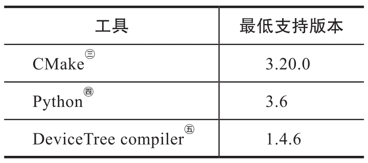
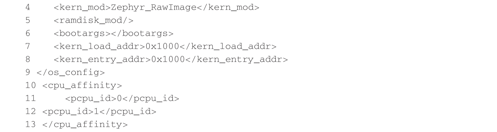

本章将介绍如何进行 Zephyr 开发环境的搭建以及如何在 ACRN 上运行 Zephyr.Zephyr 支持 Linux,Windows,macOS 等多种 OS 作为开发环境, 下文将以 Ubuntu 为例, 一步一步搭建 Zephyr 编译环境, 获取源代码以及构建, 刷写和运行示例应用程序. 在 Windows,macOS 或其他 Linux 发行版上安装 Zephyr 开发环境, 请参考 Zephyr 官方文档和安装文档.

> Zephyr 官方文档: https://docs.zephyrproject.org/latest

> Zephyr 环境安装: https://docs.zephyrproject.org/latest/getting_started/index.html


# 1. Zephyr 开发环境安装

如果使用的操作系统是 Ubuntu 发行版, 请确认版本至少是 18.04LTS 或是更新的版本. 更新并升级发行版包管理器中的软件包:

```
apt update
apt upgrade
```

## 1.1. 安装依赖软件包

使用包管理器安装一些依赖软件包. 当前主要依赖的软件包以及所需的最低版本如表 C-1 所示.



* ㊂参见 CMake 官方网站: https://cmake.org.

* ㊃参见 Python 官方网站: https://www.python.org.

* ㊄参见 Device Tree 官方网站: https://www.devicetree.org.

由于 Zephyr 使用的 CMake 版本比较新, Linux 发行版所提供的版本很可能无法满足要求, 可以通过以下方式来进行更新.

下载, 检查并执行 Kitware 存档脚本, 将 Kitware APT 存储库添加到源列表中.


使用 apt 安装所需的依赖软件包:


输入以下命令来验证系统上安装的依赖软件包的版本.

```
cmake -version
python3 -version
dtc -version
```

根据表 C-1 中的版本检查这些内容. 有关手动更新依赖包的更多信息, 请参阅 Zephyr 的安装依赖软件包页面.

> Zephyr 安装依赖包页面: https://docs.zephyrproject.org/latest/getting_started/installation_linux.html#installation-linux

## 1.2. 克隆 Zephyr

代码仓库 Zephyr 的代码主要通过 west 工具进行管理, 所以我们可以简单地通过 west 命令克隆 Zephyr 的所有代码.

安装 west:

```
pip3 install --user -U west
echo 'export PATH=~/.local/bin:"$PATH"' >> ~/.bashrc
source ~/.bashrc
```

获取 Zephyr 源代码:

```
west init ~/zephyrproject
cd ~/zephyrproject
west update
```

安装所需的 python 依赖包:

```
pip3 install --user -r ~/zephyrproject/zephyr/scripts/requirements.txt
```

## 1.3. 安装 Zephyr SDK

Zephyr 软件开发工具包 (SDK) 提供了构建 Zephyr 应用程序所需的所有工具链, 包括编译器, 汇编器, 链接器等.

下载最新的 SDK 安装程序:


运行安装程序:


# 2. 编译 Zephyr

Zephyr 本身提供了一些供参考的示例应用程序, 下面将以 "hello world" 程序为例, 介绍如何编译一个运行在 qemu_x86 上的 Zephyr 应用程序.

首先进入 zephyr 主目录:

```
cd ~/zephyrproject/zephyr
```

使用 west 编译 "hello world" 程序:

```
west build -b qemu_x86 -p auto samples/hello_world
```

在 qemu_x86 上运行 "hello world" 程序:

```
west build -t run
```

如果能在控制台上看到 "Hello World" 字样打印出来, 则代表运行成功.

# 3. 在 ACRN 上运行 Zephyr

Zephyr 可以作为 VM 客户机运行在 ACRN Hypervisor 上, 下面将以 x86 的 ehl_crb 开发板为例, 讲解如何在 ACRN 上运行一个简单的 Zephyr 应用程序.

## 3.1. 编译 Zephyr 应用程序

ACRN 已经被添加到 Zephyr 支持的平台中, 所以可以直接通过运行以下命令生成一个运行在 ACRN 上的 Zephyr 应用程序:

```
west build -b acrn_ehl_crb samples/hello_world
```

## 3.2. 编译 ACRN Hypervisor

为了使 Zephyr 运行在 ACRN Hypervisor 上, 我们需要在编译 ACRN Hypervisor 时对 ACRN 编译的 XML 配置文件进行一些修改, 以编译一个适用于 Zephyr 的 Hypervisor, 具体改动如下:



XML 配置完成后, 运行如下命令生成一个适用于 Zephyr 的 ACRN Hypervisor:

```
make -j BOARD=ehl-crb-b SCENARIO=hybrid
```

## 3.3. 制作 EFI Boot image

### 3.3.1. 制作一个使用 GNU GRUB 的系统启动盘

将一张 U 盘挂载到 Linux 系统上并构建如下目录结构.


其中, bootx64.efi 为一个 GRUB EFI 二进制文件, 通常情况下, 我们可以通过来自源代码的简单上游构建或来自友好 Linux 发行版的副本; zephyr.bin 为我们之前编译的 "hello world" 应用程序的二进制文件; acrn.bin 为我们编译的适用于 Zephyr 的 ACRN Hypervisor 的二进制文件.

grub.cfg 为我们配置的 GRUB 引导文件, 内容如下:


### 3.3.2. 用 U 盘启动应用程序

将制作好的 U 盘插在目标机上, 然后开机, 此时目标机会自动运行 ACRN 和 Zephyr 应用程序, 可以使用 vm_console 命令查看控制台输出:


如果出现 "Hello World" 字样, 则代表 Zephyr 已经成功运行在 ACRN Hypervisor 上了.
