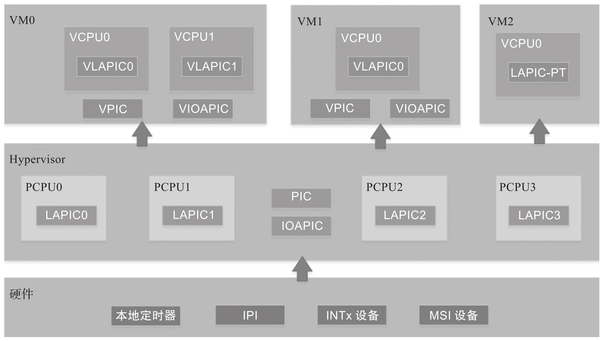

ACRN Hypervisor 实现了一个简单但功能齐全的框架来管理中断和异常, 如图 4-21 所示.

在其原生 (native) 层, 它配置了物理 PIC,IOAPIC 和 LAPIC, 以支持各种不同的中断源, 包括来自处理器内部的 Local Timer,IPI, 以及来自外部的 INTx/MSI. 在其虚拟 Guest 层中, 它模拟虚拟 PIC, 虚拟 IOAPIC, 虚拟 LAPIC 以及直通 LAPIC. 它提供了完整的 API, 允许从模拟或直通设备注入虚拟中断.

ACRN Hypervisor 中断软件模块视图:

上图中, ACRN Hypervisor 在其 HV 基础模块 (例如 IOAPIC,LAPIC,IDT) 层中设置物理中断. 它将 HV 控制流层中的中断分派给相应的处理程序; 这可以是预定义的 IPI 通知, 计时器或运行时注册的直通设备. 然后, ACRN Hypervisor 使用其基于 vPIC,vIOAPIC 和 vMSI 模块的 VM 接口, 将必要的虚拟中断注入特定的 VM, 或通过直通 LAPIC 直接将中断传递给特定的实时虚拟机.

ACRN Hypervisor 实现了以下处理物理中断的功能.

* 启动时配置中断相关的硬件, 包括 IDT,PIC,LAPIC,IOAPIC.

* 提供 API 来操作 LAPIC 和 IOAPIC 的寄存器.

* 接收物理中断.

* 为 Hypervisor 中的其他组件设置回调机制以请求中断向量并为该中断注册处理程序.

ACRN Hypervisor 拥有所有物理中断并管理每个处理器的 256 个中断向量. 所有物理中断首先在 VMX 根操作模式下处理. 为支持这一点, VM-Execution 控制域中的 "External-Interrupt Exiting" 位被设置为 1. 同时, ACRN Hypervisor 还初始化所有与中断相关的模块, 如 IDT,PIC,IOAPIC 和 LAPIC.

ACRN Hypervisor 不拥有任何物理设备 (UART 除外)​. 默认情况下, 将所有设备都分配给服务虚拟机. 服务虚拟机或用户虚拟机设备驱动程序接收到的任何中断都是 Hypervisor(通过 vLAPIC) 注入的虚拟中断. Hypervisor 管理 Host 到 Guest 的映射. 当物理中断发生时, Hypervisor 决定是否将此中断转发到 VM 以及转发到哪个 VM(如果存在的话)​.

ACRN Hypervisor 不拥有任何异常. 虚拟机的 VMCS 配置为不因异常发生 VM Exit(除 #INT3 和 #MC 之外)​. 这主要是为了简化设计, 因为 Hypervisor 本身不支持任何异常处理. Hypervisor 只支持静态内存映射, 所以不应有 #PF 或 #GP 发生. 如果 Hypervisor 收到异常, 则执行 assert 函数并打印错误消息, 然后系统会中止.

本机中断可以由以下中断源产生:

* GSI 中断.

  * PIC 或 Legacy 设备 IRQ(0～15).

  * IOAPIC 引脚.

* PCI MSI/MSI-X 向量.

* 处理器之间的 IPI.

* LAPIC 计时器.