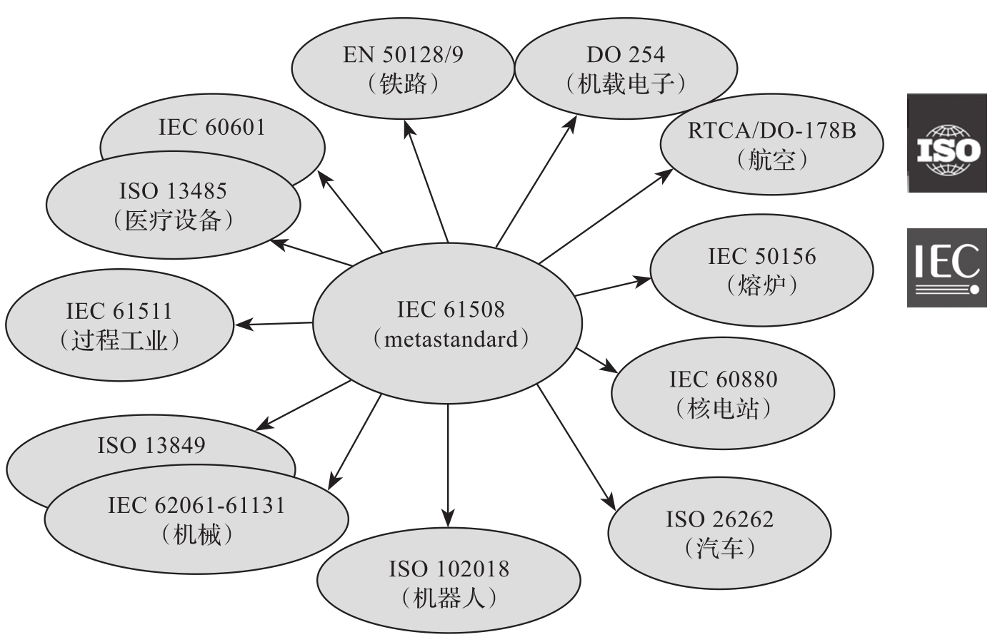

本节将简要介绍功能安全的发展历史, 相关国际标准, 定义, 基本术语, 重点解释风险和安全完整性关键概念, 介绍系统功能安全中的随机失效和系统失效, 以及通常的应对措施, 如何利用软件来应对系统功能安全中的失效, 如何保证软件自身的功能安全等.

工业文明在给人类带来利益的同时, 也带来了附生灾害. 全世界每年死于工伤事故和职业病危害的人数约为 200 万. 为了实现安全的生产, 各种各样的安全系统应运而生. 早期的安全系统基本由继电器组成, 随着半导体技术的发展, 将 PLC 等控制器应用于安全相关系统的内在驱动力越来越强. 但是, 由于对安全相关系统的认识局限, 直到 20 世纪 90 年代, 仍然有许多标准中排斥微控制器的使用, 如 IEC 60204 中还要求不要将电子技术用于机械安全相关系统.

在这种背景下, 欧洲与美国分别在两个领域开始了相关的研究与标准制定. 其中欧洲是在机械安全领域, 美国是在过程工业领域. 德国在 20 世纪 90 年代发布了标准 DIN V 19250"控制技术: 测量和控制设备的基本安全要求"​, 随后发布了标准 DIN V VDE 0801 安全相关系统的计算机原理. 美国仪表协会在 1996 年发布了 ISA-84.01 <过程工业安全仪表系统的应用>​, 并第一次提出了安全完整性等级 (Safety Integrity Level,SIL) 的概念.

接下来, 国际电工委员会 (International Electrotechnical Commission,IEC) 于 1998 年发布 IEC 61508-1, 并于 2000 年完整发布 IEC 61508, 标志着功能安全正式形成共识, 成为独立的研究领域.

IEC 61508 发布后, 各个行业随之推出行业内的功能安全标准, 包括铁路相关标准 EN 50126/128/129, 过程工业标准 IEC 61511, 机械工业标准 IEC 62601, 核工业标准 61513 等.

但是, 功能安全一直是隐藏在各个产品与系统背后的一门学科, 直到近年来由于汽车自动驾驶的飞速发展, 自动驾驶系统安全性的问题才将功能安全带入公众的视线.

图 9-1 所示为各个领域的功能安全相关标准.

什么是功能安全(Functional Safety)?

首先来看标准中的定义,​"part of the of overall safety relating to the EUC and the EUC control system that depends on the correct functioning of the E/E/PE safety-related and other risk reduction measures."​, 中文含义为 "整体安全中与受控设备 (Equipment Under Control,EUC) 和 EUC 控制系统相关的部分, 它依赖于电气 / 电子 / 可编程电子 (Electrical/Electronic/Programmable Electronic,E/E/PE) 安全相关系统和其他风险降低措施功能的正确性.​"

标准的描述从来都是严谨而晦涩. 简单来说, 就是一个产品在使用过程中, 如果出现故障了会带来伤害, 这个产品就是与功能安全相关的. 因此 Functional Safety 翻译为 "功能的安全" 比 "功能安全" 更为贴切.

下面是一些功能安全应用实例.

* 机械防护联锁和紧急停车系统: 为防止电机漏电, 加装绝缘外壳, 这就是被动安全保护措施; 为防止线圈过热, 加装热断路器, 测温→判断→断流, 这就是主动安全保护措施, 属于功能安全.

* 用于限制速度作为保护手段的变速电机驱动系统.

* 服务机器人, 物流机器人, 工业机器人.

* 起重机安全负载指示器, 避免超载导致起重机倒塌.

* 地铁站台屏蔽门: 门在关闭时, 若感触到有人被夹住, 门要自动打开, 防止人被夹伤, 列车行进中, 保证车门关闭, 不能随意打开, 这就是功能安全应用.

* 汽车指示灯, 防抱死制动和发动机管理系统: 正常驾驶汽车时, 安全气囊不会打开; 当发生碰撞时, 它会立即打开以保护司机的安全, 同时不会继续给发动机供油; 其他如防抱死制动系统(Anti-lock Braking System,ABS), 车窗玻璃升降儿童保护系统等.

* 铁路信号系统: 保证让列车不会同时走在同一条铁轨, 不发生迎面碰撞或追尾的情况.

* 飞机飞行控制面的电传操作: 航空业在许多领域应用功能安全, 例如自动飞行控制系统. 两轴自动驾驶仪系统控制飞机的俯仰和横滚, 并控制航向和高度, 所有这些都被编程为遵守某些功能安全参数, 在违反这些参数时激活警报和其他措施.

* 在医疗领域, 如果输液泵出现故障, 功能安全协议将确保激活警报, 同时泵停止工作, 保护患者免受过量给药的伤害.

功能安全是一个复杂而庞大的体系, 涉及的内容多而繁杂, 而要理解功能安全的端到端, 全系统和全生命周期的科学理论与方法, 需要先了解和掌握功能安全的一些基本概念.

