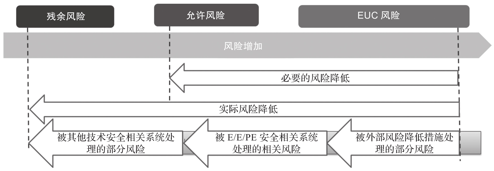

安全, 按一般的概念是指没有危险, 不受威胁, 不出事故. 按照这样的概念, 安全是不可控制的. 因为这是一个绝对安全的概念, 而绝对安全是不存在的. 在 IEC 61508 中, 安全的概念是 "不存在不可接受的风险"​. 这是一个相对安全的概念, 通过这个定义, 安全问题就转化为风险问题. 这样一来, 安全就变得可控制了, 因为风险是可控的.

实施功能安全本质上就是控制风险.

要使安全相关系统达到安全目标, 第一步, 要确定受控设备 EUC 的范围以及 EUC 与外部环境的相互影响, 然后找到 EUC 内部和 EUC 外部环境的相互作用可能存在的危险点, 针对每个危险点计算或评估出其风险, 即该点的 EUC 风险. 第二步, 要明确法律, 法规, 规章, 标准中要求达到的风险目标或社会有关方面可以接受的风险目标. 第三步, 比较 EUC 风险和允许风险, 如果 EUC 风险大于允许风险, 则必须使用 E/E/EP 安全相关系统, 其他技术安全相关系统, 外部风险降低设施等手段将风险降低到允许风险以下. 从根本上来讲, 这就是功能安全的核心工作.

从图 9-2 中可以看出, 当 EUC 风险大于允许风险时, EUC 风险与允许风险之间的差距就是必要的风险降低, 也就是各类安全相关系统降低风险的目标值. 通过 E/E/PE 安全相关系统, 其他技术安全相关系统, 外部风险降低设施等手段的实施, 最终达到了实际的风险降低. 实际的风险降低必须大于或至少等于必要的风险减低. 成功实施了各类风险降低措施后仍然存在的风险被称为残余风险, 按照现代安全的定义, 人们认为已达到了安全.

