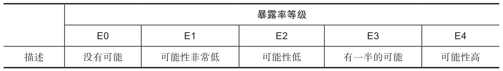
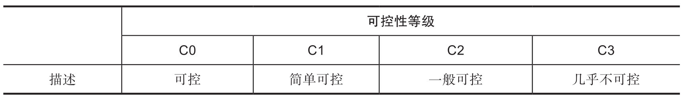
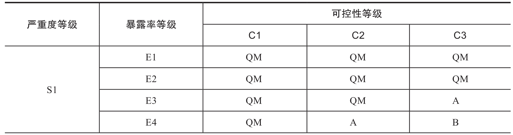
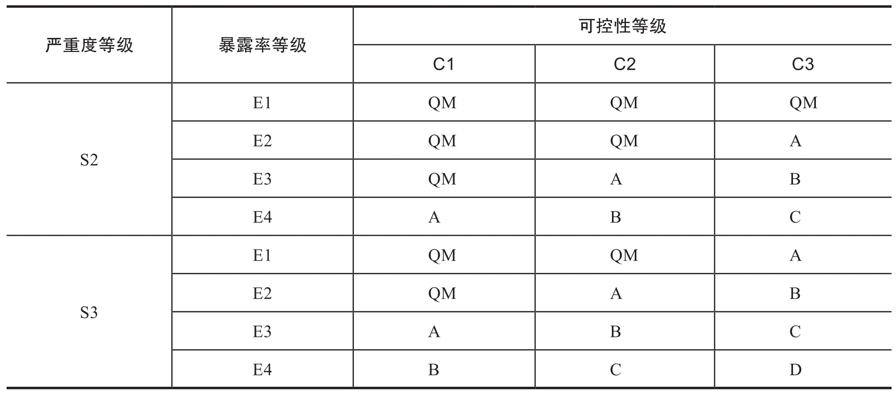
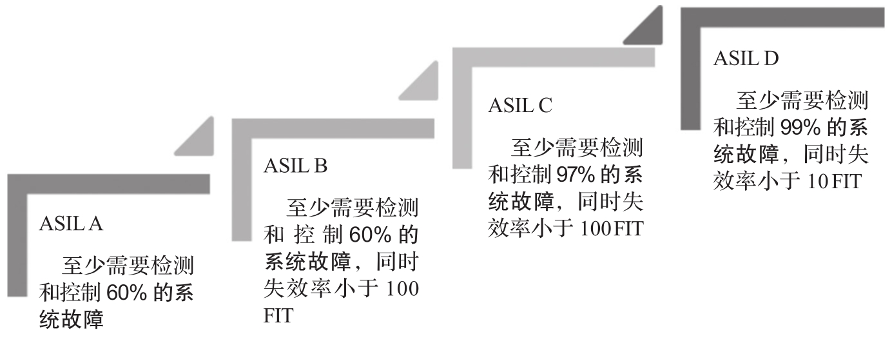

对于功能安全, 正确区分并完全理解风险和安全完整性是非常重要的.

安全完整性 (safety integrity) 是指在规定的条件, 规定的时间内, 安全相关系统成功实现所要求功能的概率. 安全完整性与风险降低的关系可以用图 9-3 来说明.

风险是对一个特定危险事件出现的概率和结果的估量, 可以对不同情况的风险进行评估(EUC 风险, 要求满足的允许风险, 实际风险)​. 允许风险根据社会基础及有关社会和政治因素的考虑来确定. 安全完整性只应用于 E/E/PE 安全相关系统, 其他技术安全相关系统和外部风险降低设施, 并作为这些系统 / 功能在规定安全功能方面取得必要的风险降低的概率的措施. 一旦确定了允许风险, 并估计了必要的风险降低, 就可以分配安全相关系统的安全完整性要求.

例如, 在车载领域的 ISO 26262 中, 汽车安全完整性等级 (Automotive Safety Integration Level,ASIL) 是危害的风险等级的指标.

依据 ISO 26262 标准进行功能安全设计时, 首先对系统的功能进行逐个分析, 识别系统所有的危害, 然后依据三个因子 (S,E,C) 来评估危害的风险级别.

严重度(Severity)

严重度是指一旦风险成为现实, 对驾驶员, 乘员或者行人等涉险人员的伤害程度, 比如电子锁故障就比刹车故障的严重程度低. 严重性用 SX 表示, X 取值可以是 0,1,2,3, 级别从低到高, 级别越高, 伤害越严重. S0 表示无伤害; S1 表示轻微或有限伤害; S2 表示严重或危及生命的伤害 (可生还)​;S3 表示危及生命的伤害(有死亡可能) 或致命伤害.

暴露率(Exposure)

暴露率描述风险出现时, 人员暴露在系统的失效能够造成危害的场景中的概率. 基于目标危险事件的情景, 根据道路环境, 天气, 车辆周围的情况等来判断该指标. 比如底盘出现异响比乘员座椅故障暴露率低. 暴露率用 EX 表示, X 取值从 0 至 4, 共 5 个等级. E0 表示几乎不可能暴露于危险中, E4 表示暴露于危险中的可能性极高, 如下表所示.

可控性 (Controllability) 可控性描述风险出现时, 驾驶员或其他涉险人员能够避免事故或伤害的可能性. 比如, 轮胎缓慢漏气比刹车失灵可控性高.

可控性用 CX 表示, 从最低 C0 可控到最高 C3 几乎不可控, 共 4 个级别, 如下表所示.

ASIL 的确定基于 S,E,C 这三个影响因子, 下表中给出了 ASIL 的确定方法, 其中 D 代表最高等级, A 代表最低等级, QM 表示质量管理(Quality Management), 表示按照质量管理体系开发系统就足够了, 不用考虑任何安全相关的设计. 确定危害的 ASIL 后, 为每个危害确定至少一个安全目标, 作为功能和技术安全需求的基础.

根据表 9-4, 通过危害分析和风险评估, 我们得出系统或功能的安全目标和相应的 ASIL. 当 ASIL 确定之后, 就需要对每个评定的风险确定安全目标, 安全目标是最高级别的安全需求. 确定安全目标之后, 就需要在系统设计, 硬件, 软件等方面进行设计, 实施和验证.

如图 9-4 所示, 对于安全完整性等级越高的系统, 按照标准要求, 需要采用更加严格的技术措施和流程来检测和控制故障, 以便达到更低的失效率.

> 失效率 (Failures In Time,FIT) 指的是 1 个 (单位) 的产品在 `1*10^9` 小时内出现 1 次失效 (或故障) 的情况.

