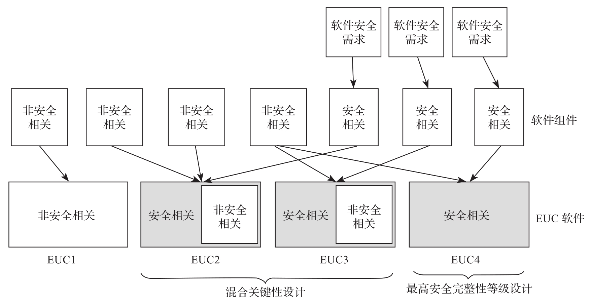

在 ECU 软件完成的功能和特性中, 并非所有的部分都是和安全相关的, 只有实现安全需求的那些软件组件被认为是安全相关的. 安全标准 (例如 ISO 26262,IEC 61508) 中提出了两种设计思路, 来实现同时包含安全相关和非安全相关组件的软件, 如下图所示.

* 最高安全完整性等级设计. 先识别安全相关功能软件组件中的最高安全完整性等级(Safety Integration Level,SIL), 然后整个 ECU 软件均按照这一最高的 SIL 来开发. 这一方法适用于安全相关功能组件在整个软件中占比较大的软件.

* 混合关键性设计. 这一设计允许软件中有多个不同 SIL 的组件, 该方法主要适用于安全关键性 (Safety-criticality) 功能组件在整个软件中占比较小, 需要集成第三方或需要集成非安全软件组件的场景.

两种设计需要达到的最终目标是一样的, 即达到系统软件必要的功能安全完整性. 两种设计方法采用的实现方式也是一样的.

* 防止含有错误的软件导致功能失效.

* 采用技术措施来检测和控制失效行为.

下面进一步详细阐述两种设计方法.

# 最高安全完整性设计

在最高安全完整性设计中, 所有软件组件具有同一 SIL. 在这一设计中, 安全相关和非安全相关功能遵循同样的高 SIL 开发流程. 当把这些组件集成在一起时, 原则上最终的软件具有同样的 SIL, 不需要考虑独立性 (Freedom from Interference,FFI) 要求. 因此, 为了达到功能安全要求, 软件架构设计层的安全分析发现的脆弱点必须被解决.

最高安全完整性设计在提供安全相关功能的软件组件占比较大的情况下有它的优势, 比如:

* 不用考虑分区技术.

* 没有由于确保 FFI 的安全机制引入的性能损失.

* 通过提升非安全相关软件组件的质量, 提高了整个系统更高可用性.

但也必须考虑如下的劣势:

* 所有软件组件的开发需要遵循最高 SIL 要求, 这将导致开发成本提高. 为了保证非安全相关部分不会干扰安全相关部分, 需要实现一些额外的安全需求.

* 按照 SIL 要求开发不意味着没有软件错误, 设计上一些组件的错误不会被阻断.

* 由于第三方软件 (黑盒软件) 开发流程是未知的和不受控制的, 第三方软件 (黑盒软件) 的集成会更加困难.

# 混合关键性设计

混合关键性设计的思路是, 系统软件可以由不同 SIL 的组件组成, 然后提供一种设计方法, 其可以用证据表明低 SIL 的组件不会影响高 SIL 的组件, 能够达到 FFI 要求, 从而达到整个软件系统的目标 SIL.

这种设计方法的核心是需要在硬件和软件层次实现无干扰 (FFI) 的安全机制.

* 功能模块必须保持一致性, 避免功能模块间不必要的交互(如, 谨慎使用全局变量)​.

* 该安全机制能确保低 SIL 的软件组件不能干扰同一软件中的高 SIL 的组件.

* 该安全机制保证一个组件的失效不会导致另一个组件失效, 或者保证能检测到组件间干扰并及时避免影响.

* 该安全机制必须根据 ECU 软件安全需求的最高 SIL 来开发.

这里再补充介绍一下刚刚用到的两个概念.

* 实现 FFI 的两个原则:

  * 检测已经发生的干扰并降低影响.

  * 阻止干扰发生.

* 功能安全标准中提到的可能的干扰:

  * 内存, 包含 RAM 和 CPU 寄存器.

  * 时序和执行, 主要指执行阻塞, 死锁和活锁或者执行时间的不正确分配.

  * 通信, 包含 ECU 内部和跨 ECU 边界的软件元素之间通信中可能发生的所有错误.

将低 SIL 和高 SIL 软件组件隔离有如下优势.

* 只需要对安全相关软件组件 (包含保证 FFI 的组件) 应用最高 SIL 的开发方法. 这可以帮助重用现有的非安全相关的软件(例如, 第三方软件)​.

* 可以阻止或检测相同 SIL 的软件组件间的故障传播. 虽然 FFI 没有强制要求, 但在故障 - 运行 (fail-operational) 架构中, 把安全相关部分与其他部分隔离, 可以提高系统的可用性.

* 能阻止或检测硬件缺陷导致的一些失效(例如, 时序监视将检测到一个时钟源故障)​.
