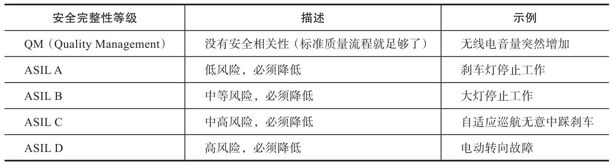

混合关键性系统典型应用场景在汽车领域, 汽车制造商使用 ISO 26262 作为在车辆内功能安全软件的标准. ISO 26262 标准的一部分是一个风险分类系统, 不同汽车安全完整性等级 (ASIL) 的软件, 需要采取的风险降低要求不一样. 四个 ASIL(A～D)从低风险到高风险分类. 质量管理或 "QM" 代表标准质量流程足够, 无须降低风险.

表 9-5 列出了功能和关键级别的示例.

> 示例: https://blogs.blackberry.com/en/2022/09/why-mixed-criticality-is-the-future-of-automotive-architectures

混合关键性的示例, 其中分类为一个 ASIL 的软件与分类为不同级别的软件在同一处理器上运行, 可能包括以下内容:

* 显示转速 (ASIL A) 和播放音乐 (QM) 的数字仪表盘.

* 显示导航 (QM) 和后视摄像头 (ASIL B) 的信息娱乐系统.

* 提供自适应巡航控制 (ASIL B) 和半自主模式 (ASIL D) 的发动机控制器.

# 为什么软件定义的车辆需要混合关键性系统

混合关键性系统的设计满足汽车设计的未来趋势.

* ECU 整合. 需要将更多个发动机 ECU 的功能集成到域控制器或高性能计算 (High Performance Computing,HPC) 平台中. 这种趋势经常将具有不同安全级别的模块组合在一起.

* 减少认证工作. 通过将高 ASIL 的软件组件限制在尽可能少的代码中, 混合关键性设计减少了工程团队必须进行的认证工作量.

* 功能安全分解. 就像飞机上的冗余喷气发动机一样, 功能安全分解是一种技术, 它允许具有冗余功能的软件组件协同工作以减少故障的发生, 并提高整体软件的 ASIL.

* 软件定义车辆. 它还可以使软件定义车辆的更新变得灵活. 许多功能和选项可以通过软件交付得以实现, 但伴随软件定义车辆而来的复杂性也引入了混合要求. 这是推动采用混合关键性的最重要因素之一. 由于软件定义的车辆旨在通过软件完成所有升级和修复——一旦汽车出厂就无须更改硬件——它们必须经常使用混合关键性来安全地整合新功能.

# 混合关键性如何简化汽车架构

表面上混合关键性似乎带来的问题多于它解决的问题. 为什么不避免复杂性, 只在最严格的 ASIL 对每个模块软件进行认证, 以保证适当的性能?

这通常是不可能的. 对于某些软件, 由于它的创建方式, 它所依赖的硬件或执行的功能——无法获得更高安全级别的认证. 例如, 由于多种因素(一个是动态内存分配)​,We b 浏览器技术无法通过安全认证, 但可能需要浏览器来显示车载手册. 如果用于显示该文档的同一个信息娱乐系统也需要访问备用摄像头, 那么如果不采用混合关键性, 整个系统将无法通过安全认证.

在更高的 ASIL 上进行认证也可能需要更长的时间和更昂贵的费用. 例如, 虽然 ASIL A 不需要功能安全审核, 但 ASIL B 和更高级别需要. 虽然 ASIL C 可以由设计模块的同一公司内的人员进行审核, 但 ASIL D 需要使用单独的独立公司来执行审核. ASIL 越高, 工程流程, 开发时间和承包商协助的成本就越高.

无论是将高级驾驶辅助系统 (Advanced Driver Assistance System, ADAS) 与便利性相结合, 还是将信息娱乐与安全性相结合, 混合关键性系统使我们能够将消费级操作系统和应用程序与经过安全认证的操作系统和功能结合起来.

# 使用 Hypervisor 技术

Hypervisor 虚拟化技术可以用于实现混合关键性系统. Hypervisor 利用硬件 SoC 的多核硬件功能及虚拟化技术本身, 把软件划分为不同的隔离空间(称为客户虚拟机)​. 同一个虚拟机内的软件都处于同一 ASIL, 但整个系统可能包含具有多个 ASIL 的虚拟机, 每个软件都运行在隔离的, 受保护的虚拟机里. Hypervisor 具有时间和空间分区的特性. 在时域中, 它按照分配给分区的时间片来调度各个分区. 在空间域, 它用物理分区的方法把资源进行划分, 确保不同分区不可以互相访问.

除在汽车领域之外, Hypervisor 虚拟化技术业还应用于包括工业, 航空电子, 列车自动控制等在内的诸多领域, 并有许多商用 Hypervisor 产品可供选择. 下面我们选择其中一个产品, 从系统架构, 虚拟化方式和认证领域方面, 介绍其技术特点和时空域隔离的主要方式.

