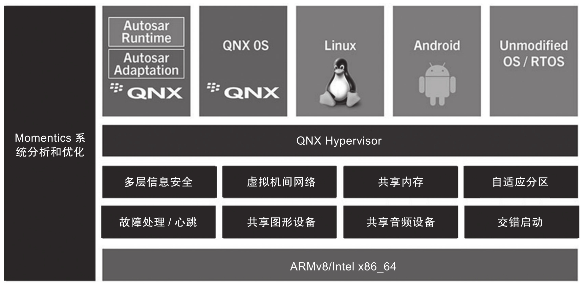

QNX Hypervisor 来自黑莓公司, 它是针对汽车电子和工业等领域的, 可以把多个不同安全需求的系统整合在同一个硬件平台上的虚拟化技术解决方案.

> QNX Hypervisor 介绍: https://www.blackberry.com/us/en/pdfviewer?file=/content/dam/qnx/products/QNX-Hypervisor-for-Safety.pdf

QNX Hypervisor 是一型虚拟机管理程序, 基于硬件虚拟化技术和实时优先级的微内核管理程序来管理虚拟机. QNX 虚拟机管理程序可以更容易地将非安全组件和安全组件隔离在不同的虚拟机中, 方便安全认证. QNX Hypervisor 已经通过了 ISO 26262 ASIL D 和 IEC 61508 SIL 3 认证, 其系统架构如图 9-6 所示.

# 安全认证

QNX Hypervisor 可以确定性地将安全关键应用程序和实时操作系统与非关键应用程序和操作系统隔离开来.

对于设备制造商而言, 这意味着他们可以更轻松, 更经济地获取和维护安全认证, 只需要关注自己的系统组件功能安全. 当将应用模块被移植到虚拟化平台时, 只有受影响的模块需要重新测试和重新认证.

QNX Hypervisor 的开发符合 IEC 61508 SIL-3(用于工业安全)​,IEC 62304(用于医疗设备软件)和 ISO 26262 ASIL-D(用于汽车安全)等标准.

# 空间隔离

QNX Hypervisor 使用硬件中的配置来保证虚拟机之间的内存和 CPU 核强隔离. 这种方法比用软件实现在效率, 性能和可靠性上更高.

# 时域隔离

QNX Hypervisor 实现并给虚拟机分配优先级, 当低优先级的虚拟机中负载繁忙时, 仍然可以确保在高优先级虚拟机中运行的实时进程的 CPU 计算资源.

这种方法比依赖时间片轮转或先来先服务 (First Come First Serve,FCFS) 调度算法更有效, 并且可以提高性能和可靠性. 在多核系统中, 不同的要求需要对各个 CPU 核进行不同的分配. QNX Hypervisor 使用优先级驱动的虚拟 CPU(vCPU)概念, 允许系统设计人员将虚拟机限制为一个或多个 CPU 核, 或者在多个虚拟机之间共享核. 这可以在确保安全性和实时行为的同时, 仍能实现最高的系统性能, 充分利用 CPU 资源.

# 支持的平台

QNX Hypervisor for Safety 支持的平台包括: 任何英特尔 x86_64VT-x 和 ARMv8-AArch64 硬件, 瑞萨电子 R-Car, 高通汽车计算平台(如 SA8155)​, 赛灵思, 联发科, 德州仪器, 恩智浦系列产品(i.MX 8 和 S32)​.