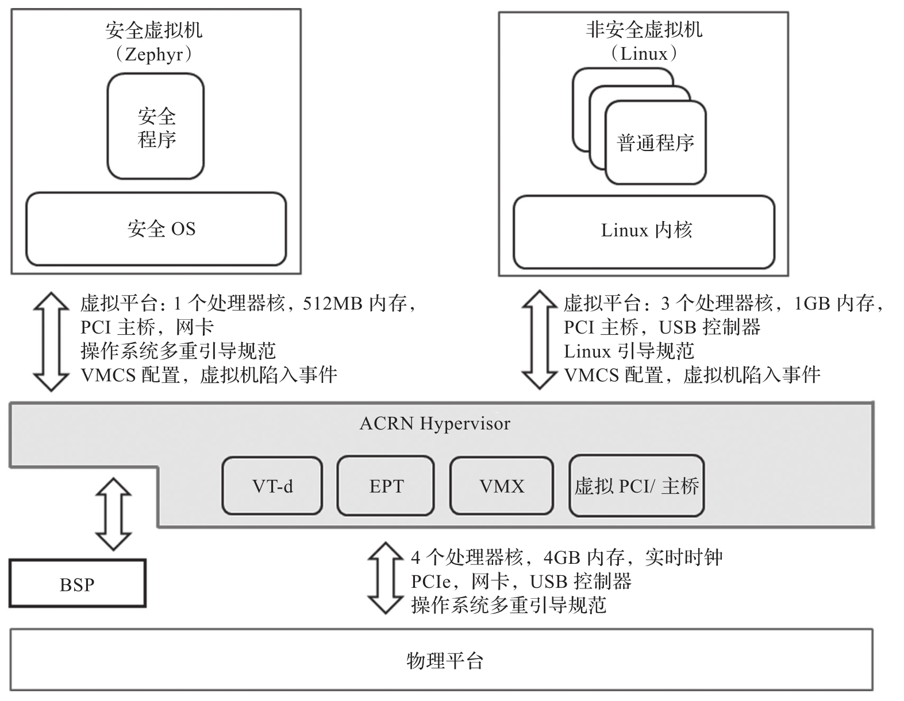
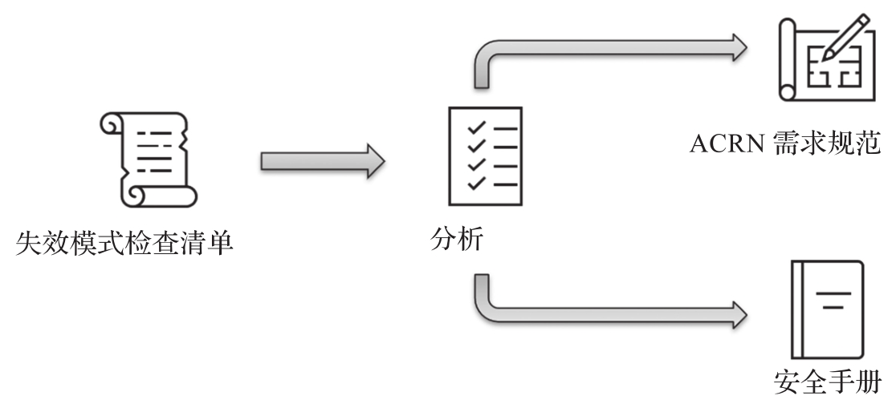

前面介绍了商用嵌入式 QNX Hypervisor, 它是闭源方案, 用户需要支付高额的授权和维护费用, 系统更新, 新硬件平台适配以及技术支持都需要在其公司的配合下才能完成. 相比闭源的商用嵌入式 Hypervisor,ACRN Hypervisor 是一款开源的, 专门为嵌入式系统设计的轻量级虚拟机 Hypervisor, 具有灵活, 轻量等特性, 是以实时性和关键安全性为设计出发点进行构建的嵌入式虚拟机参考方案. 用户可以免费获得源代码, 参考其设计进行系统开发, 以满足自己的产品开发需求.

本节将主要阐述 ACRN Hypervisor 安全认证版本的安全目标, 系统级安全措施, 独立性安全措施, 安全分析, 安全开发流程, 安全状态设计, 安全架构设计, 安全需求概述以及使用限制.

ACRN Hypervisor 的安全认证版本是一个基于 ACRN 1.4 开源版本, 经过重新架构后面向功能安全认证的版本, 其安全完整性等级到达了 IEC 61508:2010 标准中的 SIL3. 该版本支持混合关键性虚拟机系统, 可以同时运行两个虚拟机操作系统, 一个是作为安全虚拟机的 Zephyr 操作系统, 一个是作为非安全虚拟机的 Linux 操作系统. 两个同时运行的虚拟机的资源和外设是静态配置, 进行分区隔离.

ACRN 作为一型虚拟机, 如下核心模块经过了功能安全认证.

* 设备虚拟化所需的 VT-d(Virtualization Technology for Direct I/O).

* 内存虚拟化所需的 EPT(Extended Page Table).

* CPU 虚拟化所需的 VMX(Virtual Machine eXtension).

* 外设虚拟化所需的虚拟 PCI 总线和主桥.

ACRN 功能安全认证的范围如图 9-7 所示(ACRN Hypervisor 标注的方框内)​.

ACRN Hypervisor(安全认证版)系统架构及外部接口:

ACRN Hypervisor 安全认证版本是作为一个软件模块来进行安全认证的, 客户在使用它进行产品级别的功能安全认证时需要满足其在安全手册 (Safety Manual) 里定义的使用条件(Assumption of Use).

ACRN Hypervisor 功能安全认证充分证明了 ACRN 的架构设计符合功能安全的思想, 虚拟机核心代码的实现和流程符合功能安全的流程和质量要求, 同时它也可以给使用 ACRN 的客户充分的信心. 客户也可以重用 ACRN Hypervisor 安全认证版的流程, 设计, 并在其基础上进行二次开发和扩展.

具体来讲, ACRN Hypervisor 最基本的功能是为虚拟机提供一个虚拟平台, 提供 CPU 隔离, 内存隔离, 设备隔离, 缓存分区, 中断重映射等机制, 这些隔离机制使实现混合关键性系统成为可能.

要知道 Hypervisor 技术提供的虚拟平台和隔离机制有可能会影响系统安全功能. 一类是 Hypervisor 提供的虚拟平台自身存在缺陷, 运行在虚拟平台的安全功能将得到非预期结果. 具体主要缺陷有被损坏的状态, 异常硬件响应, 异常阻塞等. 另一类是 Hypervisor 引入额外的延时会导致无法满足系统实时性需求. 具体延迟有执行时间延迟, 中断异常等事件延迟.

另外, 由于安全虚拟机和非安全虚拟机存在硬件资源 (例如 L2 缓存, 系统总线等) 的共享, 非安全虚拟机中恶意应用可能损坏安全虚拟机中安全功能的内存或存储, 也可能向安全虚拟机引入额外执行延迟.

保证 Hypervisor 功能正确性和应对 Hypervisor 引入风险的措施如下.

* 关于 Hypervisor 自身缺陷. 采用系统化的开发方法, 即定义 Hypervisor 需求和期望的内部行为, 利用测试来验证实现是否满足定义的需求. 除此之外, 根据需求和架构设计, Hypervisor 还需要能检测和以防御式方法处理硬件失效.

* 关于 Hypervisor 自身引入的额外延迟. 系统级能容忍的 Hypervisor 额外延迟不在安全认证考虑范围内, ACRN Hypervisor 认证仅对由其引入在各种最坏情况下延迟进行性能评估和测试, 相关结果被记录在安全手册中. 此外, 安全手册中假设系统中采用硬件看门狗来监视安全功能的执行时间, 从而保证安全功能能在设计时间内完成.

对于来自非安全虚拟机的干扰, Hypervisor 需要利用硬件机制来实现内存或存储数据损坏等基本干扰避免措施. 如图 9-8 所示, 对于执行时间干扰, 采用系统性方法将失效模式定义在需求检查清单中. 针对每个原子需求, 确认是否存在相应失效模式; 如果存在, 需要对需求进行重新分析, 改进需求或者提供系统级建议措施来避免相应失效, 改进的需求将被记录在需求规范文档中, 系统级建议措施将被记录在安全手册中.

