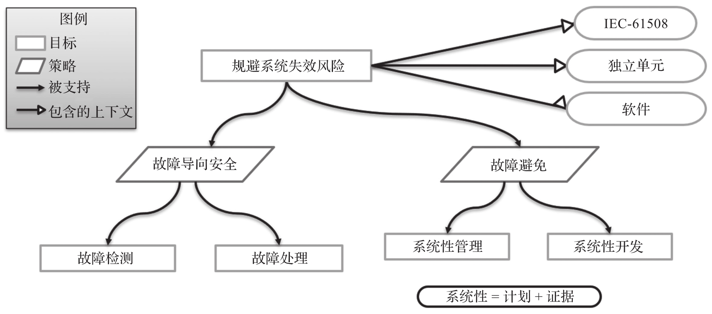

为了保证 ACRN Hypervisor 功能的正确性, 减少由 ACRN Hypervisor 引入的系统失效带来的风险, 必须对 ACRN Hypervisor 进行安全认证. ACRN Hypervisor 功能安全认证是指按照 IEEE 61508 标准的要求将 ACRN Hypervisor 作为一个独立安全软件单元 (Out-of-context) 开发, 由第三发认证机构 (如 TÜV SÜD) 对其进行合规性审查. 独立安全软件单元是指该软件开发不是针对一个特定的系统, 而是基于合理的安全完整性等级和使用假设来进行开发, 在遵循安全手册的情况下, 该软件单元可以被集成到相关安全攸关系统中.

ACRN Hypervisor 功能安全认证版本主要遵循故障导向安全 (fail-safe) 原则并采用故障避免措施来减少由系统失效引入的风险, 如图 9-9 所示.

ACRN Hypervisor 功能安全目标结构图:

* 在故障导向安全方面, 主要考虑安全相关软件如何检测故障, 以安全的方式来处理故障.

* 在故障避免方面, 主要采用系统性管理和系统性开发, 这里的系统性是指对管理和开发每个活动先计划, 通过检查每个活动是否符合计划.
