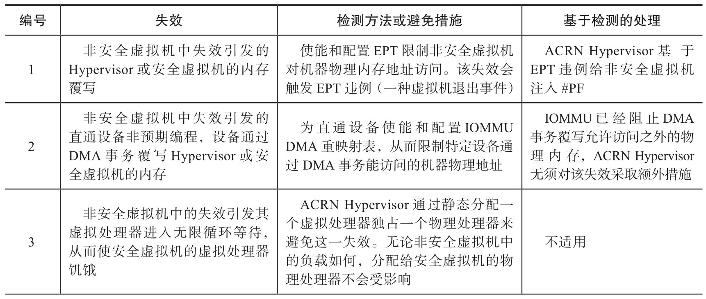
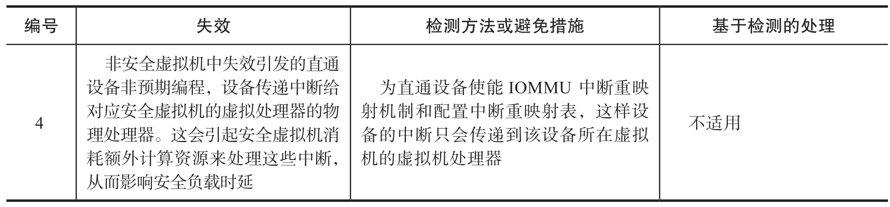

# 设备直通

在 Hypervisor 中, 直通设备是客户操作系统可以直接和独占访问的物理设备. 因为它是直接和独占的, 所以这种对物理设备的访问会比通过虚拟设备访问更快, 或者比与其他客户操作系统或 Hypervisor 主机共享访问更快.

要使用直通设备, 客户操作系统必须有自己的物理设备驱动程序. Hypervisor 本身不需要驱动程序.

对于直通设备, Hypervisor 根模式只知道它必须将来自物理设备的中断直接路由到客户操作系统, 并将来自客户操作系统的信号直接传递给设备. 所有交互都在客户操作系统和设备之间, Hypervisor 的唯一职责是使用 VT-d 实现设备隔离.

# CPU 寄存器和设备访问截获

对影响安全虚拟机行为的 CPU 寄存器和设备配置空间访问截获, 使相应物理值不会被非安全虚拟机中的应用恶意篡改.

# 安全相关设备

ACRN Hypervisor 可以将系统级安全相关设备 (如 CPU 或者芯片组里的 "安全岛" 功能) 直接分配给安全虚拟机.

# Hypervisor 中的错误处理

ACRN Hypervisor 设计不包含任何安全功能, 但提供虚拟机隔离相关机制和相关失效模式下对应的处理措施. 表 9-6 总结了由 ACRN Hypervisor 实现的虚拟机隔离机制.

