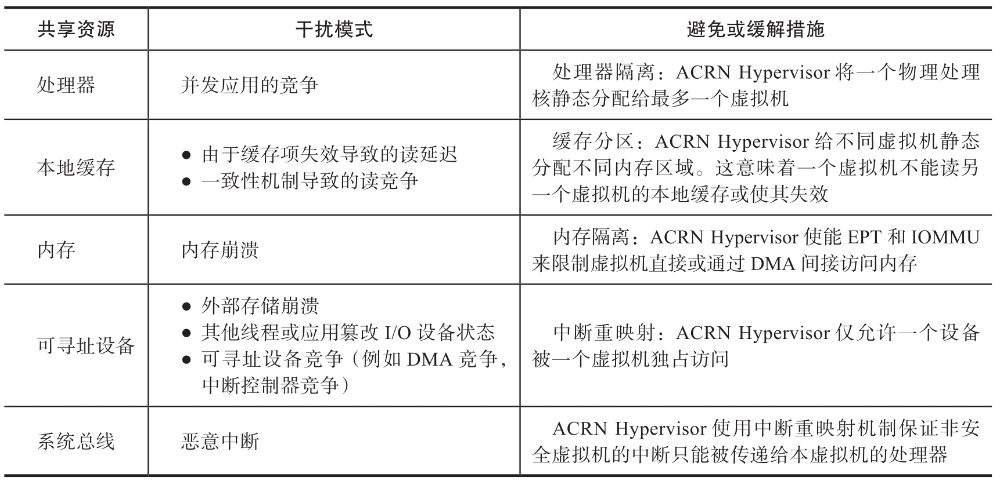
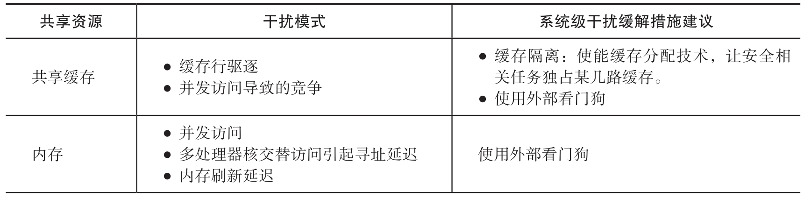
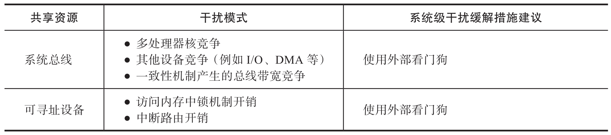

ACRN Hypervisor 自身不实现完整的安全回路 (包含传感器, 控制逻辑和执行器)​, 其设计保证虚拟机可以运行安全功能 (例如与传感器 / 执行器交互, 控制逻辑)​.

ACRN Hypervisor 最关键的安全需求是对虚拟机的隔离, 也就避免和减轻虚拟机之间的时空干扰. 下面的表主要概述了 ACRN Hypervisor 设计中可以避免和减轻的干扰模式

下表概述了残留的时间干扰模式, 这些干扰需要系统层额外的措施来缓解.

