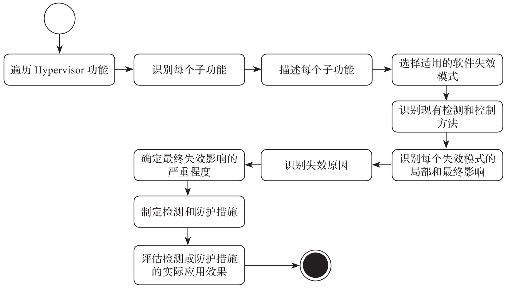
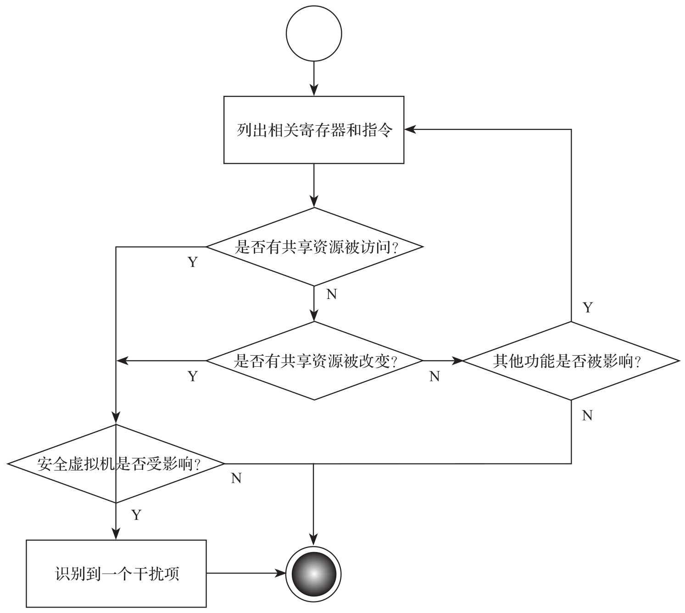

安全模式与影响分析的目的是识别软件功能的可能失效及任何必要措施. 安全模式与影响分析提供了以系统性方法局部或全局地识别软件失效模式和失效影响, 并识别失效的原因, 如图所示.

安全模式与影响分析流程图:

在软件安全需求阶段和软件架构设计阶段执行如下分析步骤.

1) 识别虚拟机监视器的子功能或模块.

2) 描述软件需求规范或软件架构设计规范中子功能或模块的功能和性能 (如有)​.

3) 选择适用的系统性软件失效模式.

4) 识别失效检查方法和现有失效控制.

5) 识别失效模式的局部或最终影响.

6) 识别失效的原因.

7) 识别预防或检测方法.

8) 评估失效预防或检测方法实际效果.

在软件安全需求阶段, 根据检查表中列举的失效模式采用如图 9-11 所示的步骤进行干扰分析.

