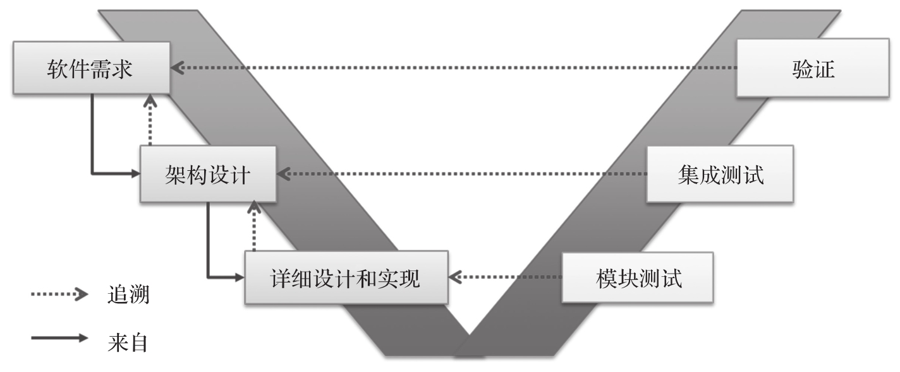
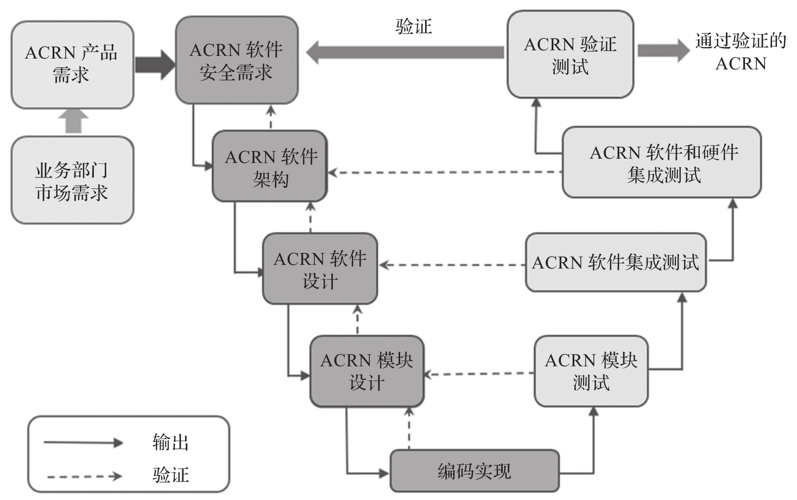
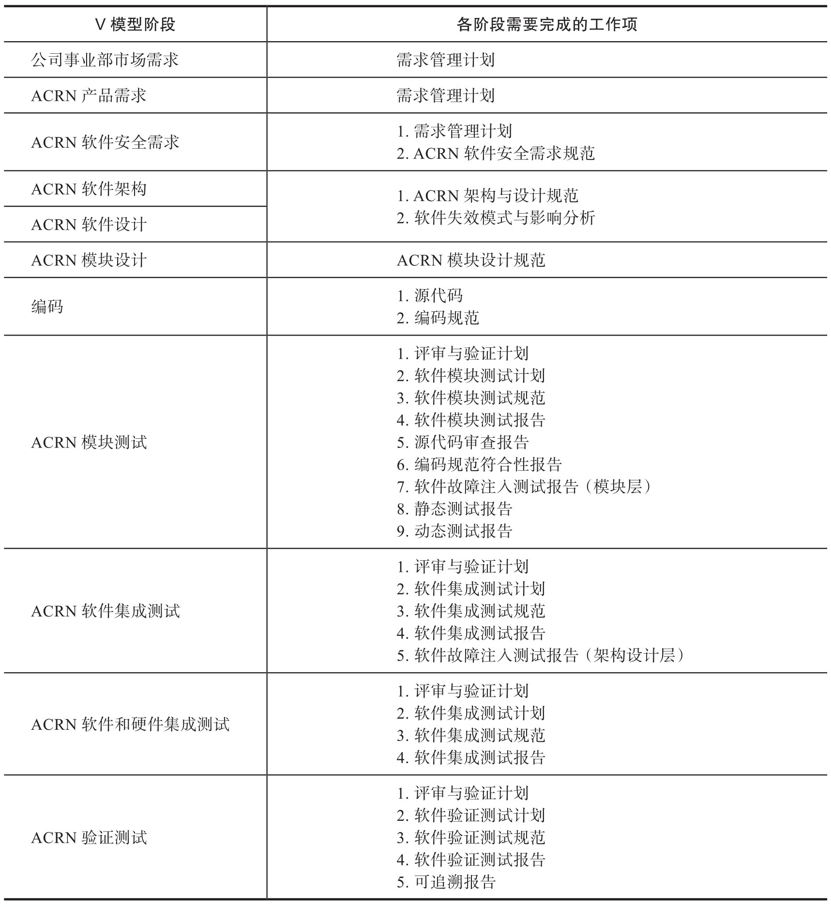
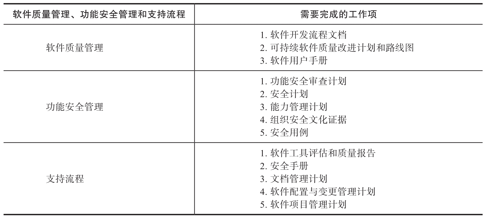
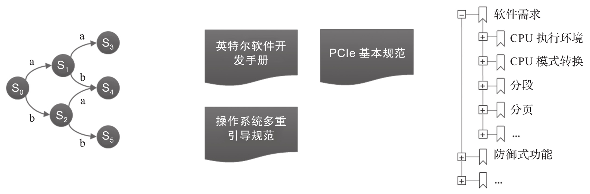

功能安全标准要求软件开发需要符合 V 模型(瀑布模型)​. 如图 9-12 所示, 在 V 模型中, 软件开发被划分为多个阶段. 首先定义如何采用系统方法来组织软件需求, 如何采用半形式化方法来定义需求, 从而确保需求的正确性, 一致性和完备性. 然后, 从需求导出架构设计, 相关验证和测试来保证架构设计和需求的一致性. 最后, 从架构设计导出详细设计和实现, 相关验证和测试来保证详细设计和架构设计的一致性. 通过相关工具软件为每个软件产品, 文档技术项赋予唯一标识, 为相关文档技术项建立链接关系, 从而保证每个软件产品文档的可追踪性.

功能安全开发的 V 模型:

# 安全开发流程

在进行软件开发前, 还需要在计划阶段明确定义和建立相关辅助流程, 并在具体执行过程中将相关流程产出进行存档, 作为流程被实施的证据. 辅助流程主要有开发人员能力管理流程, 需求管理流程, 文档管理流程, 工具分类和质检流程, 配置管理流程, 变更管理流程, 验证流程, 质量保证流程等.

如果是商用或现有软件模块符合 IEC 61508-3 中的 7.4.2.12 条款(方法 3s——非标准开发评估)​,IEC 61508 标准允许这些软件模块被应用于安全攸关系统.

下图是 ACRN 所采用的基于 V 模型的开发流程和作为 SIL 3 软件开发项目所需要的工作项及产出.

下表描述了 ACRN Hypervisor 在各个开发阶段需要完成的具体工作项. 每个工作项都是一个迭代开发的过程. 这些工作项均需通过内部审查, 在正式版本发布后, 还要被提交给第三方认证机构审查. 如果后继的开发阶段需要对正式版本的开发项进行修改, 则需要经历变更管理流程才能进行升级, 并重新进行内部审查, 提交第三方认证机构审查, 直至通过.

软件质量管理, 功能安全管理和支持流程的相关工作项, 如表 9-10 所示.

# 精确需求定义流程

在 ACRN Hypervisor 认证过程, 大多安全流程和一般的软件安全流程类似. 考虑到 Hypervisor 功能的特殊性, 在需求定义流程中, ACRN 项目采用状态机这一半形式化方法来分析和描述需求, 半形式化方法能有效保证 Hypervisor 这类复杂系统软件需求的正确性和完备性, 对其他系统软件需求的正确性和完备性保证具有借鉴意义.

通常可以通过描述 API 来定义操作系统需求, 但 Hypervisor 并不向虚拟机直接提供 API, 而是对其提供一个虚拟平台, 这个虚拟平台包含虚拟处理器, 虚拟内存, 虚拟寄存器, 虚拟外设, 支持指令执行, 支持中断异常等, 如何精确描述 Hypervisor 提供的虚拟平台功能是一个巨大挑战, 本节概述如何利用状态机描述虚拟平台功能.

精确需求是软件设计, 开发, 测试的基础, 如果把 Hypervisor 功能粗略地定义为多个虚拟机划分硬件资源, 这个需求就太模糊了, 基于这样模糊的需求, 无法导出架构设计, 也无法设计和验证测试用例.

基于粗略的需求, 很明显会有以下问题:

* 哪些硬件资源需要被划分? 对于外部设备, 哪些外部设备需要被分配给哪个虚拟机? 哪些外部设备需要对哪个虚拟机隐藏?

* 最多能支持多少虚拟机? 通常 Hypervisor 支持的虚拟机数量不是无限的, 会受到硬件资源的限制, 也可能受其他因素的限制. 系统集成过程, 需要考虑相关 Hypervisor 能力限制来设计系统安全功能.

* 为虚拟机提供哪些硬件功能(例如 CPU 功能)​? 系统集成过程中, 需要知道哪些硬件功能是可用的以及这些硬件功能的使用限制(如果有)​, 同时需要对安全功能使用的相关硬件功能进行集成验证.

如何启动虚拟机? 需要在需求中精确定义虚拟机启动协议, 以及在执行虚拟机前, 相关软硬件的初始状态.

面对上面的挑战, ACRN Hypervisor 使用如下系统化方法来分析和组织软件需求, 如图 9-14 所示.

* 将虚拟处理器抽象成状态转换系统. 系统中的状态包含寄存器值, 内存状态和设备状态, 触发条件包含指令执行, 中断异常事件.

* 为了使虚拟处理器状态转换系统需求定义成为可能, ACRN Hypervisor 参考现有技术文档 (英特尔软件开发手册, PCI 总线基本规范, 多启动规范等) 来定义相关硬件功能, 当虚拟处理器的相关功能和物理处理器功能精确一致时, 就在需求文档中引用相关技术文档的对应技术条款.

系统包含大量的状态转换, 从工程角度, 如果每一个行为都用半形式化方法来定义, 这将是一个巨大的工程. 因此, 只有在虚拟处理器的相关功能和物理处理器功能不一致时, 才会使用半形式化方法来定义虚拟处理器相关行为.
