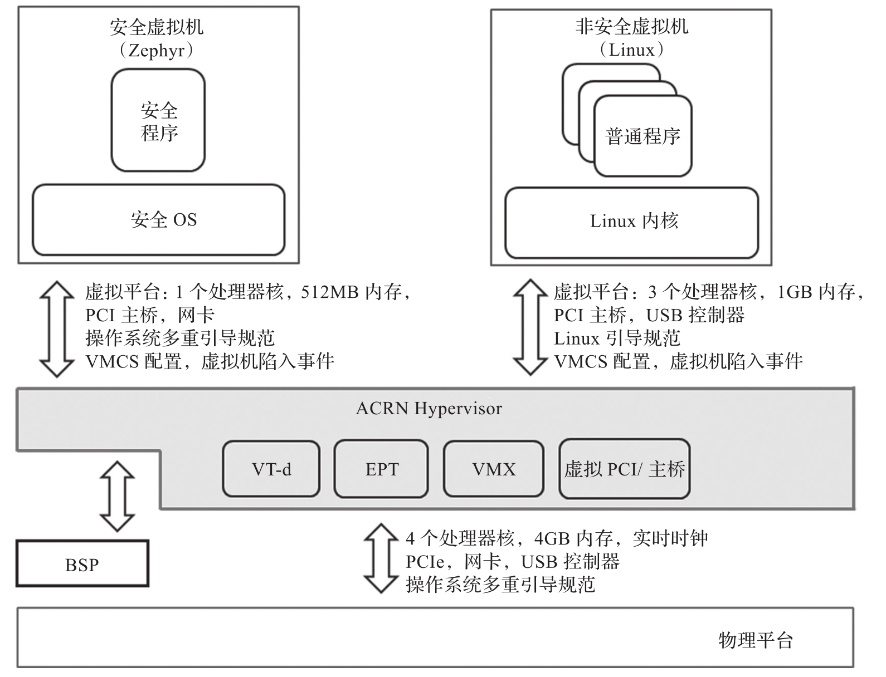
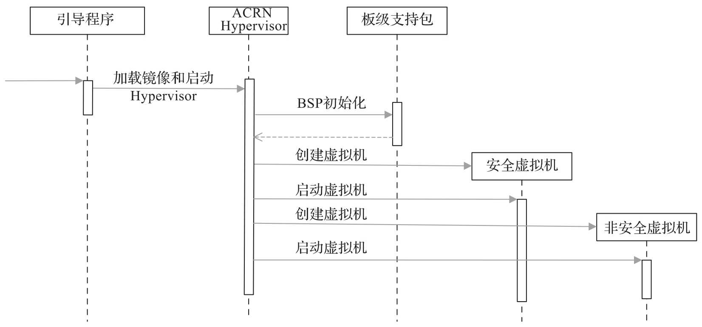

本节从以下几个方面来阐述 ACRN Hypervisor 的安全架构设计.

* 与硬件平台交互.

* 与板级支持包交互.

* 与安全虚拟机交互.

* 与非安全虚拟机交互.

下图中列出了 ACRN Hypervisor 与硬件及其他软件系统的接口, 下面具体进行介绍.

ACRN Hypervisor(安全认证版)与外部系统的接口:

# 与硬件平台交互

硬件平台启动后, 引导程序 (Bootloader) 将控制权交给 ACRN Hypervisor, 在这之后 Hypervisor 接管所有的物理资源. 这些物理资源包括所有物理处理器核, 内存和设备. ACRN Hypervisor 可能会使用一部分硬件资源.

除此之外, ACRN Hypervisor 被编译成 Multiboot 兼容的镜像, 需要引导程序提供 Multiboot 兼容的启动信息. 启动信息包括 Multiboot 兼容格式的内存映射信息, 以及两个虚拟机的内核镜像信息.

# 与板级支持包交互

ACRN Hypervisor 调用板级支持包进行与目标板相关的初始化和错误检测.

ACRN Hypervisor 从引导程序获得物理引导处理器 (Bootstrap Processor,BP) 控制权或启动物理应用处理器(Application Processor,AP), 建立好 C 语言环境后调用板级支持包的初始化例程(如 bsp_init)​. 当且仅当初始化成功后, bsp_init 返回. ACRN Hypervisor 保证 bsp_init 不会同时在多个处理器上同时运行, 如果任何物理处理器核上 bsp_init 失败, 它将不会启动任何虚拟机.

> 由于 ACRN Hypervisor 的启动代码采用汇编语言编写, 板级支持包采用 C 语言编写, 故在调用 bsp_init 前必须建立 C 语言环境

当 ACRN Hypervisor 在一个物理处理器核上检测到任何不可恢复的错误时, 它将在该处理器核上调用板级支持包的错误处理接口(如 bsp_fatal_error)​. 错误处理接口将系统平台转到安全状态, 不再返回. 运行在处理器核上的虚拟 CPU 也不再被恢复. 这里需要注意的是, bsp_fatal_error 需要在多个处理器核上同时运行, 以防在 Hypervisor 多个处理器核上同时检测到不可恢复错误.

# 与安全虚拟机交互

ACRN Hypervisor 与安全虚拟机交互, 启动虚拟 CPU, 并处理虚拟机退出 (VM Exit) 事件.

在启动一个虚拟机前, ACRN Hypervisor 为每个虚拟 CPU 准备一个 VMCS,VMCS 包含客户寄存器值, 虚拟机中的一些指令行为或者事件设置. VMCS 也包括一个控制虚拟机中可访问内存区域的 EPT.ACRN Hypervisor 将安全虚拟机的虚拟 CPU 的 IP 设置为客户物理地址 (100000H) 并启动该虚拟 CPU.

启动一个虚拟机之后, ACRN Hypervisor 采用事件驱动机制, 仅根据虚拟机退出事件为虚拟机模拟一些指令的设计行为和事件. 当没有虚拟机退出事件时, 如果虚拟 CPU 对应的物理处理核是激活的, ACRN Hypervisor 不会被执行, 或者一个虚拟 CPU 等待被虚拟机中其他虚拟 CPU 启动.

# 与非安全虚拟机交互

ACRN Hypervisor 与非安全虚拟机交互, 启动虚拟 CPU, 并处理虚拟机退出 (VM Exit) 事件, 和 ACRN Hypervisor 与安全虚拟机交互的方式一样.

此外, ACRN Hypervisor 期望非安全虚拟机的客户操作系统内核是 Linux bzimage 格式, 按照 Linux/x86 启动协议兼容格式为非安全虚拟机提供启动信息. ACRN Hypervisor 也创建描述虚拟 CPU 和 LAPIC 的虚拟 ACPI 表. 该虚拟 ACPI 表被存放在从 F2400H 开始的客户物理内存区域.

下图所示为 ACRN Hypervisor 启动时序图. 物理平台上电后, 启动程序引导物理平台启动, 然后将控制权交给 ACRN Hypervisor.ACRN Hypervisor 在每个物理核上调用板级支持包的初始化例程, 之后创建并启动两个虚拟机.

