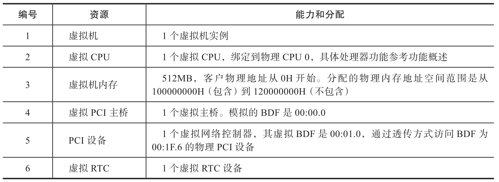
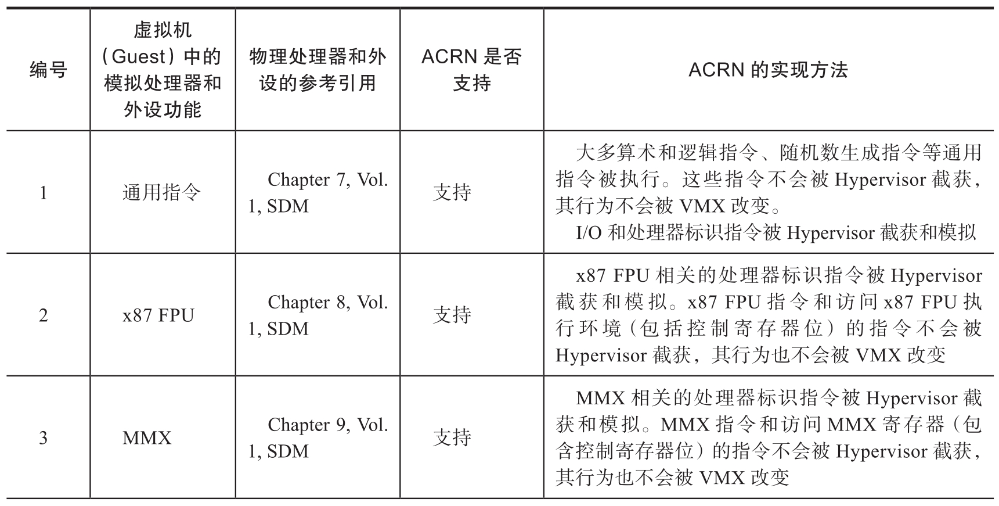
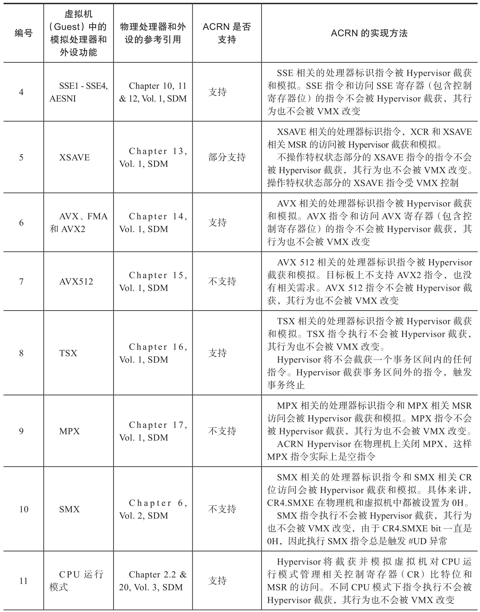
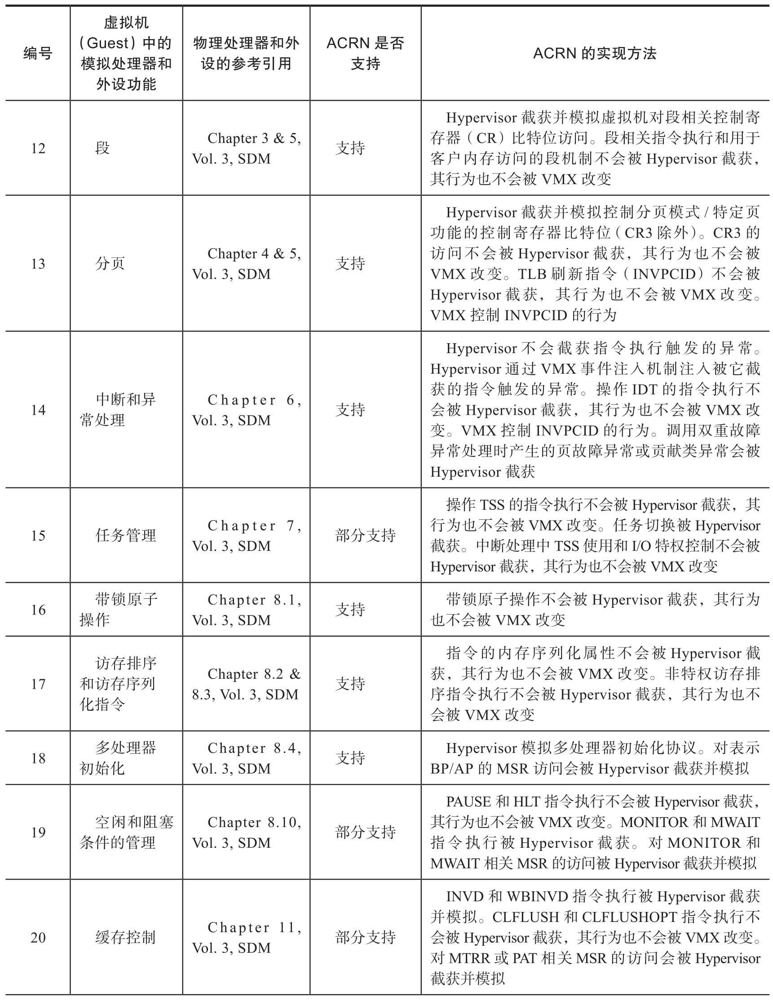
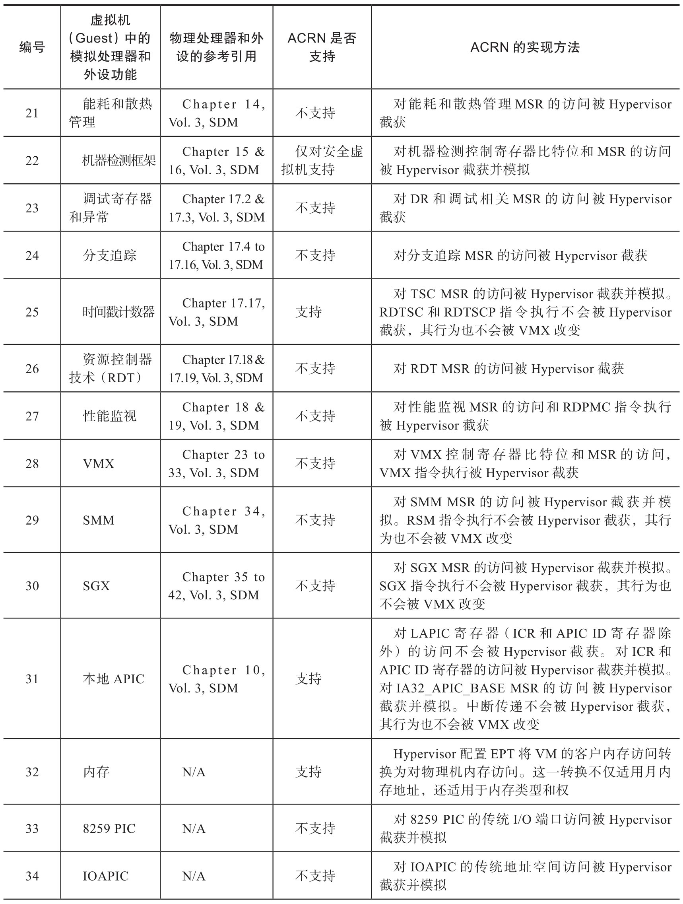
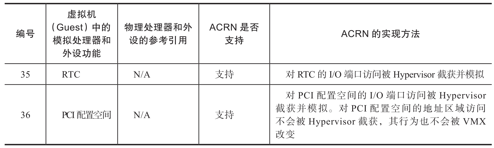

ACRN Hypervisor 管理分配给虚拟机的资源. 表 9-11 和表 9-12 分别总结了为安全虚拟机和非安全虚拟机提供的资源.

提供给安全虚拟机的资源:

提供给非安全虚拟机的资源:

ACRN Hypervisor 主要功能是为每个虚拟机提供一个虚拟机器平台. 虚拟机 (Guest) 通常通过指令来使用虚拟机器平台 (Hypervisor) 的功能. 实现这些功能遵循如下策略.

* Hypervisor 截获和模拟指令. 在这类场景下, 试图执行的指令将触发一次虚拟机退出事件, 物理处理器的控制流被切换回 Hypervisor, 由 Hypervisor 处理这一虚拟机退出事件.

* 通过 VMX 改变行为. 在这类场景下没有虚拟机退出事件发生, 由于 Hypervisor 对 VMCS 域的配置, 因此从虚拟机角度来看, 指令执行行为不同于非 VMX 操作模式.

* Hypervisor 不截获, VMX 也不改变行为. 在这类场景下, 没有虚拟机退出事件发生, 从虚拟机角度来看, 指令执行行为和非 VMX 操作模式一样.

下表为虚拟机中的处理器和外设功能概览以及 ACRN Hypervisor 实现策略概述. 如无特别说明, 表 9-13 是从虚拟机角度描述指令和寄存器的.

