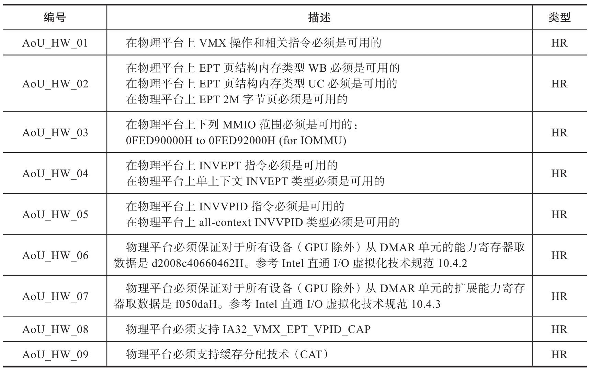
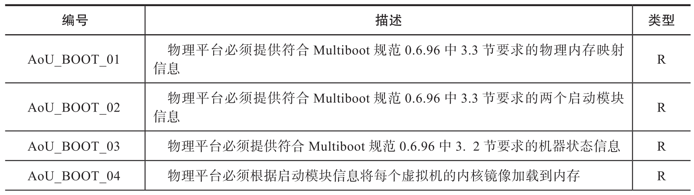
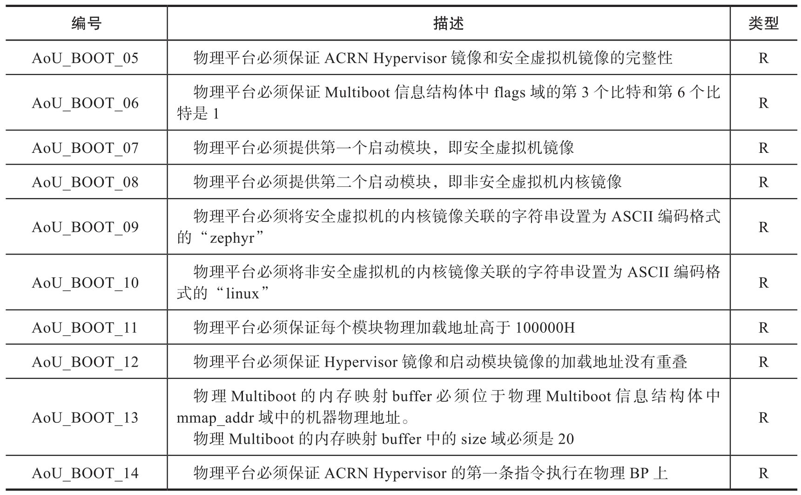
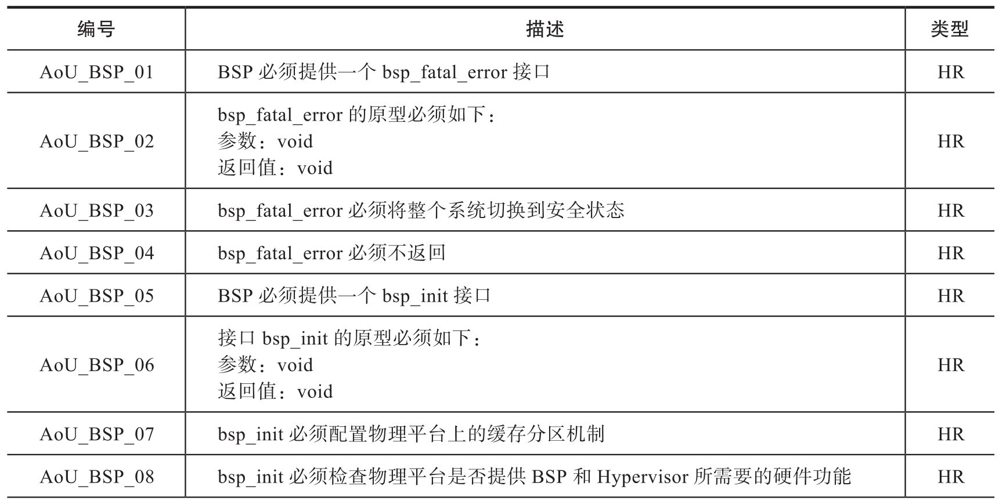
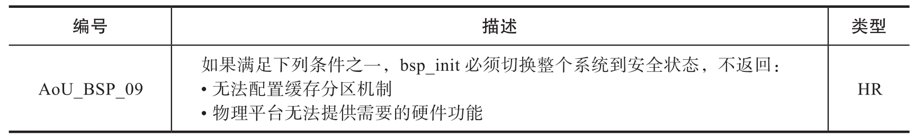
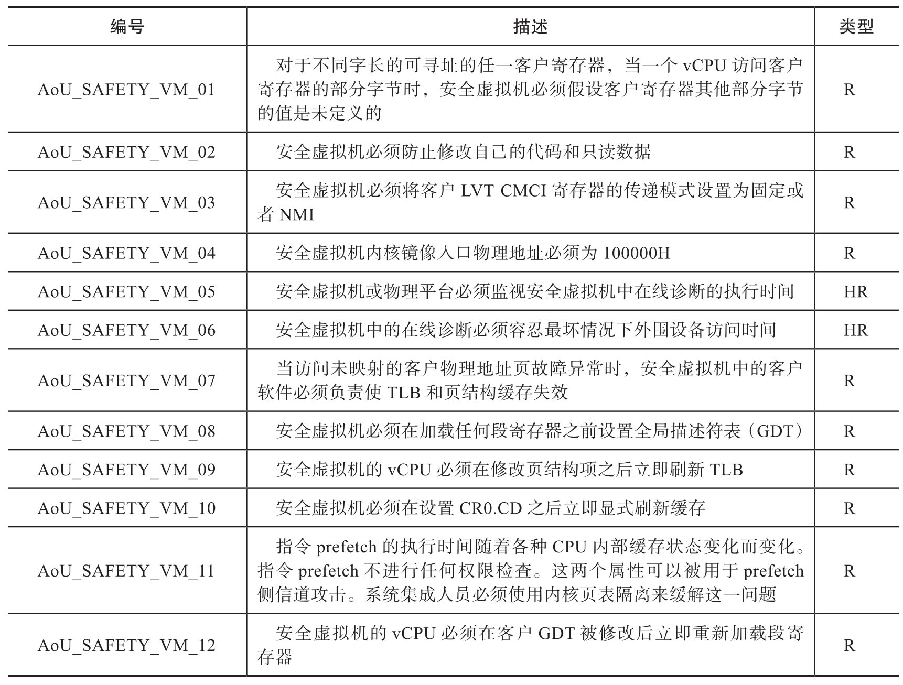
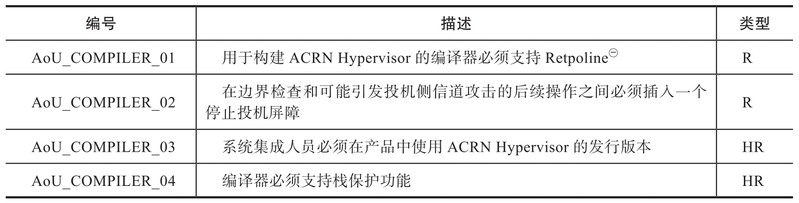

本节描述的使用限制是保证基于 ACRN Hypervisor 系统级安全的重要组成部分, 用户使用 ACRN Hypervisor 过程中必须考虑这些限制. 这些限制条件来自需求分析, 架构设计分析和安全分析过程, 由于 Hypervisor 的基本功能类似 (例如提供一个虚拟平台)​, 对其他 Hypervisor 设计也具有参考意义.

本节描述的使用限制来源于如下活动.

●需求分析: 主要包括 ACRN 虚拟机监视器要提供软件需求规范中的功能需要遵循的限制. 这些限制通常是针对通用用例中外部硬件或软件模块的限制.

●架构设计分析: 主要包括 ACRN 虚拟机监视器架构设计过程中为保证设计决定正确性需要遵循的限制. 这些限制通常是针对通用用例中外部硬件和相关固件或启动程序的限制.

●安全分析: 主要包括避免虚拟机中非确定性或非预期行为需要遵循的限制. 这些限制通常是针对通用用例中外部硬件或软件模块的限制.

下面定义的推荐等级是为了表明这些限制对安全的整体影响.

●高度推荐 (Highly Recommended,HR): 表示该限制和虚拟机隔离或 ACRN 虚拟机监视器错误处理直接相关.

●推荐 (Recommended,R): 表示该限制的违反不直接影响虚拟机隔离或 ACRN 虚拟机监视器错误处理, 但影响部分虚拟机监视器功能的需求符合性. 这些影响是否有安全隐患取决于安全相关虚拟机如何使用受影响的功能.

# 1. 针对物理平台的限制

物理平台中的安全相关限制主要针对硬件功能, ACRN 虚拟机监视器利用这些功能实现虚拟机隔离. 这些硬件功能中任何一项缺失将导致 ACRN 无法启动虚拟机, 如表 9-14 和表 9-15 所示.

针对物理平台的安全相关限制:

针对物理平台的功能相关限制:

# 2. 针对启动程序的限制

启功程序中的限制主要针对 ACRN 虚拟机监视器需要的启动协议. 这些使用限制的违反将导致虚拟机监视器无法被启动, 如表 9-16 所示.

针对启动程序的限制:

# 3. 针对板级支持包的限制

板级支持包中的限制主要针对板级支持包提供的接口, 参见表 9-17. 任一需要的接口缺失将导致构建虚拟机监视器时链接失败.

针对板级支持包的限制:

# 4. 针对安全虚拟机中软件的限制

安全虚拟机中软件的限制主要是为了避免非确定性硬件行为和容忍硬件操作的抖动, 参见表 9-18.

针对安全虚拟机中软件的限制:

# 5. 针对编译器和集成流程的限制

编译器和集成流程的限制是为了支持缓解侧信道漏洞的信息安全功能, 参见表 9-19.

针对编译器和集成流程的限制:

㊀ 一种防止 "幽灵" 安全漏洞的方法: https://www.intel.com/content/www/us/en/developer/articles/technical/software-security-guidance/technical-documentation/retpoline-branch-target-injection-mitigation.html
