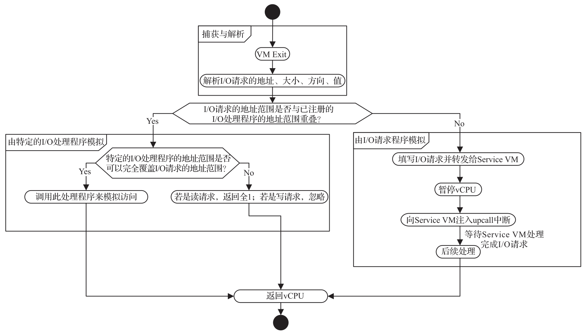

在 ACRN Hypervisor 中, I/O 模拟有多种方式和处理位置, 包括 Hypervisor, 服务虚拟机中的内核 HSM(Hypervisor Service Module), 以及服务虚拟机中的设备模型.

Hypervisor 中的 I/O 模拟提供以下功能.

* 在 Hypervisor 中维护两个列表, 分别用来处理 I/O 端口和 MMIO, 以模拟特定范围内被捕获的 I/O 访问.

* 当特定 I/O 访问无法由任何注册在 Hypervisor 中的处理程序处理时, Hypervisor 会将 I/O 访问转发到服务虚拟机.

下图所示为 Hypervisor 中 I/O 模拟的控制流程.

1) 通过 VM Exit 捕获 I/O 访问, 并从 VM Exit Qualification 或调用指令解码器对 I/O 访问进行解码.

2) 如果 I/O 访问的范围与任何注册的 I/O 处理程序重叠, 则在完全覆盖访问范围时调用该处理程序, 如果访问跨越边界则忽略该访问.

3) 如果 I/O 访问范围不与任何注册的 I/O 处理程序的范围重叠, 则向服务虚拟机发送 I/O 处理请求.