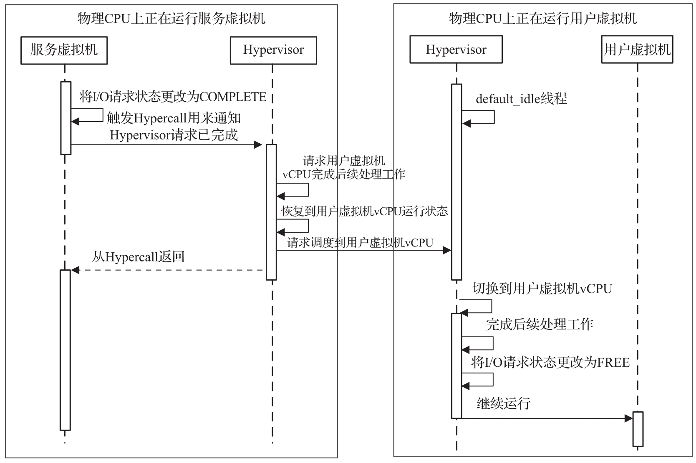
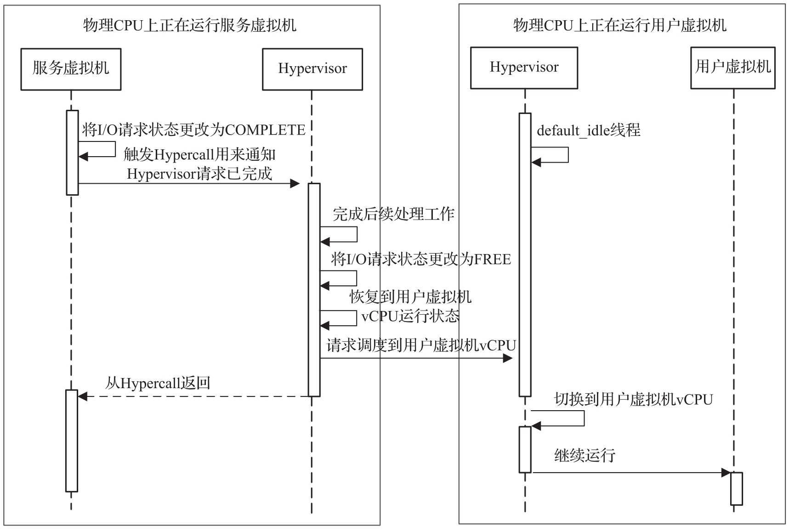

如上所述, 如果 ACRN Hypervisor 未找到与捕获的 I/O 访问范围重叠的任何处理程序, 则将 I/O 请求传送到服务虚拟机. 本节将介绍 I/O 请求机制的初始化以及如何通过 Hypervisor 中的 I/O 请求模拟 I/O 访问.

# 初始化

对于每个用户虚拟机, Hypervisor 与服务虚拟机共享一个页表用来交换 I/O 请求. 4 KB 的页表由 16 个 256 字节的 slot 组成, 由 vCPU 的 ID 进行索引. 设备模型需要在创建 VM 时分配和设置请求缓冲区, 否则服务虚拟机将无法模拟来自用户虚拟机的 I/O 访问, 无法由 Hypervisor 中的 I/O 处理程序处理的 I/O 访问都将被丢弃 (读取全为 1, 写入被忽略)​.

# I/O 请求的类型

ACRN Hypervisor 与服务虚拟机的交互支持四种类型的 I/O 请求, 如下表所示.

对于 I/O 端口的访问, ACRN Hypervisor 将始终向服务虚拟机传递 PIO 类型的 I/O 请求.

对于 MMIO 的访问, ACRN Hypervisor 将向服务虚拟机传递 MMIO 或 WP 的 I/O 请求, 具体取决于访问的 GPA 在 EPT 中的映射.

Hypervisor 永远不会传递任何 PCI 类型的 I/O 请求, 但会在完成时以与 I/O 端口访问相同的方式处理此类 I/O 请求.

# I/O 请求状态转换

在 ACRN Hypervisor 中, I/O 请求缓冲区中的每个 slot 都由具有四种状态的有限状态机管理, 图 4-33 说明了 I/O 请求的状态转换和触发它们的事件.

这四种状态是:

●空闲 (FREE), 即 slot 中没有 I/O 请求, 可以传递新的 I/O 请求. 这是用户虚拟机创建的初始状态.

●阻塞 (PENDING), 即 I/O 请求 slot 被服务虚拟机待处理的 I/O 请求占用.

●处理中 (PROCESSING), 即 I/O 请求已分派给客户端, 但客户端尚未完成处理.

●完成 (COMPLETE), 即客户端已完成 I/O 请求, 但 Hypervisor 尚未处理其返回结果.

当 I/O 请求 slot 的状态为 FREE 或 COMPLETE 时, I/O 请求 slot 的内容归 Hypervisor 所有. 在这种情况下, 服务虚拟机只能访问该 slot 的状态. 类似地, 当状态为 PENDING 或 PROCESSING 时, Hypervisor 只能访问该 slot 的状态, 内容由服务虚拟机所有.

I/O 请求的状态转换过程如下.

●为了传递 I/O 请求, Hypervisor 获取与触发 I/O 访问的 vCPU 相对应的 slot, 填充 I/O 请求内容, 将状态更改为 PENDING 并通过 upcall 通知服务虚拟机.

●在 upcall 中, 服务虚拟机将处于 PENDING 状态的每个 I/O 请求分派给客户端, 并将状态更改为 PROCESSING.

●分配了 I/O 请求的客户端在完成 I/O 请求的模拟后将状态更改为 COMPLETE. 在状态更改后, 进行 Hypercall 以在 I/O 请求完成时通知 Hypervisor.

●Hypervisor 在收到完成通知后完成 I/O 请求的后期工作, 并将状态更改回 FREE.

●服务虚拟机在无法处理 I/O 请求时, 会返回全 1 以进行读取并忽略写入, 并将请求的状态更改为 COMPLETE.

# I/O 请求的后续工作 (Post-work)

I/O 请求完成后, 还需要为 I/O 读取做一些后续工作, 以相应地更新 Guest 寄存器. 每次调度回 vCPU 时, Hypervisor 都会重新进入 vCPU 线程, 而不是切换到调度 vCPU 的位置, 因此引入了后期工作.

在将 I/O 请求传送到服务虚拟机之前, Hypervisor 会暂停 vCPU. 一旦 I/O 请求模拟完成, Client 就会通过 Hypercall 通知 Hypervisor.Hypervisor 将接收该请求, 执行后续工作, 并恢复 vCPU. 后续工作负责更新 vCPU 状态以反映 I/O 读取的影响.

下图说明了完成 MMIO 的 I/O 请求的工作流程.

一旦 I/O 请求完成, 服务虚拟机通过 Hypercall 通知 Hypervisor,Hypervisor 将会恢复触发访问的用户虚拟机的 vCPU. 用户虚拟机的 vCPU 恢复后, 如果访问读取地址, 它首先会更新 Guest 寄存器, 将相应的 I/O 请求 slot 的状态更改为 FREE, 并继续执行 vCPU.

下图说明了完成 I/O 端口的 I/O 请求的工作流程, 这与 MMIO 情况类似, 只是在恢复 vCPU 之前完成了后期工作. 这是因为 I/O 端口读取的后期工作需要更新 vCPU 的通用寄存器 EAX, 而 MMIO 读取的后期工作需要进一步模拟被捕获的指令.

