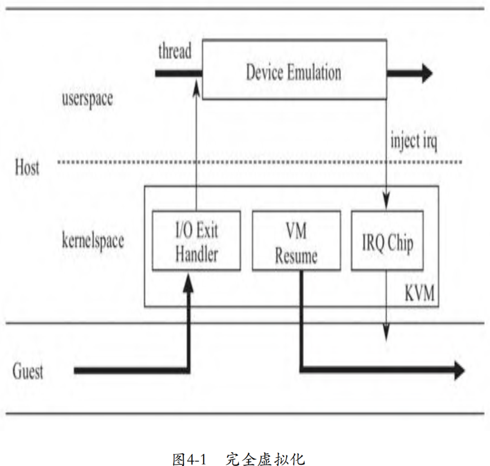
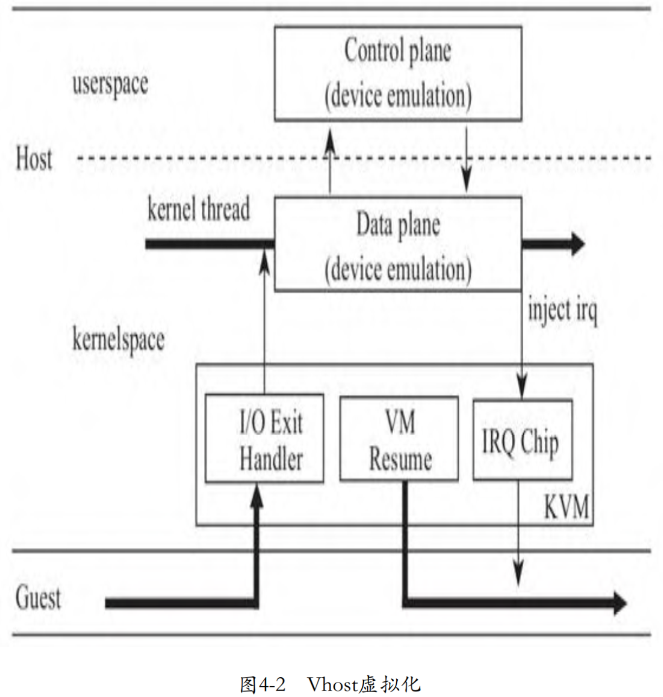
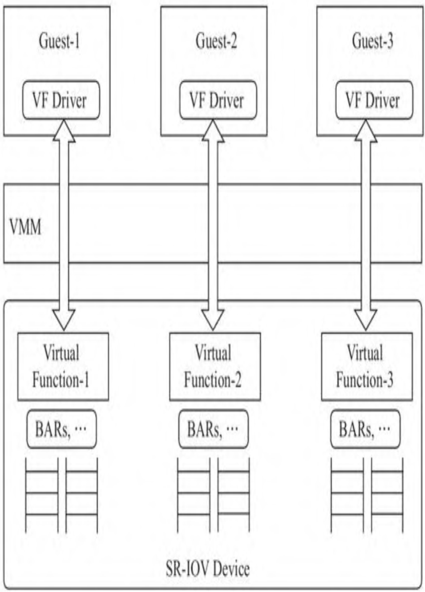

最先出现的设备虚拟化方案是, VMM 按照硬件设备的规范, 完完整整地模拟硬件设备的逻辑. 完全虚拟化的优势是 VMM 对于 Guest 是完全透明的, Guest 可以不加任何修改地运行在任何 VMM 上. 起初, 完全虚拟化的逻辑完全在用户空间实现, 因为 Guest 的 I/O 操作触发 CPU 从 Guest 陷入 Host 内核中的 KVM 模块后, CPU 还需要从内核空间切换到用户空间进行 I/O 模拟操作, 其过程基本如图 4-1 所示.

既然 Guest 因为 I/O 触发 CPU 切换到 Host 模式后首先进入的是内核中的 KVM 模块, 为什么**不在内核**中完成设备的**模拟**动作, 而是要**切换到用户空间**中模拟呢? 因此, 在有些场景下, 设备虚拟更适合在内核空间进行, 比如典型的**中断虚拟化芯片的模拟**. 但是, 有的设备模拟过程非常复杂, 如果**完全在内核中**实现, 除了会给**内核**中**增加复杂度**, 也容易带来**安全问题**. 于是, 开发人员提出了一个折中的 **Vhost** 方案, 将模拟设备的**数据处理相关部分**(`dataplane`)搬到了**内核空间**, **控制部分**还保留在**用户空间**中, 如图4-2所示.

事实上, 对于软件方式模拟的设备虚拟化来讲, 完全没有必要生搬硬套硬件的逻辑, 而是可以制定一个更高效、简洁地适用于驱动和模拟设备交互的方式, 于是**半虚拟化**诞生了, **Virtio 协议**是半虚拟化的典型方案之一. 与完全虚拟化相比, 使用 Virtio 标准的驱动和模拟设备交互不再使用**寄存器等传统的 I/O 方式**, 而是采用了 **Virtqueue** 的方式来传输数据. 这种设计降低了设备模拟实现的复杂度, 去掉了很多 CPU 和 I/O 设备之间不必要的通信, 减少了 CPU 在 Guest 模式和 Host 模式之间的切换, I/O 也不再受数据总线宽度、寄存器宽度等因素的影响, 提高了虚拟化的性能.

除了软件开发人员在软件虚拟方案上不断地更新迭代以外, **芯片厂商**在**硬件层面**也在提供支持, 比如 Intel 提出了 VT-d 方式. VT-d 最初支持将设备整个透传给虚拟机, 但是这种方案不支持在多虚拟机之间共享设备, 不具备可扩展性, 于是又演生出了 SR-IOV 方案, 如图4-3所示.

事实上, 相对于硬件虚拟化方式, 设备采用软件虚拟有一些明显的优势, 比如在可信计算方面, 虚拟设备的绝大部分复杂代码都在用户空间实现, 而特权操作则需要通过 VMM 完成. 因此, 为了提高硬件虚拟化方案的安全性, Intel 花了很大力气加强 VT-d 方案的安全性, 典型的方案包括 DMA 重映射、中断重映射.