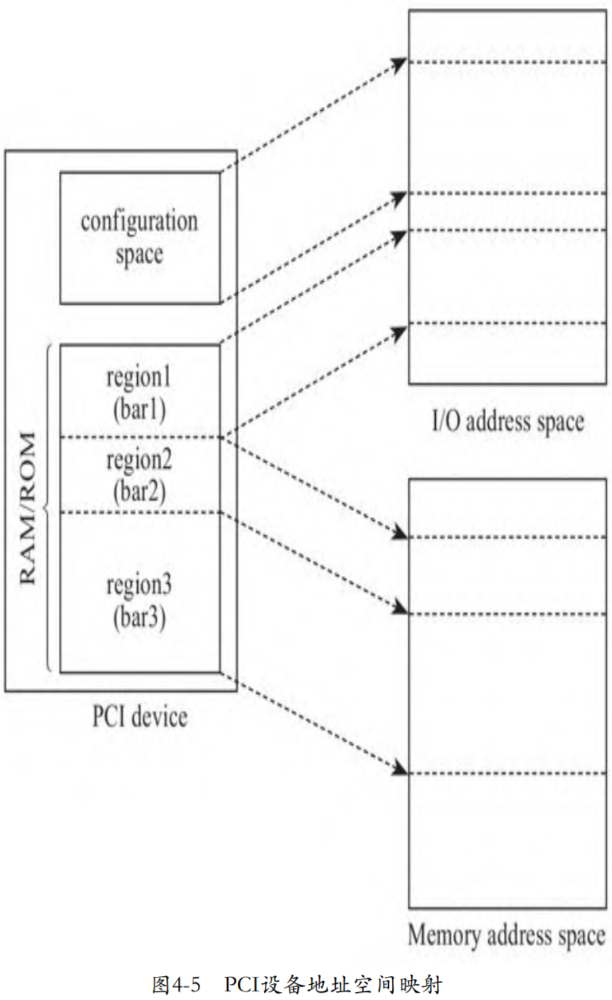
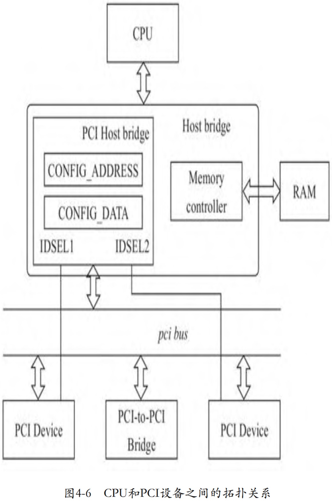
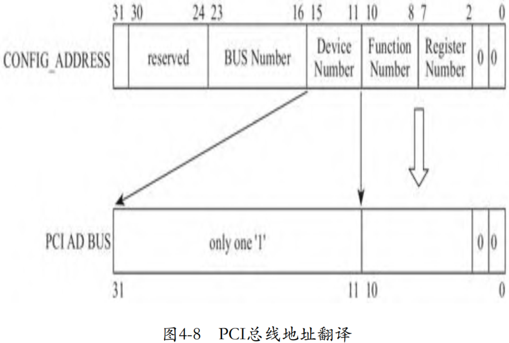

PCI 标准约定, **每个 PCI 设备**都需要实现一个称为**配置空间**(`Configuration Space`)的结构, 该结构就是**若干寄存器的集合**, 其大小为 256 字节, 包括**预定义头部**(`predefined header region`)和**设备相关部分**(`device dependent region`), 预定义头部占据 64 字节, 其余 192 字节为设备相关部分. 预定义头部定义了 PCI 设备的基本信息以及通用控制相关部分, 包括 Vendor ID、Device ID 等, 其中 **Vendor ID** 是**唯一**的, 由 **PCI 特别兴趣小组**(`PCI SIG`)统一负责分配. 在 Linux 内核中, **PCI 设备驱动**就是通过 **Device ID** 和 **Vendor ID** 来**匹配设备**的. 所有 PCI 设备的预定义头部的前 16 字节完全相同, 16～63 字节的内容则依具体的PCI设备类型而定. 位于配置空间中的偏移 0x0E 处的寄存器 `Header Type` 定义了 PCI **设备的类型**, 00h 为普通 PCI 设备, 01h 为 PCI 桥, 02h 为 CardBus 桥. 图 4-4 为普通 PCI 设备的预定义头部.


除了预定义头部外, 从偏移 64 字节开始到 255 字节, 共 192 字节为**设备相关**部分, 比如存储设备的能力(`Capabilities`). 比如 PCI 设备支持的 `MSI(X)` 中断机制, 就是利用 PCI 设备配置空间中设备相关部分来**存储中断信息**的, 包括**中断目的地址**(即**目的 CPU**), 以及**中断向量**. **操作系统**初始化中断时将为 PCI 设备分配的**中断信息**写入 PCI **配置空间**中的设备相关部分. 系统初始化时, **BIOS**(或者 **UEFI**)将把 PCI 设备的**配置空间映射到处理器**的 **I/O 地址空间**, **操作系统**通过 I/O 端口访问配置空间中的寄存器. 后来的 PCI Exepress 标准约定配置空间从 256 字节扩展到了 4096 字节, 处理器需要通过 **MMIO** 方式访问配置空间, 当然**前 256 字节**仍然可以通过 **I/O 端口方式**访问. 篇幅所限, 我们不过多讨论 PCI Exepress 相关内容了.

除了配置空间中的这些寄存器外, PCI 设备还有**板上存储空间**. 比如 PCI 显卡中的 `frame buffer`, 用来存储显示的图像, 板上内存可以划分为多个区域, 这个 frame buffer 就属于其中一个区域; 再比如网卡可能使用板上内存作为发送和接收队列. **处理器**需要将这些**板上内存**区域**映射**到**地址空间**进行访问, 但是与同标准中**预先约定好的配置空间**相比, 不同设备的板上内存大小不同, 不同机器上的 PCI 设备也不同, 这些都是**变化的**, 处理器**不可能预先**为所有 PCI 设备制定一个地址空间映射方案. 因此, PCI 标准提出了一个聪明的办法, 即**各 PCI 设备**自己提出需要占据的地址空间的**大小**, 以及**板上内存**是映射到**内存地址空间**, 还是 **I/O 地址空间**, 然后将这些诉求**记录**在配置空间的寄存器 **BAR** 中, 每个 PCI 最多可以请求映射 **6** 个区域. 至于映射到**地址空间**的**什么位置**, 由 **BIOS**(或者 **UEFI**)在**系统初始化**时, 访问寄存器 BAR, 查询各 PCI 设备的诉求, **统一**为 PCI 设备**划分**地址空间.

**PCI** 设备**配置空间**和**板上存储空间**到**处理器地址空间**的映射关系如下图所示.



了解了 PCI 设备的配置空间的基本结构后, 在探讨 VMM 如何虚拟 PCI 设备的配置空间前, 我们还需要知晓处理器是如何访问 PCI 设备的配置空间的. **PCI 总线**通过 `PCI Host Bridge` 和 CPU 总线相连, PCI Host Bridge 和 PCI 设备之间通过 PCI 总线通信. **PCI Host Bridge** 内部有**两个寄存器**用于系统软件访问 PCI 设备的配置空间, 一个是位于 **CF8h** 的 `CONFIG_ADDRESS`, 另外一个是位于 **CFCh** 的 `CONFIG_DATA`.

当**系统软件**访问 PCI 设备**配置空间**中的**寄存器**时, 首先将**目标地址**写入寄存器 `CONFIG_ADDRESS` 中, 然后向寄存器 `CONFIG_DATA` 发起访问操作, 比如向寄存器 `CONFIG_DATA` 写入一个值. 当 **PCI Host Bridge** 感知到 CPU 访问 `CONFIG_DATA` 时, 其根据地址寄存器 `CONFIG_ADDRESS` 中的值, 片选**目标 PCI 设备**, 即有效连接目标 PCI 设备的管脚 **IDSEL**(`Initialization Device Select`), 然后将寄存器 `CONFIG_ADDRESS` 中的**功能号**和**寄存器号**发送到 **PCI 总线**上. 目标 PCI 设备在收到地址信息后, 在接下来的时钟周期内与 PCI Host Bridge 完成数据传输操作. 这个过程如图 4-6 所示. 对于 PCIe 总线, 图 4-6 中的 **PCI Host Bridge** 对应为 **Root Complex**.



图 4-6 中特别画出了**内存控制器**, 目的是协助读者理解**系统**是如何**区分**映射到内存地址空间的**设备内存**和**真实物理内存**, 对于**设备内存映射**的**内存地址**, **内存控制器**会将其**忽略**, 而 **PCI Host Bridge** 则会**认领**. 在 **BIOS**(或者 **UEFI**)为 **PCI 设备**分配**内存地址空间**后, 会将其告知 PCI Host Bridge, 所以 PCI Host Bridge 知晓哪些地址应该发往 PCI 设备.

根据 PCI 的体系结构可见, **寻址一个 PCI 配置空间**的**寄存器**, 显然需要**总线号**(`Bus Number`)、**设备号**(`Device Number`)、**功能号**(`Function Number`)以及**最后的寄存器地址**, 也就是我们通常简称的 **BDF** 加上**偏移地址**. 如果是 **PCIe 设备**, 还需要在**总线号前面**加上一个 **RC**(`Root Complex`)**号**. 因此, **PCI Host Bridge** 中的**寄存器** `CONFIG_ADDRESS` 的格式如图 4-7 所示.


访问具体的 PCI 设备时, 作为 **CPU** 与 **PCI 设备**之间的**中间人** `PCI Host Bridge`, 还需要将**系统软件**发送过来的**地址格式**转换为 **PCI 总线地址格式**, 转换方式如图 4-8 所示.



由于 `PCI Host Bridge` 使用管脚 **IDSEL** 已经片选了**目标 PCI 设备**, 因此 PCI 总线地址**不**再需要**设备号**了, 只需要将**功能号**和**寄存器号**翻译到 **PCI 总线地址**即可.

下面以 kvmtool 为例讨论其是如何虚拟 PCI 设备配置空间的:

```cpp
commit 06f4810348a34acd550ebd39e80162397200fbd9
kvm tools: MSI-X fixes
kvmtool.git/pci.c

// 所有设备的configure space header
static struct pci_device_header		*pci_devices[PCI_MAX_DEVICES];
static struct pci_config_address	pci_config_address;

static void *pci_config_address_ptr(u16 port)
{
	unsigned long offset;
	void *base;

	offset		= port - PCI_CONFIG_ADDRESS;
	base		= &pci_config_address;

	return base + offset;
}

static bool pci_config_address_in(struct ioport *ioport, struct kvm *kvm, u16 port, void *data, int size)
{
	void *p = pci_config_address_ptr(port);

	memcpy(data, p, size);

	return true;
}

static bool pci_config_data_in(struct ioport *ioport, struct kvm *kvm, u16 port, void *data, int size)
{
	unsigned long start;
	u8 dev_num;

	start = port - PCI_CONFIG_DATA;

	dev_num		= pci_config_address.device_number;

	if (pci_device_exists(0, dev_num, 0)) {
		unsigned long offset;

		offset = start + (pci_config_address.register_number << 2);
		if (offset < sizeof(struct pci_device_header)) {
			void *p = pci_devices[dev_num];

			memcpy(data, p + offset, size);
		} else
			memset(data, 0x00, size);
	} else
		memset(data, 0xff, size);

	return true;
}
```

kvmtool 定义了一个数组 `pci_devices`, **所有的 PCI 设备**都会在这个数组中注册, 这个数组的**每个元素**都是一个 PCI 设备**配置空间头**.

kvmtool 定义了变量 `pci_config_address`, 对应于 PCI 标准中约定的用于记录 PCI 设备**寻址的寄存器** `CONFIG_ADDRESS`.

当系统软件访问 PCI 设备的配置空间头信息时, 其首先将向 `CONFIG_ADDRESS` 写入目标 PCI 设备的地址信息, 包括目标 PCI 的总线号、设备号以及访问的是配置空间中的哪一个寄存器. 代码第 15～23 行就是当 Guest 向寄存器 `CONFIG_ADDRESS` 写入将要访问的目标 PCI 设备的地址时, 触发 VM exit 陷入 VMM 后, VMM 进行模拟处理的过程. 结合函数 `pci_config_address_ptr` 的实现可见, kvmtool 将 Guest 准备访问的目标 PCI 设备地址记录在变量 `pci_config_address` 中.

待 Guest 设置完将要访问的目标地址后, 接下来将开启读写 PCI 配置空间数据的过程. Guest 将通过访问寄存器 `CONFIG_DATA` 读写 PCI 配置空间头的信息, Guest 访问寄存器 CONFIG_DATA 的这个 I/O 操作将触发 VM exit, 处理过程进入 KVM, 代码第 25～49 行是 KVM 中对这个写寄存器 CONFIG_DATA 过程的模拟.

kvmtool 首先从寄存器 `CONFIG_ADDRESS` 中取出目标 PCI 设备的设备号, 见第 33 行代码, 然后以设备号为索引, 在数组 pci_devices 中确认是否存在这个 PCI 设备. PCI 标准规定, 对于不存在的设备, 寄存器 CONFIG_DATA 的所有位都置为 "1", 表示无效设备, 见第 36 行代码.

第 38 行代码从寄存器 `CONFIG_ADDRESS` 取出寄存器号, 寄存器号这个字段的单位是双字(DWORD), 即4 字节, 所以代码中将 `register_number` 左移 2 位, 将双字转换为字节, 即计算出目标寄存器在配置空间中的偏移. 第 40 行代码以设备号为索引, 从数组 `pci_devices` 中取出目标 PCI 设备的配置空间的基址, 然后加上寄存器的偏移, 就计算出了最终的目标地址. 最后调用 memcpy 将 Guest 写到配置空间的值存储到设备的配置空间中, 见第 42 行代码.

第 38 行代码中有个变量 start, 用来处理 Guest 以非 4 字节对齐的方式访问 PCI 设备配置空间, 类似的, 函数 pci_config_address_ptr 也考虑了这种情况. 我们来看一下 kvmtool 早期只处理了 4 字节对齐的情况, 可以看到寄存器的偏移仅仅是寄存器号乘以 4 字节:

```cpp

```

探讨了通用的 PCI 设备配置空间的虚拟后, 我们再通过一个具体的例子体会一下 VMM 是如何虚拟配置空间中的寄存器 BAR 的. 下面是 kvmtool 中 Virtio 设备初始化相关的代码:

```cpp

```

函数 `virtio_pci__init` 为 virtio PCI 设备准备了 3 块板上内存区间. 寄存器 `bar[0]` 中的板上存储区间需要映射到 Guest 的 I/O 地址空间, 起始地址为 `vpci-＞base_addr`; 寄存器 `bar[1]` 中的板上存储空间需要映射到 Guest 的内存地址空间, 起始地址为`vpci-＞msix_io_block`; 寄存器 `bar[3]` 中的板上存储空间页需要映射到 Guest 的内存地址空间, 起始地址为 `vpci-＞msix_pba_block`.

kvmtool 中为 PCI 设备分配内存地址空间的函数为 `pci_get_io_space_block`. kvmtool 从地址 `KVM_32BIT_GAP_START+0x1000000` 开始为 PCI 设备分配地址空间. 每当 PCI 设备申请地址空间时, 函数 pci_get_io_space_block 从这个地址处依次叠加:

```cpp

```

类似的, kvmtool 为 PCI 设备分配 I/O 地址空间的函数为 `ioport__register`, 我们不再赘述.

在函数 `virtio_pci__init` 的最后, 我们看到其调用 `pci__register` 在记录 PCI 设备的数组 pci_devices 中注册了设备, 这样 Guest 就可以枚举这些设备了:

```cpp

```