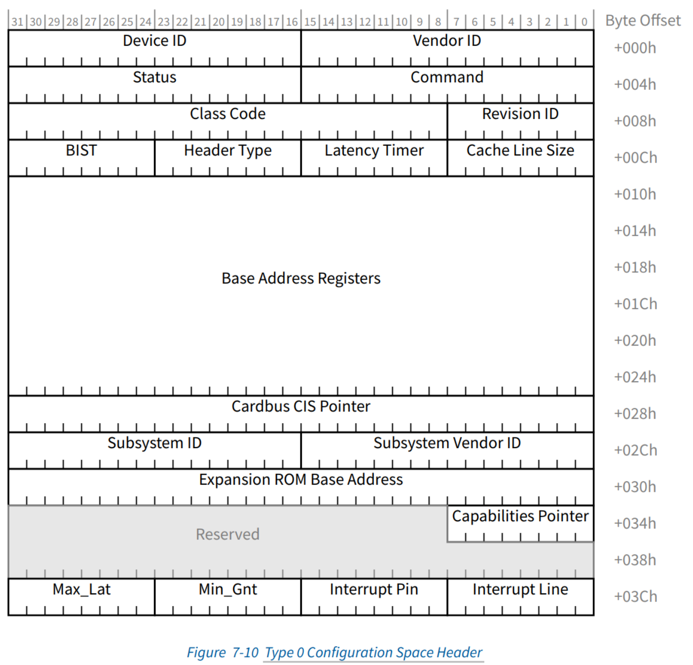

PCI标准约定, 每个PCI设备都需要实现一个称为配置空间(Configuration Space)的结构, 该结构就是若干寄存器的集合, 其大小为256字节, 包括预定义头部(predefined header region)和设备相关部分(device dependent region), 预定义头部占据64字节, 其余192字节为设备相关部分. 预定义头部定义了PCI设备的基本信息以及通用控制相关部分, 包括Vendor ID、Device ID等, 其中Vendor ID是唯一的, 由PCI特别兴趣小组(PCI SIG)统一负责分配. 在Linux内核中, PCI设备驱动就是通过Device ID和Vendor ID来匹配设备的. 所有PCI设备的预定义头部的前16字节完全相同, 16～63字节的内容则依具体的PCI设备类型而定. 位于配置空间中的偏移0x0E处的寄存器Header Type定义了PCI设备的类型, 00h为普通PCI设备, 01h为PCI桥, 02h为CardBus桥. 图4-4为普通PCI设备的预定义头部.

除了预定义头部外，从偏移64字节开始到255字节，共192字节为设备相关部分，比如存储设备的能力（Capabilities）。比如PCI设备支持的MSI（X）中断机制，就是利用PCI设备配置空间中设备相关部分来存储中断信息的，包括中断目的地址（即目的CPU），以及中断向量。操作系统初始化中断时将为PCI设备分配的中断信息写入PCI配置空间中的设备相关部分。系统初始化时，BIOS（或者UEFI）将把PCI设备的配置空间映射到处理器的I/O地址空间，操作系统通过I/O端口访问配置空间中的寄存器。后来的PCI Exepress标准约定配置空间从256字节扩展到了4096字节，处理器需要通过MMIO方式访问配置空间，当然前256字节仍然可以通过I/O端口方式访问。篇幅所限，我们不过多讨论PCI Exepress相关内容了。

除了配置空间中的这些寄存器外，PCI设备还有板上存储空间。比如PCI显卡中的frame buffer，用来存储显示的图像，板上内存可以划分为多个区域，这个frame buffer就属于其中一个区域；再比如网卡可能使用板上内存作为发送和接收队列。处理器需要将这些板上内存区域映射到地址空间进行访问，但是与同标准中预先约定好的配置空间相比，不同设备的板上内存大小不同，不同机器上的PCI设备也不同，这些都是变化的，处理器不可能预先为所有PCI设备制定一个地址空间映射方案。因此，PCI标准提出了一个聪明的办法，即各PCI设备自己提出需要占据的地址空间的大小，以及板上内存是映射到内存地址空间，还是I/O地址空间，然后将这些诉求记录在配置空间的寄存器BAR中，每个PCI最多可以请求映射6个区域。至于映射到地址空间的什么位置，由BIOS（或者UEFI）在系统初始化时，访问寄存器BAR，查询各PCI设备的诉求，统一为PCI设备划分地址空间。

PCI设备配置空间和板上存储空间到处理器地址空间的映射关系如图4-5所示.

了解了PCI设备的配置空间的基本结构后，在探讨VMM如何虚拟PCI设备的配置空间前，我们还需要知晓处理器是如何访问PCI设备的配置空间的。PCI总线通过PCI Host Bridge和CPU总线相连，PCI HostBridge和PCI设备之间通过PCI总线通信。PCI Host Bridge内部有两个寄存器用于系统软件访问PCI设备的配置空间，一个是位于CF8h的CONFIG_ADDRESS，另外一个是位于CFCh的CONFIG_DATA。

当系统软件访问PCI设备配置空间中的寄存器时，首先将目标地址写入寄存器CONFIG_ADDRESS中，然后向寄存器CONFIG_DATA发起访问操作，比如向寄存器CONFIG_DATA写入一个值。当PCI Host Bridge感知到CPU访问CONFIG_DATA时，其根据地址寄存器CONFIG_ADDRESS中的值，片选目标PCI设备，即有效连接目标PCI设备的管脚IDSEL（Initialization Device Select），然后将寄存器CONFIG_ADDRESS中的功能号和寄存器号发送到PCI总线上。目标PCI设备在收到地址信息后，在接下来的时钟周期内与PCI Host Bridge完成数据传输操作。这个过程如图4-6所示。对于PCIe总线，图4-6中的PCI Host Bridge对应为Root Complex。

图4-6中特别画出了内存控制器，目的是协助读者理解系统是如何区分映射到内存地址空间的设备内存和真实物理内存，对于设备内存映射的内存地址，内存控制器会将其忽略，而PCI Host Bridge则会认领。在BIOS（或者UEFI）为PCI设备分配内存地址空间后，会将其告知PCI Host Bridge，所以PCI Host Bridge知晓哪些地址应该发往PCI设备。

根据PCI的体系结构可见，寻址一个PCI配置空间的寄存器，显然需要总线号（Bus Number）、设备号（Device Number）、功能号（Function Number）以及最后的寄存器地址，也就是我们通常简称的BDF加上偏移地址。如果是PCIe设备，还需要在总线号前面加上一个RC（Root Complex）号。因此，PCI Host Bridge中的寄存器CONFIG_ADDRESS的格式如图4-7所示。