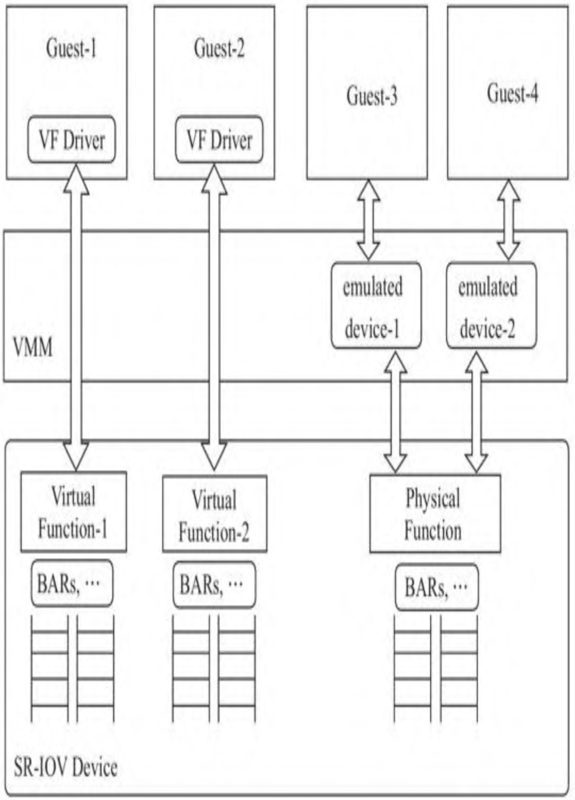
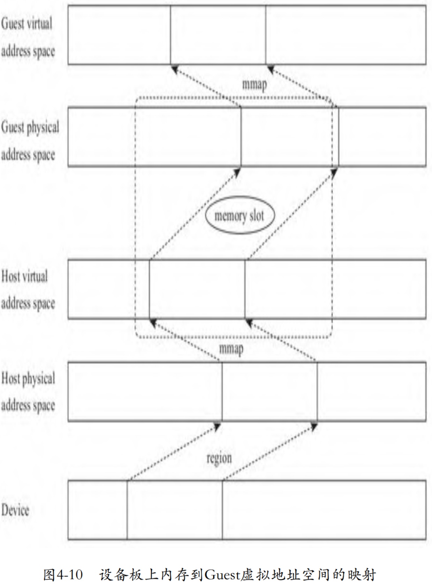
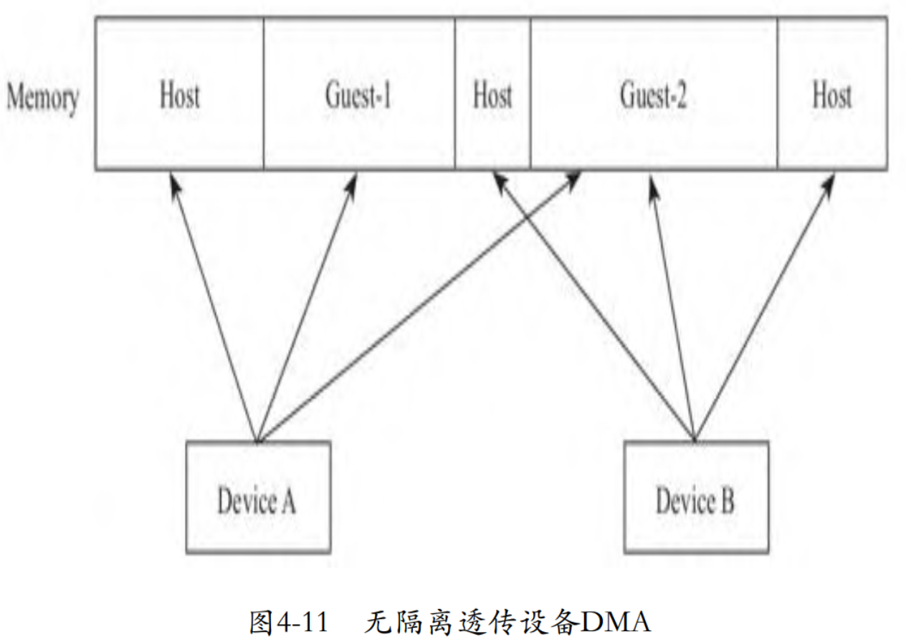
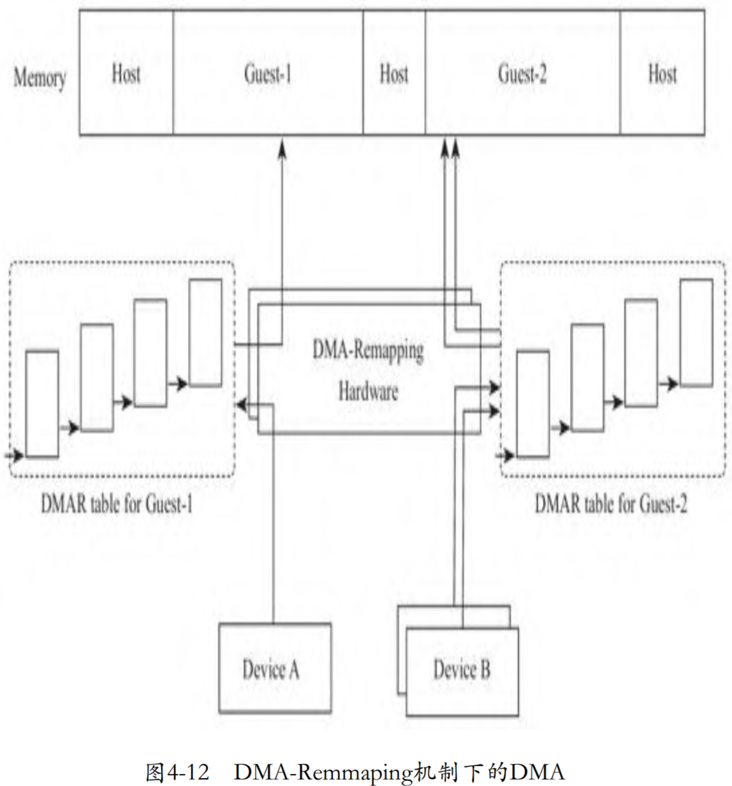
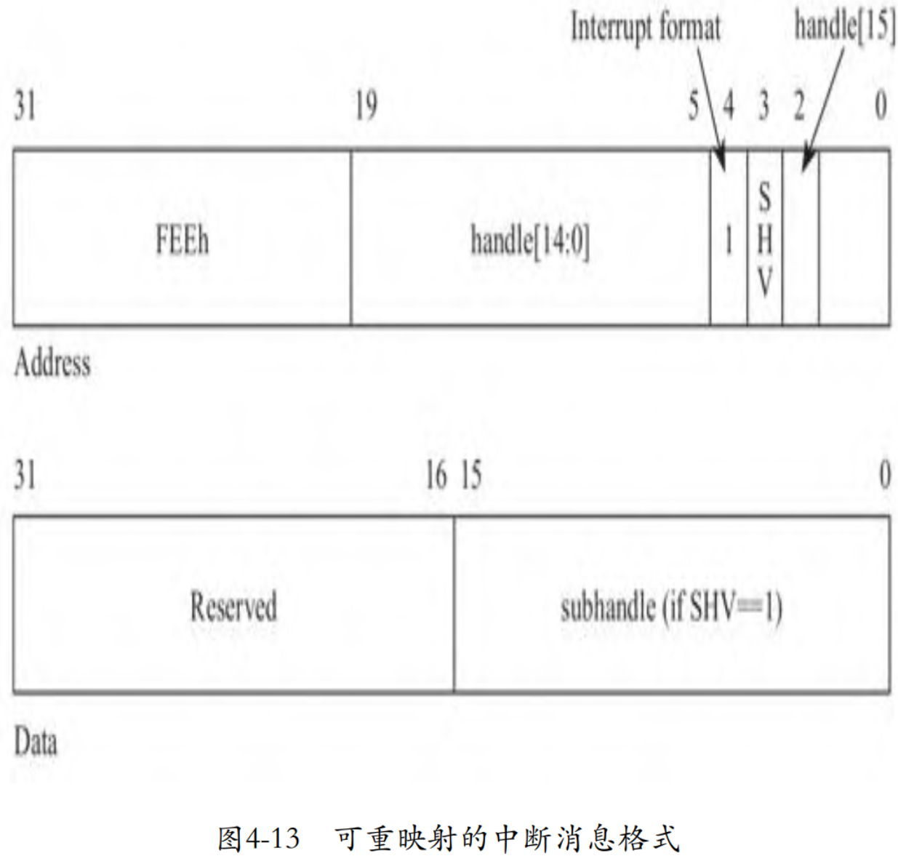
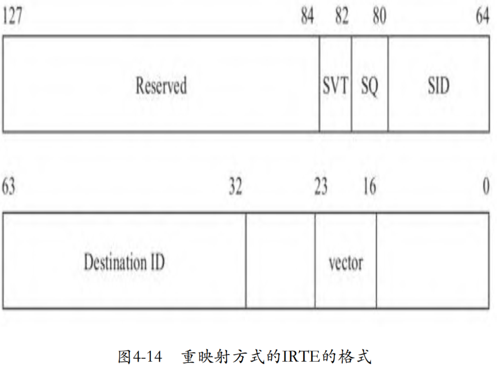
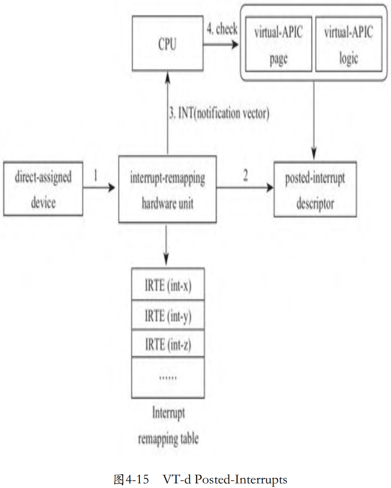
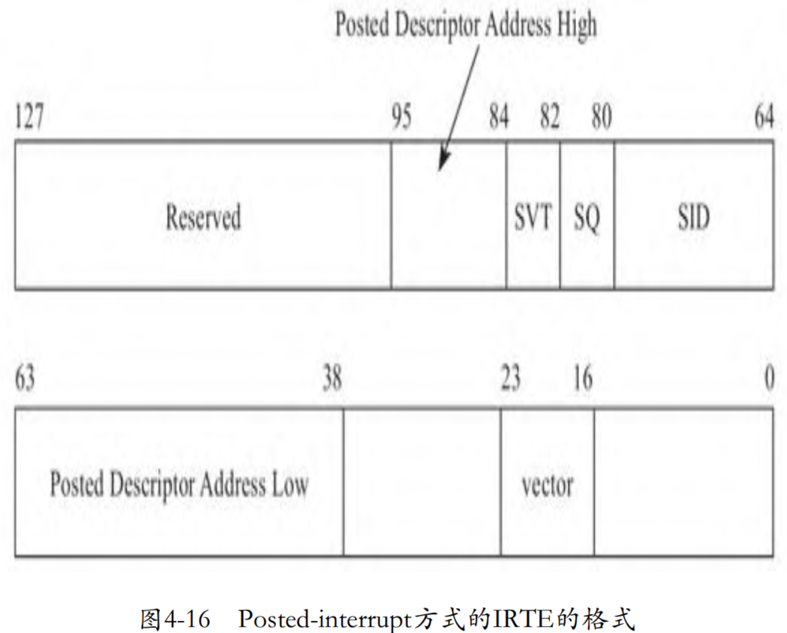

设备虚拟化如果采用软件模拟的方式，则需要VMM参与进来。为了避免这个开销，Intel尝试从硬件层面对I/O虚拟化进行支持，即将设备直接透传给Guest，Guest绕过VMM直接访问物理设备，无须VMM参与I/O过程，这种方式提供了最佳的I/O虚拟化性能。Intel最初采用的方式是Direct Assignment，即将整个设备透传给某一台虚拟机，不支持多台VM共享同一设备。

对于一台多核的物理机，其上可以运行若干台虚拟机，如果外设只能分配给一台虚拟机使用，那么这种方案显然不具备扩展性。于是设备制造商们试图在硬件层面将一个物理设备虚拟出多个设备，每个设备可以透传给一台虚拟机，这样从硬件设备层面实现共享，而无须由VMM通过软件的方式支持多台虚拟机共享同一物理外设。为了使不同设备制造商的设备可以互相兼容，PCI-SIG制定了一个标准：Single Root I/O Virtualization and Sharing，简称SR-IOV。SR-IOV引入了两个新的Function类型，一个是Physical Function，简称PF; 另一个是Virtual Function，简称VF。一个SR-IOV可以支持多个VF，每一个VF可以分别透传给Guest，如此，就从硬件角度实现了多个Guest分享同一物理设备，如图4-9所示。



每个VF都有自己独立的用于数据传输的存储空间、队列、中断及命令处理单元等，但是这些VF的管理仍然在VMM的控制下，VMM通过PF管理这些VF。虚拟机可以直接访问这些VF，而无须再通过VMM中的模拟设备访问物理设备。PF除了提供管理VF的途径外，Host以及其上的应用仍然可以通过PF无差别地访问物理设备。对于那些没有VF驱动的 Guest，虚拟机依然可以通过SR-IOV设备的PF接口共享物理设备。

# 虚拟配置空间

通过将VF透传给Guest的方式，VF的数据访问不再需要通过VMM，大大提高了Guest的I/O性能。但是，如果Guest恶意修改配置空间中的信息，比如中断信息（MSI），则可能导致VF发出中断攻击。因此，出于安全方面的考虑，VF配置空间仍然需要VMM介入，而且后面我们会看到，有些信息，比如寄存器BAR中的地址，必须依照虚拟化场景进行虚拟。Guest不能直接修改设备的配置，当Guest访问VF的配置空间时，将会触发VM exit陷入VMM，VMM将过滤Guest对VF配置空间的访问并作为Guest的代理完成对VF设备的配置空间的操作。这个过程不会卷入数据传输中，因此不影响数据传输的效率。

前面在讨论PCI配置空间及其模拟时，我们看到kvmtool定义了一个数组pci_devices，用来记录虚拟机所有的PCI设备，后来kvmtool将这个数组优化为一棵红黑树。当Guest枚举PCI设备时，kvmtool将以设备号为索引在这个数据结构中查找设备。因此，为了能够让Guest枚举到VF，kvmtool需要将VF注册到这个数据结构中，用户可以通过kvmtool的命令行参数“vfio-pci”指定将哪些VF透传给虚拟机：

```cpp

```

对于VF来说，在系统启动时，虽然Host的BIOS（或者UEFI）已经为VF划分好了内存地址空间并存储在了寄存器BAR中，而且Guest也可以直接读取这个信息。但是，因为Guest不能直接访问Host的物理地址，所以Guest并不能直接使用寄存器BAR中记录的HPA。所以，kvmtool需要对VF配置空间中寄存器BAR的内容进行虚拟，结合内存虚拟化原理，设备板上内存到Guest空间的映射关系如图4-10所示。



结合图4-10，kvmtool需要完成两件事：一是将VF配置空间的BAR寄存器中的地址信息修改为GPA，而不是HPA；二是保护模式下的CPU是采用虚拟地址寻址的，所以PA还需要映射为VA，操作系统自身提供了mmap功能完成PA到VA的映射，因此，kvmtool只需要建立GPA到HVA的映射关系。相关代码如下：

```cpp

```

普通的虚拟设备没有真实的配置空间，所以kvmtool需要从0开始组织虚拟设备的配置空间。而VF是有真实的配置空间的，kvmtool需要做的是加工，所以kvmtool首先需要读取VF的配置空间，然后在这个原始数据的基础上进行加工，第11行代码就是读取VF的配置空间并进行解析。然后，kvmtool从Guest地址空间中为VF板上内存分配地址空间，并使用GPA更新寄存器BAR，第13～18行代码就是循环处理所有的寄存器BAR。最后，kvmtool将加工好的配置空间更新回VF真实的配置空间，见第20行代码。函数 vfio_pci_parse_cfg_space读取VF配置空间，具体代码如下。VF中将配置空间分成很多区域，比如每256字节的配置空间是一个区域，每个BAR定义对应一个区域。代码中 VFIO_PCI_CONFIG_REGION_INDEX对应的就是256字节的配置空间，对于PCIe设备，配置空间大小是4096字节。函数vfio_pci_parse_cfg_space首先通过ioctl获取配置空间在VF中的偏移，然后调用函数pread从这个偏移处读取配置空间：

```cpp

```

接下来，kvmtool需要从Guest地址空间中为VF板上内存分配地址空间，并使用GPA更新配置空间中的寄存器BAR，这个逻辑在函数vfio_pci_configure_bar中。函数vfio_pci_configure_bar首先通过ioctl从VF中读取BAR对应的区域的信息，然后根据获取的区域的大小（代码中的map_size）调用函数pci_get_io_space_block从Guest的地址空间中分配地址区间。函数pci_get_io_space_block从变量io_space_blocks指定的地址空间处，依次为PCI设备在Guest的地址空间中分配地址。分配好了Guest的地址区间后，还需要将这个地址区间和Host的BIOS（或者UEFI）为VF分配的真实的物理地址区间一一映射起来，这就是vfio_pci_configure_bar调用vfio_map_region的目的：

```cpp

```

函数vfio_map_region为GPA和HVA建立起映射关系。从内存虚拟化角度，其实就是Host为Guest准备一个内存条:

```cpp

```

显然，对应我们现在的情况，变量guest_phys_addr就是kvmtool为BAR对应的区间在Guest地址空间中分配的地址。变量userspace_addr就是Host的BIOS（或者UEFI）为VF在Host的地址空间分配的地址PA对应的VA，函数vfio_map_region中调用mmap函数就是为了得出VA。确定了变量guest_phys_addr和userspace_addr后，vfio_map_region调用kvm__register_dev_mem请求KVM模块为Guest注册虚拟内存条。当CPU发出对BAR对应的内存地址空间的访问时，EPT或者影子页表会将GPA翻译为VF在Host地址空间中的相应HPA，当这个HPA到达Host bridge时，内存控制器将忽略这个地址，PCI bost bridge或者Root Complex将认领这个地址。函数vfio_map_region的代码如下：

```cpp

```

完成了BAR等寄存器的加工后，kvmtool将调用vfio_pci_fixup_cfg_space将加工好的配置空间更新到VF的配置空间中。比如下面的代码中，我们可以看到，寄存器BAR的信息是kvmtool加工后的信息：

```cpp

```

除了寄存器BAR的虚拟外，还有其他的一些虚拟，比如为了支持MSI-X，需要虚拟配置空间中设备相关的Capability部分。这些逻辑都比较直接，我们不再一一讨论了。

# DMA 重映射

将设备直接透传给Guest后，为了提高数据传输效率，透传设备可以直接访问内存，但是如果Guest可以直接控制设备，那就需要防范恶意的Guest借助透传的设备访问其他Guest或者Host的内存。比如，Device A透传给了Guest-1，但是其有可能访问Guest-2和Host的内存；Device B透传给了Guest-2，但是其也有可能访问Guest-1和Host 的内存，如图4-11所示。



为此，芯片厂商设计了DMA重映射（DMA Remmaping）机制，在外设和内存之间增加了DMA硬件重映射单元，一个DMA重映射硬件可以为所有设备提供地址重映射服务，也可以有多个DMA重映射硬件，分别为一些外设提供服务。当VMM处理透传给Guest的外设时，VMM将请求内核为Guest建立一个页表，并将这个页表告知负责这个外设地址翻译的DMA重映射硬件单元，这个页表限制了外设只能访问这个页面覆盖的内存，从而限制外设只能访问其属于的虚拟机的内存。当外设访问内存时，内存地址首先到达DMA重映射硬件，DMA重映射硬件根据这个外设的总线号、设备号以及功能号，确定其对应的页表，查表得出物理内存地址，然后将地址送上总线。在虚拟化场景下，如果多个设备可以透传给同一个虚拟机，那么它们共享一个页表，如图4-12所示。



如同一台真实的物理计算机有多段用于不同用途的内存段一样，kvmtool将为Guest准备多段内存段，kvmtool将内存段称为memory bank。在为Guest准备好内存段之后，kvmtool将为每个内存段通过ioctl向内核发送VFIO_IOMMU_MAP_DMA命令，请求内核在DMA重映射单元页表中为其建立好映射关系。相对于为CPU进行地址翻译的MMU，DMA 重映射硬件是为外设进行I/O地址翻译的，所以也称为IOMMU。kvmtool 中代码如下：

```cpp

```

当为外设建立页表时，如果外设透传给的虚拟机尚未建立页表，则内核将创建根页表。在虚拟化的场景下，代码中的domain指代的就是一个虚拟机：

```cpp

```

内核在通知外设进行DMA前，需要将DMA地址告知外设。虚拟地址是CPU使用的，设备并不知道这个概念，所以，内核的设备驱动需要将虚拟地址转换为物理地址。在设备透传场景下，设备和Guest之间不再有VMM的干预，外设接收的是GPA。留意上面代码中函数 vfio_map_mem_bank请求内核建立映射关系的参数dma_map，其中这句代码是设置IOMMU的输入地址：

```cpp

```

我们看到，代码中将IOMMU的输入地址命名为iova，其他多处也使用了这个名字，那么为什么称其为iova呢？我们比照CPU的虚拟内存就很容易理解了，外设用这个地址发起DMA，就类似于CPU使用虚拟地址（VA）访存，然后给到MMU，所以，这里从设备发出的给到IOMMU的，也被称为VA，因为是用于I/O的，所以命名为iova。

函数vfio_map_mem_bank中设置IOMMU翻译的目的地址的代码如下：

```cpp

```

显然，这里的vaddr是virtual address的缩写。但是事实上，需要IOMMU将GPA翻译为HPA，所以理论上dma_map中应该使用物理地址paddr，而不是vaddr，那么，为什么使用虚拟地址呢？我们知道，kvmtool在用户空间中申请区间作为Guest的物理内存段，自然使用的是虚拟地址记录区间。但这不是问题，因为内核会在建立IOMMU的页表前，将虚拟地址转换为物理地址，最后IOMMU页表中记录的是GPA到HPA的映射。

内核中处理kvmtool发来的命令VFIO_IOMMU_MAP_DMA的核心函数是 domain_page_mapping，该函数完成IOMMU页表的建立。注意该函数的第3个参数，可见内核已经将kvmtool传入的HVA转换为HPA了。domain_page_mapping通过一个循环完成了一个内存段的地址映射，其根据GPA，即iova，从页表中找到具体的表项，然后将HPA写入表项中。具体代码如下：

```cpp

```

# 中断重映射

当将设备直接透传给虚拟机时，有一个问题就不得不面对，那就是如何避免虚拟机对外设编程发送一些恶意的中断，对主机或其他虚拟机进行攻击。因此，硬件厂商引入了中断重映射（interrupt remapping）机制，在外设和CPU之间加了一个硬件中断重映射单元。当接收到来自外设的中断时，硬件中断重映射单元会对中断请求的来源进行有效性验证，然后以中断号为索引查询中断重映射表，代替外设向目标发送中断。中断重映射表由VMM而不是虚拟机进行设置，因此从这个层面确保了透传设备不会因虚拟机恶意篡改而向Host或者其他 Guest发送具有攻击性目的的中断。中断重映射硬件提取接收到的中断请求的来源（PCI设备的Bus、Device和Function号等信息），然后根据不同设备所属的domain，将该中断请求转发到相应的虚拟机。

为了使VMM能够控制系统重要的资源，当CPU处于Guest模式，并探测到有外部设备中断到达时，将首先从Guest模式退出到Host模式，由VMM处理中断，然后注入中断给目标Guest。另外，在“中断虚拟化”一章中，我们看到，为了去掉中断注入时需要的VM exit，Intel设计了posted-interrupt机制，CPU可以在Guest模式直接处理中断。因此，当设备透传给Guest时，在有中断重映射提供安全保护作用的情况下，Intel将中断重映射和posted-interrupt结合起来实现了VT-d posted-interrupt，使外设中断直达虚拟机，避免了VM exit，不再需要VMM的介入。

为了支持中断重映射，还需要对中断源进行升级，包括I/O APIC 以及支持MSI、MSI-X的外设，使中断重映射硬件能从中断消息中提出中断重映射表的索引。为了向后兼容，对于那些只能发送经典的中断消息格式的外设，中断重映射单元就像不存在一样，不做任何干预，原封不动地将中断消息送上总线。可重映射的中断消息格式如图4-13所示。



在Address消息中，第5～19位和第2位共同组成了16位的handle，并且在第3位SHV为1的情况下，Data消息的第0～15位包含了 subhandle。中断重映射硬件将根据handle和subandle计算该中断在中断重映射表中的索引值，计算方法如下：

```cpp

```

VMM需要在初始化时在内存中为中断重映射表分配一块区域，并将该区域告知中断重映射硬件单元，即将该表的地址写到中断重映射表地址寄存器（Interrupt Remap Table Address Register）：

```cpp

```

当中断重映射硬件单元工作在重映射中断（Remapped Interrupt）方式下，中断重映射单元根据中断请求中的信息计算出一个索引，然后从中断重映射表中索引到具体的表项IRTE，从IRTE中取出目的CPU、中断vector等，创建一个中断消息，发送到总线上，此时的中断重映射单元相当于一个代理。在这种方式下，除了外设或中断芯片和CPU之间多了一层中断重映射硬件单元外，在其他方面没有任何差异，从LAPIC看到的和来自外设或者I/O APIC的中断消息别无二致。这种方式的IRTE格式如图4-14所示。

在“中断虚拟化”一章中，我们讨论了Intel设计的postedinterrupt processing机制，在该机制下，假设虚拟设备运行在一颗CPU上，而VCPU运行在另外一颗CPU上，那么虚拟设备发出中断请求时，虚拟中断芯片将中断的信息更新到VCPU对应的 posted-interrupt descriptor 中，然后向VCPU发送一个通知 posted-interrupt notification，即一个指定向量值的核间中断，处于Guest模式的CPU 收到这个中断后，将不再触发VM exit，而是在Guest模式直接处理中断。



那么对于设备透传模式，是否可以和Posted-interrupt结合起来，避免掉这些VM exit以及VMM的介入呢？于是，芯片厂商设计了Vtd Posted-interrupt，在这种机制下，由中断重映射硬件单元完成 posted-interrupt descriptor的填写，以及向目标CPU发送通知 posted-interrupt notification，如图4-15所示。



当中断重映射硬件单元工作在Post-interrupt的方式下时，其中断重映射表项IRTE的格式如图4-16所示。与Remapped Interrupt方式不同的是，IRTE中没有了目标CPU字段，取而代之的是posted-interrupt descriptor的地址。



那么在什么时机设置中断重映射表呢？我们以支持MSI(X)的设备为例，其中断相关的信息保存在配置空间的Capabilities list中，这些信息由操作系统内核设置。在虚拟化场景下，当 Guest 的内核设置 VF 配置空间中的MSI(X)信息时，将触发VM exit，CPU将陷入VMM中。此时，VMM除了代理Guest完成对VF配置空间的访问外，就可以通过Host 内核中的VFIO驱动，为透传设备分配、更新相应的中断重映射表项。kvmtool中截获Guest设置配置空间中MSI(X)相关寄存器的处理函数是 vfio_pci_msix_table_access，代码如下:

```cpp

```

vfio_pci_msix_table_access截获到Guest配置VF配置空间的 MSI(X)的操作后，调用vfio_pci_enable_msis向Host内核中的VFIO模块发起配置MSI(X)以及中断重映射相关的请求。内核收到用户空间的请求后，将初始化设备配置空间中的MSI(X)相关的capability，这个过程是由函数msi_capability_init来完成的，msi_capability_init 在做了一些通用的初始化后，将调用体系结构相关的函数 `arch_setup_msi_irqs` 完成体系结构相关的部分：

```cpp

```

对于x86架构，起初这个函数实现在I/O APIC相关的文件中，但是事实上这个函数是处理MSI中断的，只是开发者将其暂时实现在这个文件中，因此后来开发者将其独立到一个单独文件msi.c中。

arch_setup_msi_irqs最终会调用到函数msi_compose_msg设置中断消息的目的地（MSI的地址）、中断消息的内容（MSI的data）。注意msi_compose_msg这个函数的实现，可以清楚地看到在这个函数中为中断准备了中断重定向表项，并将其更新到中断重定向表中，相关代码如下：

```cpp

```

对于Post-interrupt方式的中断，需要在IRTE中记录postedinterrupt descriptor的地址，这样中断重映射单元才可以更新 posted-interrupt descriptor。更新posted-interrupt descriptor 相关的代码如下，其中pda_h指的是Posted Descriptor高地址，pda_l 指的是Posted Descriptor低地址：

```cpp

```

