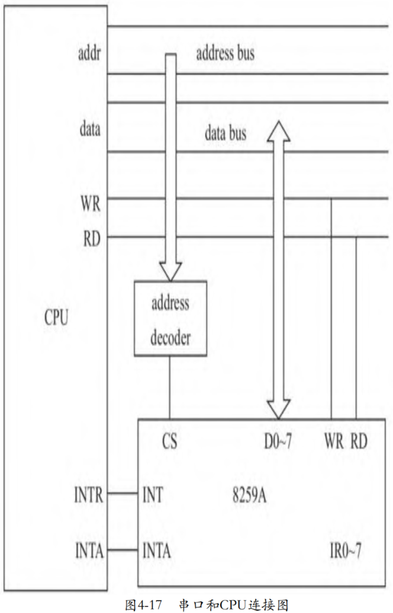
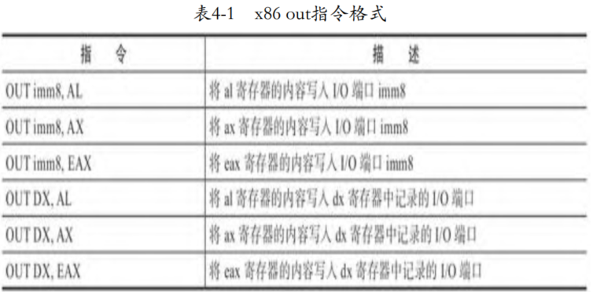
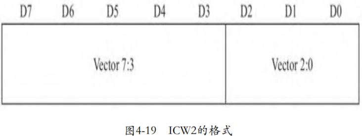

在这一节中，我们以串口为例探讨设备完全虚拟化的原理。早在还没有出现计算机的时候，就已经出现了一些设备，比如MODEM、电传打字机等，这些设备与其他设备之间的通信方式是串行的。它们有2根数据线，1根用于发送，1根用于接收。比如一个字符编码是8位，那么串行是1位1位地传，需要多个时钟周期才可以传输一个字符；而并行则可以多位同时传，假设有8根数据线，那么在一个时钟周期就可以把 8 位都送上数据总线。

当PC出现后，PC的总线都是并行的，因此，这些设备与PC相连就成了一个问题，于是，串口出现了，串口负责并行和串行的转换。串口和处理器通过地址总线、数据总线以及I/O控制总线相连。除此之外，还有一个中断线，串口收到数据时需要通知CPU，串口通过 8259A 向 CPU 发送中断请求。具体连接关系如图4-17所示。



# Guest发送数据

一般访问外设的内存或者寄存器有2种方式：一种是将外设的内存、寄存器映射到CPU的内存地址空间中，CPU访问外设如同访问自己的内存一样，这种方式称为MMIO(Memory-mapped I/O)；另外一种方式是使用专用的I/O指令。CPU访问串口使用后者，处理器向串口发送数据的基本步骤如下：

1） 处理器向地址总线写入串口地址，地址译码电路根据地址的3
～9位，确定CPU意图访问哪个芯片，即片选，拉低对应的片选输出。
2） 锁存器锁存A0～A2，用来选择目的寄存器。
3） 处理器将数据送上数据总线。
4） 处理器拉低WR管脚，通知目标芯片读取数据。

1. Guest写串口

x86提供的向I/O端口输出数据的指令是out，格式如表4-1所示。



out指令有2个操作数，第一个操作数是I/O端口地址，可以是立即数，也可以放在dx寄存器中，如果使用一个字节的立即数，那么端口地址范围只能在0～255。如果大于255，需要首先将端口地址写入dx寄存器，然后使用dx寄存器作为第一个操作数。第二个操作数是写给外设的值，根据值的大小，分别使用al、ax和eax寄存器。

了解了串口的基本原理后，我们写一个简单的向串口输出的 Guest，后面调试模拟串口设备使用：

```assembly

```

代码主体是一个简单的循环，每次循环Guest向串口输出一个字节。这个字节从0开始，每次循环后字节值自增1。因为端口地址0x3f8 已经大于一个字节了，所以我们将0x3f8首先加载到dx寄存器，然后使用dx寄存器作为out指令的第一个操作数。out指令将完成前面提到的将地址送上地址总线、将数据送上数据总线、拉低WR等操作。小小的一个out指令，其背后隐藏着如此多的逻辑。

0x3f8是串口的I/O地址，由IBM的工程师为串口分配。IBM的工程师给第1个串口分配的I/O地址范围是0x3f8～0x3ff，给第2个串口分配的I/O地址范围是0x2f8～0x2ff。

串口内部有多个寄存器，包括tx/rx buffer、LCR(line control register)、LSR(line status register)，MCR(modem control register)等，它们都连接在串口内部总线上，那么串口如何知晓CPU 准备访问哪个寄存器呢？当I/O地址送上地址总线后，其中位3～9用来计算片选，比如地址0x3f8，其3～9位是1111111，那么第1个串口的片选将有效，如果地址是0x2f8，其3～9位是10111111，那么第2个串口的片选有效。余下的0～3位用来决定访问的是串口设备的哪个寄存器。

以地址0x3f8为例，后三位都是0，因此，对应RDR(receive data regiser)或者TDR(transmit data register)。那么如何区分是哪个寄存器呢？这个时候就需要借助控制总线了，即CPU的IOR/IOW管脚。对于out指令，当CPU将数据送上数据总线后，CPU将拉低管脚IOW，通知串口开始从数据总线读取数据，此时串口会将从数据总线读取的数据写入寄存器TDR。最后，串口会将TDR中的数据，按照串行编码要求，加上起始位、停止位等，组织成串行的格式，发送给连接的具体串口设备，比如说Modem。

2. KVM截获Guest的I/O信息

对于Guest写串口的操作，KVM需要截取到Guest向串口输出的信息，并且调用虚拟串口设备完成I/O操作。所以，KVM充当的角色之一类似地址译码电路，其需要根据out指令的I/O地址，判断出片选哪个外设。根据VMX的设计，当Guest进行I/O时，将触发CPU从Guest模式切换到Host模式，CPU控制权将从Guest首先流转到内核的KVM模块。此时，KVM模块可以截取I/O端口地址、读写的值、数据宽度等相关信息，并将这些信息传递给模拟设备，由模拟设备完成具体的I/O操作。

KVM是如何获取Guest的I/O信息呢？VMCS中定义了若干与VM exit相关的字段，即VM-EXIT INFORMATION FIELDS。CPU在从Guest模式退出到Host模式前，会填充这些字段，为Host判断是什么原因导致VM exit提供依据。这些退出信息相关的字段中，包括基本的退出原因，比如是因为Guest执行了特殊的指令，还是因为进行I/O操作，或者是因为Guest访问了特殊的寄存器等。CPU会将Guest退出的原因记录到VMCS中的字段Exit reason中，所以，对于KVM来讲，第一步是从VMCS中读出VM exit的原因，然后调用对应的处理函数。处理因为I/O引起VM exit的函数是handle_io：

```cpp

```

仅仅知道Guest退出原因还是不够的，以I/O引起的退出为例，还需要知道I/O地址、I/O相关的值等。VMCS中有另外一个字段Exit qualification，会记录更具体的信息。对于不同退出原因，这个字段记录的内容是不同的，因此这个字段的解析需要根据退出原因按照VMX 的定义进行解释。对于因为I/O导致的VM exit，Exit qualification 中记录的信息关键字段包括：

1） 第 0～2 位表示读写的数据宽度，0 表示宽度是 1 个字节，1 表示 2 个字节，3 表示 4 个字节。

2） 第 3 位表示是读还是写。

3） 第 4 位表示这是一次普通的I/O，还是一个string I/O。普通 I/O一次传递1个size（0～2位表示的宽度）大小的字节，对应于x86的指令out、in；string I/O是一次传递多个size大小的字节，对应于x86的指令outs、ins。

4） 第16～31位为访问的I/O地址。

可见，I/O所需的有用信息都在这个Exit qualification字段中，所以，函数handle_io首先读取VMCS中的这个字段，获取I/O信息，为简洁起见，我们略去string I/O相关部分：

```cpp

```

函数handle_io首先读取VMCS中的Exit qualification字段，获取I/O信息。我们看到大部分信息都从Exit qualification字段中读取，包括I/O地址、是读还是写等，但是注意I/O的值，为什么从rax读取呢？out指令有2个操作数，一个是I/O地址，可以是立即数，也可以放在dx寄存器中，依地址宽度而定；另外一个是输出的值，根据值的宽度分别保存在al、ax和eas/rax寄存器中。因此，在Guest执行I/O指令时，显然，写入给设备的值已经存放在al、ax或者eax/rax寄存器中了。而在CPU从Guest模式退出到Host模式的一刹那，KVM会将Guest的通用寄存器保存到结构体VCPU中的寄存器数组regs中。因此，函数 handle_io 从结构体VCPU中的寄存器数组regs中读取寄存器rax的值，rax 中记录的就是Guest准备写给设备的值。

3. 内核空间和用户空间之间的数据传递

KVM将截获的Guest的I/O相关的信息保存在了一个结构体 kvm_run 实例中，每个VCPU对应一个结构体kvm_run的实例。如果I/O没有在内核空间得到处理，那么还需要切换到用户空间进行模拟。最初，KVM会在用户空间和内核空间采用复制的方式传递I/O信息。显然，复制不是最好的实现，于是后来又采用了内存映射的方式，即在创建VCPU时，为kvm_run分配了一个页面，用户空间调用mmap函数把这个页面映射到用户空间。后来，因为在string I/O中包含Guest的虚拟地址等原因，KVM又进一步优化，内存映射区域从1个页面增加为2个页面，在kvm_run页面之后增加了一个页面专门用于承载I/O数据。结构体kvm_run的定义如下：

```cpp

```

其中，字段direction表示是读还是写；size表示每次读写的宽度，比如1个字节，2个字节还是4个字节；port表示读写地址；count 记录string类型的I/O的长度；字段data_offset用户记录I/O数据所在的地址相对于kvm_run起始地址的偏移。

显然，我们的KVM用户空间实例需要把kvm_run映射到用户空间才可以访问 Guest 的I/O数据：

```cpp

```

4. 虚拟串口设备接收CPU数据

这一节我们通过实现虚拟串口接收CPU写给串口的数据来进一步体验I/O完全虚拟化的原理，为了简单，串口并没有将收到的数据发送给串口设备，只是简单地将收到的数据输出到了标准输出。具体代码如下：

```cpp

```

函数kvm_emulate_io类似地址译码器，如果I/O地址是属于串口地址范围的，并且处理器是向串口写数据，则调用串口的out函数。为了简洁，代码中只处理了写I/O端口0x3f8的情况。值得注意的是，I/O 数据存储在kvm_run后偏移data_offset后地方，而data_offset存储在 kvm_run 中，所以，I/O数据存储的位置如下：

```cpp

```

# Guest接收数据

当串口收到串口设备的数据后，将向处理器向发送数据，基本步骤如下：

1） 串口通过8259A向处理器发起中断请求。

2） 处理器响应中断，向8259A发送确认信号，告诉8259A开始处理中断，调用串口对应的中断处理函数。

3） 处理器将串口地址送上总线。

4） 地址译码器执行片选逻辑，选中目标串口。

5） 锁存器锁存A0～A2，确定CPU访问串口的哪一个寄存器。

6） 处理器拉低控制总线的RD管脚，通知串口处理器已经做好接收数据的准备了。

7） 被选中的串口收到RD信号后，根据锁存器中的A0～A2，确定对应的寄存器，将寄存器内容送上数据总线。

那么当使用软件模拟串口时，首先，外设也需要向虚拟中断芯片发起中断请求。然后，虚拟中断芯片执行中断注入。Guest响应中断，发起读外设的操作，Guest的I/O操作将触发VM exit，CPU陷入KVM中。KVM模块中的I/O处理函数根据I/O地址判断是访问串口设备的，于是调用模拟串口设备处理I/O。模拟串口设备根据A0～A3，确定处理器读取的寄存器，然后将寄存器内容写到保存I/O数据的页面。在下一次VM entry前，KVM将使用I/O页面中的数据覆盖VCPU中保存的 Guest 的 rax 寄存器，在切换瞬间，VCPU 中保存的 Guest 的 rax 被加载到物理 CPU 的 rax 寄存器，完成整个模拟过程。

1. 串口发送中断请求

当串口设备收到数据时，其需要通过中断通知CPU接收数据，为了能够响应中断，虚拟机需要具备中断芯片。需要特别注意的是，为虚拟机创建中断芯片的操作一定要在创建VCPU之前，否则创建的VCPU就不会有对应的虚拟中断芯片实例了，所以下面的代码中，我们在创建虚拟机实例后、创建VCPU前，马上创建了虚拟中断芯片：

```cpp

```

我们略过串口设备接收数据的过程，假设数据已经存储到串口的接收寄存器（Receiver Data Buffer）中，接下来我们需要通过中断的方式向处理器发出通知。在“中断虚拟化”一章中我们讨论过，用户空间的模拟设备可以通过系统调用ioctl向虚拟中断芯片发起请求，具体的ioctl命令是KVM_IRQ_LINE。显然，虚拟串口需要告知中断芯片其连接在哪个中断线（IRn）上，IBM PC约定第一个串口连接8259A的IR4管脚。

物理设备通过管脚相连，所以8259A可以自己感知到哪个管脚收到了信号，并且知道信号是高电平还是低电平。但是软件模拟的方式没有物理线路连接，因此需要通过设计数据结构来定义物理世界。KVM设计了结构体kvm_irq_level来承载模拟设备和模拟中断芯片之间的中断信息的传递：

```cpp

```

其中level表示管脚电平，0表示低电平，1表示高电平。irq表示外设接的是8259A的哪一个管脚。后来又增加了表示中断注入状态的字段status，用户空间可以通过这个字段获悉中断注入的状态：

```cpp

```

我们在模拟串口中设置了一个间隔1秒的定时器，模拟每隔1秒串口就会收到数据。定时器每隔1秒发出一个信号SIGALRM，处理信号SIGALRM的函数为serial_int，serial_int向内核中的虚拟中断芯片发送中断请求。IBM PC约定第一个串口使用的中断管脚是IR4，所以函数 serial_int 传给函数kvm_irq_line的第1个参数是4，因为KVM中虚拟的 8259A 仅支持边沿出发，所以函数serial_int调用kvm_irq_line两次，制造了一个电平跳变，代码如下所示：

```cpp

```

因为信号的引入，切入Guest的函数也需要进行一点改造。在切入 Guest之前，内核中的KVM模块将检查VCPU进程是否有信号需要处理，如果有pending的信号，则会跳转到信号处理函数，因此会导致切入 Guest失败，所以这里增加了检查切入Guest失败的原因，如果切入失败是由信号导致的，则再次尝试切入Guest：

```cpp

```

另外，因为使用了time相关的函数，编译时需要链接rt库：

```cpp

```

2. Guest初始化中断芯片以及设置中断处理函数

我们需要实现一个简单的Guest，这个Guest需要实现串口中断的服务函数，完成读取串口的操作。

每一颗8259A芯片都有两个I/O端口，开发人员可以通过它们对 8259A进行编程。主8259A的端口地址是0x20、0x21，从8259A的端口地址是0xA0、0xA1。8259A有两种命令字：初始化命令字 ICW(Initialization Command Word)和操作命令字OCW（Operation Command Word）。顾名思义，ICW用于初始化8259A芯片，而OCW可以用于8259A初始化之后的任何时刻。当8259A上电后，必须要向其发送初始化命令字，8259A才能进入工作模式。8259A的ICW包括4个：

1） ICW1

ICW1 的格式如图4-18所示。


D4位必须设置为1，这是ICW1的标志。任何时候，只要向8259A的第一个端口写入的命令的第4位为1，那么8259A就认为这是一个ICW1。一旦8259A收到一个ICW1，他就认为一个初始化序列开始了。D0位指出是否在初始化过程中设置ICW4，如果IC4为0表示不写入ICW4，IC4为1表示写入ICW4。在80x86系统中必须设置ICW4，所以IC4必须设置为1。D1位表示使用单片还是级联方式，SNGL为1表示单片模式，SNGL为0表示级联模式。D2位在8086/8088系统中不起作用，设定为0。D3位表示触发模式，LTIM为0为边沿触发，LTIM1为水平触发。KVM中虚拟的8259A仅支持级联模式，不支持水平触发。综上，在x86系统上，ICW1 被设置为二进制00010001=0x11。

2) ICW2

ICW2 用来设定起始中断向量，其格式如图4-19所示。



x86的前32（0～31）个中断向量号是保留给处理器用的，因此，其他设备的中断向量号应该从32开始。高5位D7～D3，由ICW2在初始化编程时设定；低3位D2～D0则由8259A根据中断进入的引脚序号而自动填入，从IR0～IR7依次为000～111。在本例中我们设置8259A的起始中断向量是32，当IR0管脚收到请求时，8259A将发出的中断向量是32+0；当IR1管脚收到请求时，8259A将发出的中断向量是32+1，以此类推。

