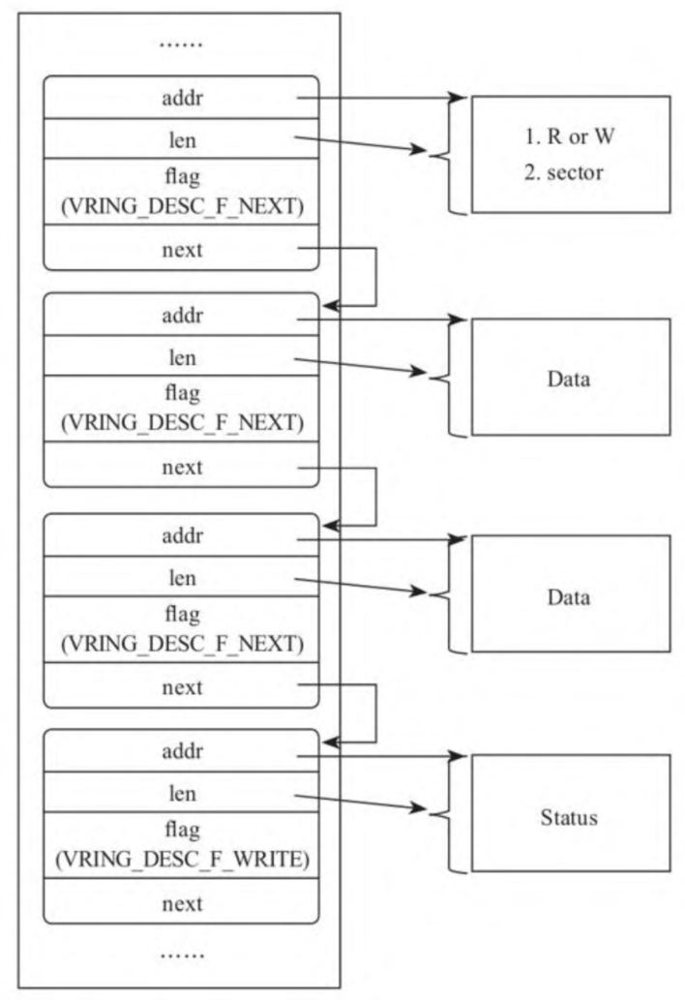
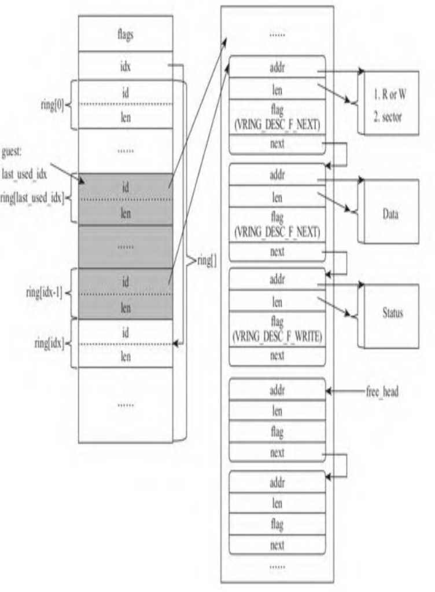

最初, 广泛使用的 Virtio 协议版本是 0.9.5. 在 Virtio 1.0 之后, Virtio 将设备的配置部分做了些微调, 但是 Virtio 的**核心部分保持一致**. 比如 PCI 接口的 Virtio, 将**原来**放在**第 1 个 I/O 区域**内的**配置拆分**成几个部分, **每一部分**使用**一个 capability** 表示, 包括 Common configuration、Notifications、ISR Status、Device-specific configuration 等, 使设备的配置更灵活、更易扩展.

Virtio 的核心数据结构是 **Virtqueue**, 其是 **Guest 内核中的驱动**和 **VMM 中的模拟设备**之间**传输数据**的**载体**. 后续如无特别指出, "**Guest 内核中的驱动**"将简称为**驱动**, "**VMM中的模拟设备**"将简称为**设备**. **一个设备**可以只有一个 Virtqueue, 也可以有**多个 Virtqueue**. 比如对于**网络设备**而言, 可以有一个**用于控制的 Virtqueue**, 然后分别有**一个或多个**用于**发送和接收**的 Virtqueue. 所以, **很多变量**、**状态**都是 **per queue** 的. 

Virtqueue 主要包含**三部分**: **描述符表**(`Descriptor Table`)、**可用描述符区域**(Available Ring)、**已用描述符区域**(Used Ring). Virtio 1.0 **之前**的标准要求这三部分**在一块连续的物理内存**上, Virtio 1.0 **之后**就没有这个规定了, 只要求这三部分**各自的物理内存连续**即可. 

# 描述符表

描述符表是 Virtqueue 的核心, 由一系列的描述符构成. 每一个描述符指向一块内存, 如果这块内存存放的是驱动写给设备的数据, 我们将这个描述符称为out类型的; 如果是驱动从设备读取的数据, 我们称这个描述符为in类型的. 在前面I/O栈部分探讨驱动时, 我们看到, 无论是读还是写, 都是驱动侧负责管理存储区, 同样的道理, Virtqueue的管理也是由Guest内核中的驱动负责, 它会管理这些内存的分配和回收. 即使是in类型的内存块, 也是由驱动为设备分配的, 设备仅仅是向其中写入驱动需要的数据, 驱动读取数据后自行回收资源. 

描述符包括如下几个字段: 

1)addr. 字段addr指向存储数据的内存块的起始地址, 为了让模拟设备理解这个地址, Guest填充这个地址时, 需要将GVA转换为GPA. 

2)len. 对于out、in两个方向, 描述符中的字段len有不同意义. 对于out方向的, len表示驱动在这个内存块中准备了可供设备读取的数据量. 对于in方向的, len表示驱动为设备提供的空白的存储区的尺寸及设备至多可以向里面写入的数据量. 

3)flag. 用来标识描述符的属性, 例如, 如果这个描述符只允许有in方向的数据, 即只承载设备向驱动传递的数据, 那么flag需要加上标识VRING_DESC_F_WRITE. 除此之外, flag还有一个重要的作用, 后面会进行介绍. 

4)next. 驱动和设备的一次数据交互, 可能需要用多个描述符来表示, 多个描述符构成一个描述符链(descriptor chain). 那么当前描述符是否是描述链的最后一个, 后面是否还有描述符, 我们要根据flag字段来判别. 如果字段flag中有标识VRING_DESC_F_NEXT, 则表示描述符中的字段next指向下一个描述符, 否则, 当前描述符就是描述符链的最后一个描述符. 

驱动除了需要向设备提供I/O命令、写入的起始扇区和数据外, 还需要知道设备的执行状态. 因此, 描述符链既包含out类型的描述符, 承载驱动提供给设备的I/O命令和数据, 也包含in类型的描述符, 将命令的执行状态写在其中, 让驱动了解设备处理I/O的状态. 

以驱动向设备写数据为例, 描述符链包括一个header, header指向的内存块记录I/O命令写及起始的扇区号, 无须记录写的扇区总数, 因为模拟设备会根据数据描述符中的长度计算. 接下来是I/O数据相关的描述符, 一个request中可能合并了多个I/O request, 即使单个I/O request也可能包含多个不连续的内存块, 而每个单独的内存块都需要一个描述符描述, 所以数据相关的描述符可能有多个. 最后一个是状态描述符, 它记录设备I/O执行的状态, 比如I/O是否成功了等. 

描述符链的组织如下图所示. 

# 可用描述符区域

驱动准备好描述符后, 需要有个位置记录哪些描述符可用. 为此, Virtqueue中就开辟了一块区域, 我们称其为可用描述符区域, 这个"可用"是相对设备而言的. 可用描述符区域的主体是一个数组ring, ring中每个元素记录的是描述符链的第一个描述符的ID, 这个ID是描述符在描述符表中的索引. 

驱动每次将I/O request转换为一个可用描述符链后, 就会向数组ring中追加一个元素, 因此, 在驱动侧需要知道数组ring中下一个可用的位置, 即未被设备消费的段之后的一个位置, 在可用描述符区域中定义了字段idx来记录这个位置. 

在CPU从Guest模式切换到Host模式后, 模拟设备将检查可用描述符区域, 如果有可用的描述符, 就依次进行消费. 因此, 设备需要知道上次消费到哪里了. 为此, 设备侧定义了一个变量last_avail_idx, 记录可以消费的起始位置. 

最初, 数组ring是空的, last_avail_idx和idx都初始化为0, 即指向数组ring的开头. 随着时间的推移, 将形成如下图所示的常态, 数组ring中位于 last_avail_idx和idx-1之间的部分就是未被设备处理的, 我们将数组ring中的这部分称为有效区域. 

# 已用描述符区域

与可用描述符类似, 设备也需要将已经处理的描述符记录起来, 反馈给驱动. 为此, Virtio标准定义了另一个数据结构, 我们称其为已用描述符区域, 显然, 这个"已用"也是相对驱动而言的. 已用描述符区域的主体也是一个数组ring, 与可用描述符区域中的数组稍有不同, 已用描述区域数组中的每个元素除了记录设备已经处理的描述符链头的ID外, 因为设备可能还会向驱动写回数据, 比如驱动从设备读取数据、设备告知驱动写操作的状态等, 所以还需要有个位置能够记录设备写回的数据长度. 

设备每处理一个可用描述符数组ring中的描述符链, 都需要将其追加到已用描述符数组ring中, 因此, 设备需要知道已用描述符数组ring的下一个可用的位置, 这就是已用描述符区域中变量idx的作用. 同理, 在驱动侧定义了变量last_used_idx, 指向当前驱动侧已经回收到的位置, 位于 last_used_idx 和 idx-1 之间的部分就是需要回收的, 我们称其为有效已用描述符区域, 如下图所示. 

# Virtio 设备的 PCI 配置空间

Virtio 设备可以支持**不同的总线接口**. 有些嵌入式设备**不支持 PCI 总线**, 而是使用 **MMIO** 的方式, 一些如 S390 的体系结构, 既不支持PCI 也不支持MMIO, 而是使用 `channel I/O`, Virito协议定义了对这些接口的支持. 

因为 PCI 是最普遍的方式, 所以这里以 PCI 为例进行讨论. 基于 PCI 总线的 Virtio 设备有**特殊**的 **Vendor ID** 和 **Devcie ID**:

* Vendor ID 是 `0x1AF4`

* Device ID 的范围从 `0x1000` 到 `0x103F`

就像 PCI 设备都有自己的配置空间一样(配置空间就是一些支持 PCI 设备配置的寄存器集合), **Virtio 设备**也有一些自己**特殊的寄存器**, 包括一些**公共的寄存器**和与**具体设备类型相关的寄存器**. 公共的寄存器在前, 设备相关的紧跟其后, Virtio 标准约定使用**第 1 个 BAR** 指向的 **I/O 区域**放置这些寄存器.

**公共的寄存器**也称为 **Virtio header**, 包含如表所示的寄存器. 

其中: 

1) `Device Features` 寄存器是 **Virtio 设备填写**的, 用来**告诉驱动**, 当前**设备**可以**支持哪些特性**. 

2) `Guest Features` 用来**告知设备**, **当前驱动**支持**哪些特性**. 通过 Device Features 和 Guest Features 这 2 个寄存器, Guest 和 Host 之间就可以进行协商, 做到**不同版本驱动和设备之间的兼容**. 

3) `Device Status` 表示**设备的状态**, 比如 Guest 是否已经正确地驱动了设备等. 

4) `ISR Status` 是中断相关的. 

5) `Queue Address` 表示 **Virtqueue** 所在的**地址**, 这个地址由**驱动分配**, 并**告知设备**. 

6) `Queue Size` 表示 **Virtqueue** 的描述符表中**描述符的个数**, **设备端**初始化队列时会**设置**. 

7) 因为一个 Virtio 设备可能有多个 Virtqueue, 当**某个操作**是针对某个 Virtqueue 时, **驱动**首先要指定针对**哪个 Virtqueue**, 这就是 `Queue Select` 寄存器的作用. 

8) 在某个 **Virtqueue 准备**好后, **驱动**需要**通知设备**进行消费, Virtio 标准采用的方式就是**对某个约定地址进行 I/O**, 触发 CPU 从 **Guest** 切换到 **Host**, 这个约定的 I/O 地址就是 **Queue Notify 寄存器**. 

